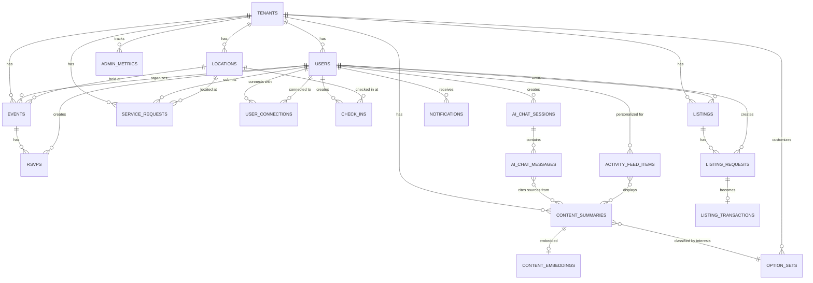

# Data Model Diagram

```mermaid
erDiagram
    TENANTS ||--o{ USERS : has
    TENANTS ||--o{ LOCATIONS : has
    TENANTS ||--o{ EVENTS : has
    TENANTS ||--o{ LISTINGS : has
    TENANTS ||--o{ SERVICE_REQUESTS : has
    TENANTS ||--o{ CONTENT_SUMMARIES : has
    
    USERS ||--o{ USER_CONNECTIONS : "connects with"
    USER_CONNECTIONS }o--|| USERS : "connected to"
    
    USERS ||--o{ CHECK_INS : creates
    LOCATIONS ||--o{ CHECK_INS : "checked in at"
    
    USERS ||--o{ EVENTS : organizes
    LOCATIONS ||--o{ EVENTS : "held at"
    EVENTS ||--o{ RSVPS : has
    USERS ||--o{ RSVPS : creates
    
    USERS ||--o{ LISTINGS : owns
    LISTINGS ||--o{ LISTING_REQUESTS : has
    USERS ||--o{ LISTING_REQUESTS : creates
    LISTING_REQUESTS ||--o| LISTING_TRANSACTIONS : becomes
    
    USERS ||--o{ SERVICE_REQUESTS : submits
    LOCATIONS ||--o{ SERVICE_REQUESTS : "located at"
    
    CONTENT_SUMMARIES ||--o| CONTENT_EMBEDDINGS : embedded
    CONTENT_SUMMARIES }o--|| OPTION_SETS : "classified by interests"
    
    USERS ||--o{ AI_CHAT_SESSIONS : creates
    AI_CHAT_SESSIONS ||--o{ AI_CHAT_MESSAGES : contains
    AI_CHAT_MESSAGES }o--o{ CONTENT_SUMMARIES : "cites sources from"
    
    USERS ||--o{ NOTIFICATIONS : receives
    USERS ||--o{ ACTIVITY_FEED_ITEMS : "personalized for"
    ACTIVITY_FEED_ITEMS }o--o{ CONTENT_SUMMARIES : "displays"
    
    TENANTS ||--o{ OPTION_SETS : customizes
    TENANTS ||--o{ ADMIN_METRICS : tracks
```

---
