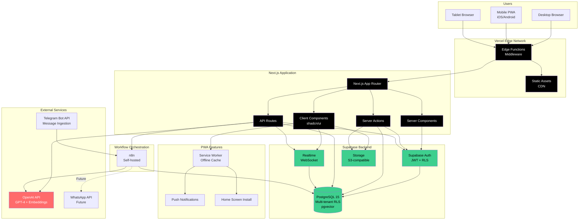

# High Level Architecture

## Technical Summary

The Ecovilla Community Platform is a **modern web application** built with Next.js 14 and React, employing a mobile-first responsive design that delivers an exceptional experience across all devices. The architecture leverages **Next.js App Router** for optimal performance through server-side rendering, static generation, and streaming, while **shadcn/ui components** provide a sophisticated, accessible UI layer following the detailed design specification. 

The backend utilizes **Supabase** for managed PostgreSQL database with Row Level Security for multi-tenancy, authentication, real-time subscriptions, and file storage, complemented by **Next.js Server Actions and API Routes** for custom business logic. An AI-powered assistant integrates with **OpenAI's GPT-4** for chat-based knowledge access with RAG (Retrieval Augmented Generation) using Supabase's pgvector extension. 

The application deploys as a **Progressive Web App (PWA)** via Vercel's edge network, providing mobile-optimized access with offline support, push notifications, and home screen installation—with a clear path to native apps post-MVP. This architecture achieves the PRD's goals of scalability (300 families/~800 users), performance (<3s load times, 99.5%+ uptime), and multi-tenant SaaS readiness while perfectly aligning with the detailed design specification.

## Platform and Infrastructure Choice

**Platform:** Next.js + Supabase + Vercel

**Key Services:**
- **Next.js 14+**: React framework with App Router, Server Components, Server Actions, streaming SSR, static generation
- **Vercel**: Hosting platform, edge network CDN, serverless functions, automatic deployments
- **Supabase**: PostgreSQL 15.x database, Row Level Security (RLS), Supabase Auth, Supabase Storage, Supabase Realtime
- **n8n (self-hosted)**: Workflow automation engine for Telegram integration, message processing, and future external integrations
- **OpenAI API**: GPT-4 for AI assistant chat, GPT-3.5-turbo for message classification, text-embedding-3-large for RAG embeddings
- **Telegram Bot API**: Scheduled message ingestion from interest-based community groups
- **Vercel KV (Redis)**: In-memory caching for session data and rate limiting

**Deployment Host and Regions:**
- **Vercel (Web App)**: Global Edge Network (300+ locations worldwide)
- **Supabase**: AWS `us-east-1` (N. Virginia) initially, can add regions as needed
- **n8n**: Self-hosted (user's existing infrastructure) - webhook endpoint must be publicly accessible
- **PWA**: Installable on all platforms via modern browsers

**Rationale:**
- Next.js + Vercel provide industry-leading performance (Core Web Vitals optimization)
- Server Components reduce JavaScript bundle size dramatically
- Vercel's edge network ensures <3s load times globally (NFR1)
- PWA capabilities provide mobile-app-like experience without app stores
- Supabase RLS provides secure, scalable multi-tenancy (TA2)
- **n8n integration enables scheduled Telegram message ingestion and AI-powered processing** - core value proposition bridging existing community communication with new platform
- **n8n integration enables scheduled Telegram message ingestion and AI-powered processing** - core value proposition bridging existing community communication with new platform
- Cost-effective for MVP with transparent scaling (~$25/month for Telegram processing)

## Repository Structure

**Structure:** Monorepo

**Monorepo Tool:** Turborepo

**Package Organization:**
```
ecovilla-platform/
├── apps/
│   ├── web/                    # Next.js 14 application
│   └── docs/                   # Documentation site (future)
├── packages/
│   ├── ui/                     # shadcn/ui components + custom components
│   ├── database/               # Database schemas, migrations, types
│   ├── shared/                 # Shared utilities, validation (Zod), constants
│   └── config/                 # Shared tooling configs (ESLint, TypeScript, Tailwind)
├── infrastructure/             # OpenTofu configurations (minimal)
└── scripts/                    # Build and deployment scripts
```

**Rationale:**
- Simpler structure for web-focused architecture
- `ui` package centralizes all shadcn components + design system
- `database` package manages Supabase schema and type generation
- Future-ready for additional apps (admin dashboard, docs site)
- Infrastructure tracked in version control with OpenTofu

## High Level Architecture Diagram



## Architectural Patterns

- **Server-First Architecture with Streaming:** Next.js App Router prioritizes Server Components for initial render, progressively enhancing with Client Components. Server Actions handle mutations. _Rationale:_ Minimizes JavaScript sent to client, improves Core Web Vitals, reduces bundle size for mobile (<150KB target).

- **Progressive Web App (PWA):** Service workers cache assets and API responses, enable offline functionality, support push notifications and home screen installation. _Rationale:_ Provides native-app-like experience on mobile without app store deployment, meets mobile-first requirement (NFR1).

- **Multi-Tenant Architecture with RLS:** PostgreSQL Row Level Security policies automatically filter all queries by `tenant_id` based on JWT claims. _Rationale:_ Secure, performant multi-tenancy foundation for SaaS (TA2), eliminates application-layer filtering complexity.

- **Optimistic UI with Server Actions:** Client updates state immediately, Server Actions sync to database in background with automatic revalidation. _Rationale:_ Instant perceived performance (<3s), graceful offline handling, better UX.

- **Real-time Subscriptions:** Supabase Realtime WebSocket connections for live check-ins, notifications, feed updates. Client subscribes to specific tables/filters. _Rationale:_ Core requirement for map features and community awareness (NFR4: <30s notification latency).

- **Component-Based Design System:** shadcn/ui primitives extended with custom components following Atomic Design (atoms → molecules → organisms) as defined in design spec. _Rationale:_ Matches detailed design specification, ensures consistency, leverages proven accessible components (Radix UI).

- **Repository Pattern for Data Access:** All database interactions abstracted through typed repository functions using Supabase client, never raw SQL in components. _Rationale:_ Type safety, testability, consistent error handling, enables future database migration.

- **AI Assistant as RAG-Powered Orchestrator:** Chat interface queries embedded knowledge base (pgvector), combines with GPT-4 for contextual responses and action suggestions. Uses streaming for real-time response display. _Rationale:_ FR4 requirement, provides intelligent knowledge access without traditional KB UI.

- **Structured Workflow Pattern (No Direct Messaging):** All interactions through typed workflows (exchange requests, event RSVPs, service requests) with state machines tracked in database. _Rationale:_ Explicit PRD requirement, reduces communication overhead, maintains focus on coordination vs chat.

- **Event-Driven Integration with n8n:** Telegram message ingestion via Bot API webhooks → n8n workflows orchestrate: (1) real-time storage in PostgreSQL, (2) daily batch classification by interest area (GPT-3.5-turbo), (3) daily summarization per interest (GPT-4), (4) embedding generation for RAG search (text-embedding-3-large). _Rationale:_ Core MVP feature enabling interest-based home feed summaries from existing Telegram groups (FR10), enriches AI assistant with real community conversation context, bridges existing communication tools with new platform.

---
