# Ecovilla Community Platform - UI/UX Specification

**Version:** 2.0  
**Last Updated:** October 5, 2025  
**Status:** In Progress

---

## Introduction

This document defines the user experience goals, information architecture, user flows, and visual design specifications for the Ecovilla Community Platform's user interface. It serves as the foundation for visual design and frontend development, ensuring a cohesive and user-centered experience.

**Important Note**: This specification explicitly **excludes all direct messaging and group chat features**. Communication features are handled separately and are not part of this frontend specification.

---

## Table of Contents

1. [Overall UX Goals & Principles](#overall-ux-goals--principles)
2. [Design Consistency Guide](#design-consistency-guide)
3. [Information Architecture](#information-architecture)
4. [User Flows](#user-flows)
5. [Component Library](#component-library)
6. [Branding & Style Guide](#branding--style-guide)
7. [Responsiveness Strategy](#responsiveness-strategy)
8. [Accessibility Requirements](#accessibility-requirements)
9. [Animation & Micro-interactions](#animation--micro-interactions) ⏳
10. [Content & Micro-copy Guidelines](#content--micro-copy-guidelines) ⏳
11. [Performance Considerations](#performance-considerations) ⏳
12. [Next Steps](#next-steps)

---

## Overall UX Goals & Principles

### Target User Personas

#### Sofia - The Newcomer (Seeking Safety & Discovery)
- **Context**: Just arrived at Ecovilla, overwhelmed by new environment
- **Needs**: Reassurance and gradual introduction to community, clear wayfinding and helpful onboarding
- **Emotional Need**: "I'm overwhelmed and don't want to make a mistake"
- **Design Response**: Psychological safety through softness, progressive disclosure, warm welcome sequences

#### Marcus - The Organizer (Seeking Speed & Power)
- **Context**: Active community coordinator managing multiple initiatives, drowning in coordination tasks
- **Needs**: Efficiency, power tools and shortcuts over hand-holding
- **Emotional Need**: "I'm drowning in tasks and need efficiency"
- **Design Response**: Power tools, bulk operations, keyboard shortcuts, undo over confirm dialogs

#### Elena - The Balanced Resident (Seeking Calm & Control)
- **Context**: Established resident maintaining healthy community engagement
- **Needs**: Stay connected without being overwhelmed, values quality over quantity
- **Emotional Need**: "I want to stay connected without being overwhelmed"
- **Design Response**: Smart filtering, weekly digests, "you're all caught up" states, bulletproof Focus Mode

#### Carmen - The Resource Coordinator (Seeking Organization & Visibility)
- **Context**: Manages community resources, tool library, harvest sharing
- **Needs**: Clear inventory visibility and transaction tracking
- **Emotional Need**: "I need to keep track of everything without chaos"
- **Design Response**: Clear status indicators, streamlined workflows, admin tools that feel empowering

---

### Usability Goals

1. **Ease of Learning**: New users can complete core tasks (profile setup, first check-in, browse calendar) within 5 minutes
2. **Efficiency of Use**: Power users can access frequent features (check-in, calendar view, exchange search) within 2 taps from home
3. **Error Prevention**: Clear validation and confirmation for destructive actions (deactivate account, delete listing)
4. **Memorability**: Infrequent users can return after weeks without relearning navigation
5. **Mobile-First Performance**: 90% of usage on mobile, <3 second load times, touch-optimized throughout

---

### Design Principles

1. **Regenerative by Design** - Every interaction should leave users feeling energized, not depleted. Design reduces overwhelm rather than creating it.

2. **Belonging Through Inclusivity** - Design for all personas simultaneously with multiple entry points for different needs and comfort levels.

3. **Nature as North Star** - Visual language rooted in organic forms and earth elements. Calming palette derived from Costa Rican cloud forest landscapes.

4. **Efficiency with Warmth** - Streamlined flows without coldness. Human-centered copy that guides without condescending.

5. **Mindful Transparency** - Honest information delivery with no dark patterns. Clear privacy controls. Users always know what's happening and why.

---

## Design Consistency Guide

### Navigation Standards

#### Bottom Navigation (Primary - Mobile)
- **5 tabs**: Home 🏠, Map 🗺️, Calendar 📅, Exchange 🔄, AI Assistant 🤖
- **Note**: "Messages" tab removed per specification requirements
- **Visibility Rules**:
  - ✅ **Always visible** on resident-facing screens
  - ❌ **Hidden during onboarding wizard** (Flows 0-1)
  - ❌ **Hidden on admin/backoffice screens**
  - ✅ **Visible on modal overlays** (bottom sheet, full-screen modals)

#### Top Bar Standards
- **Standard Order** (left to right):
  1. Back arrow (when applicable) - Left edge
  2. Screen title - Center
  3. Notification bell icon - Top right (first icon)
  4. Settings/action icon - Top right (second icon, if needed)
- **Consistency Rule**: Never swap icon positions across screens
- **Context Actions**: Additional icons (search, filter, add) appear left of bell icon

---

### Onboarding Flow Standards

**Step Count**: **6 steps** (standardized across all flows)

1. Password Setup & Activation
2. About You (profile photo, name, language, location)
3. Journey Stage Selection
4. Your Interests (min 3 required)
5. Share Your Skills
6. Set Notifications & Privacy

**Progress Indicator**: Always visible at top, showing current step (e.g., "Step 3 of 6")

**Navigation**:
- "Back" button (top left) - returns to previous step
- "Skip" option (top right) - only on optional steps (Skills, Interests)
- "Next" / "Continue" button (bottom, full width)
- "Cancel" (exits to login) - only on step 1

---

### Modal & Dialog Standards

#### Confirmation Modals (Destructive Actions)

**Deactivate Modal:**
- Heading: "Deactivate User?" (22px bold, orange text)
- Icon: Pause icon (orange)
- Description: "This temporarily deactivates the user account. They can be reactivated later."
- Consequences list
- Checkbox: "Notify user of deactivation"
- Buttons: "Cancel" (light gray) / "Deactivate" (orange)

**Delete Modal:**
- Heading: "Delete User?" (22px bold, red text)
- Icon: X in circle (red)
- Description: "This permanently deletes the user and all their data. This action cannot be undone."
- Warning: "⚠️ This is a destructive action"
- Consequences list
- Confirmation input: "Type DELETE to confirm"
- Checkbox: "Notify user before deletion"
- Buttons: "Cancel" (light gray) / "Delete Permanently" (red, disabled until typed)

---

## Information Architecture

### Site Map / Screen Inventory

```mermaid
graph TD
    A[Launch] --> B[Login/Registration]
    B --> C[Onboarding Wizard]
    C --> D[Home Dashboard]
    
    D --> E[Home Feed]
    D --> F[Community Map]
    D --> G[Calendar]
    D --> H[Exchange & Listings]
    D --> I[AI Assistant]
    
    E --> E1[Daily Digest]
    E --> E2[Check-in Feed]
    E --> E3[Exchange Updates]
    E --> E4[Event Announcements]
    
    F --> F1[Interactive Map View]
    F --> F2[Lot Details]
    F --> F3[Facility Information]
    F --> F4[Active Check-ins]
    F --> F5[Map Layers Panel]
    
    G --> G1[Calendar Month View]
    G --> G2[Event Details]
    G --> G3[RSVP Management]
    G --> G4[Filter by Category]
    
    H --> H1[Browse Listings]
    H --> H2[Search Items]
    H --> H3[Create Listing]
    H --> H4[My Listings]
    H --> H5[Borrow/Lend History]
    
    I --> I1[Chat Interface]
    I --> I2[Voice Input]
    I --> I3[Quick Actions]
    I --> I4[Conversation History]
    
    D --> J[Profile Icon Menu]
    J --> J1[Edit Profile]
    J --> J2[Family Members]
    J --> J3[Privacy Settings]
    J --> J4[Notification Preferences]
    J --> J5[Interests & Skills]
    J --> J6[Admin Backoffice]
    
    J6 --> K1[User Management]
    J6 --> K2[Event Moderation]
    J6 --> K3[Exchange Moderation]
    J6 --> K4[Content Management]
    J6 --> K5[Community Settings]
```



---

### Navigation Structure

**Primary Navigation** (Mobile Bottom Tabs, 5 items)
- **Home** 🏠 - Personalized feed, daily digest, quick actions
- **Map** 🗺️ - Community map, check-ins, spatial awareness
- **Calendar** 📅 - Events, RSVPs, community schedule
- **Exchange** 🔄 - Browse listings, manage items, search resources
- **AI Assistant** 🤖 - Chat interface, voice queries, community knowledge

**Secondary Navigation** (Top Bar)
- Back button (when applicable)
- Screen title
- **Notification bell** (first icon, right)
- **Settings/Context action** (second icon, right, when applicable)
- Profile icon dropdown (when on desktop)

**Profile Menu** (Mobile: From profile icon; Desktop: Dropdown)
- My Profile
- Family Members
- Notification Preferences
- Privacy Settings
- Admin Dashboard (if admin/coordinator role)
- Help & Support
- Sign Out

**Breadcrumb Strategy**
- Not used on mobile (limited space)
- Desktop: Show breadcrumbs for deep navigation (Admin > User Management > Edit User)
- Always maintain clear "back" affordance

---

## User Flows

### Overview

All 12 primary user flows are fully documented in a standalone artifact with comprehensive details including wireframes, edge cases, error handling, and success criteria for each flow.

**📋 [View Complete User Flows Documentation](Ecovilla User Flows - Complete Documentation)**

**Flow Organization:**

**Onboarding Cluster (Flows 0-2)**
- Flow 0: Admin Creates User
- Flow 1: Account Activation & Onboarding  
- Flow 2: Edit Profile & Privacy

**Core Experience (Flow 3)**
- Flow 3: Home Feed (Daily Digest)

**Spatial Features (Flows 4-5)**
- Flow 4: Explore Community Map
- Flow 5: Create Check-In

**Event Management (Flows 6-7)**
- Flow 6: Create Event
- Flow 7: Event Moderation (Admin)

**Exchange System (Flows 8-10)**
- Flow 8: Create Exchange Listing
- Flow 9: Browse & Borrow Exchange Listings
- Flow 10: Exchange Listing Moderation (Admin)

**AI Assistant (Flow 11)**
- Flow 11: AI Chat Assistant

**Administration (Flow 12)**
- Flow 12: User & Community Management (Admin)

### Quick Reference: Key User Journeys

**New Resident Onboarding Journey**:
1. Admin creates account (Flow 0)
2. Resident receives email, sets password
3. Complete 6-step onboarding wizard
4. Land on Home dashboard, ready to engage
5. **Duration**: ~5-7 minutes

**Daily Engagement Journey**:
1. Open app → Home feed (Flow 3)
2. Review actions and updates
3. Check community map for activity (Flow 4)
4. Optional: Create check-in (Flow 5) or RSVP to event (Flow 6)
5. **Duration**: ~2-3 minutes

**Exchange Workflow**:
1. Browse listings (Flow 9)
2. Request to borrow item
3. Owner approves request
4. Coordinate pickup
5. Return item, complete transaction
6. **Duration**: 2-7 days typically

**Admin Moderation Workflow**:
1. Review flagged content (Flow 7 or 10)
2. Investigate context and history
3. Message owner if needed
4. Approve, edit, or remove content
5. Log action in audit trail
6. **Duration**: ~3-5 minutes per item

---

## Component Library

### Overview

The Ecovilla platform uses **Atomic Design methodology** with components organized in four layers:

- **Atoms**: Foundational elements (buttons, inputs, icons, typography)
- **Molecules**: Simple combinations (form fields, cards, search bars)
- **Organisms**: Complex assemblies (navigation, modals, tables, feeds)
- **Patterns & Behaviors**: Interaction states and animations

---

### Implementation Stack

**Core Foundation:**
- **Base Components**: [shadcn/ui](https://ui.shadcn.com/docs/components) - Accessible, customizable React components built on Radix UI
- **Icon Library**: [Lucide](https://lucide.dev/icons/) - Beautiful, consistent icon set (600+ icons)
- **Styling**: Tailwind CSS with custom Ecovilla theme
- **Primitives**: Radix UI for accessible, unstyled component foundations
- **Accessibility**: WCAG AA compliance built-in via Radix UI

**Extended Component Registries:**

These premium component libraries extend shadcn/ui with advanced, pre-built components featuring sophisticated animations and interactions. All are copy-paste, Tailwind-based, and fully customizable.

1. **[ReactBits.dev](https://reactbits.dev/)**
   - Premium React components with smooth animations
   - Advanced form controls, data displays, and interactions
   - Perfect for: Complex forms, data visualization, interactive elements
   - Key components: Multi-step forms, advanced selects, timeline components

2. **[Skiper UI](https://skiper-ui.com/components)**
   - Beautiful, modern component collection
   - Focus on sleek aesthetics and micro-interactions
   - Perfect for: Cards, navigation, modals, overlays
   - Key components: Animated cards, drawer panels, floating menus

3. **[Cult UI](https://www.cult-ui.com/)**
   - Trendy, cutting-edge components with bold design
   - Modern aesthetics with refined animations
   - Perfect for: Hero sections, feature showcases, CTAs
   - Key components: Animated backgrounds, gradient effects, modern layouts

4. **[Magic UI](https://magicui.design/)**
   - Exceptional animation and motion components
   - Pre-built animated UI elements and effects
   - Perfect for: Transitions, loading states, celebrations, onboarding flows
   - Key components: Animated text, particle effects, morphing shapes, scroll animations
   - **Critical for**: Our Animation & Micro-interactions implementation

**Why This Stack:**
- ✅ All components share the same foundation (React + Tailwind)
- ✅ Copy-paste approach = Full code ownership and customization
- ✅ No package lock-in or version conflicts
- ✅ Pre-built animations save 100+ hours of development
- ✅ Maintains shadcn/ui philosophy while accelerating development
- ✅ All respect accessibility standards (WCAG AA)

---

### Design Philosophy Alignment

**Regenerative by Design**: Components create calm, spacious interfaces with thoughtful animations that energize rather than deplete.

**Nature as North Star**: Organic shapes, earth-tone colors, generous spacing - all customizable via Tailwind theme.

**Efficiency with Warmth**: Streamlined interactions without coldness, using smooth animations from Magic UI and ReactBits.

**Mindful Transparency**: Clear states, honest feedback, no dark patterns - all registries support proper loading, error, and success states.

**Performance-First**: Despite rich animations, all components are optimized for mobile-first performance with proper code-splitting.

---

### Design Tokens

#### Color Tokens (Tailwind CSS custom theme)

```css
:root {
  /* Primary - Forest Canopy */
  --forest-deep: #2D5016;
  --forest-canopy: #4A7C2C;
  --forest-fresh: #6B9B47;
  
  /* Neutrals - Earth & Clay */
  --soil: #1A1A1A;
  --stone: #4A4A4A;
  --mist: #8C8C8C;
  --sand: #E8E5E0;
  --cloud: #F8F6F3;
  --sunlight: #FFFFFF;
  
  /* Supporting - Sky & Water */
  --river: #5B8FA3;
  --sky: #7BA5B8;
  --dew: #E8F2F5;
  
  /* Semantic - Sunrise Accent */
  --sunrise: #D97742;
  --growth: #6B9B47;
  --honey: #D4A574;
  --clay: #C25B4F;
  --stream: #7BA5B8;
}
```

#### Typography Tokens

```css
--font-sans: 'Inter', system-ui, sans-serif;
--font-mono: 'JetBrains Mono', monospace;

--text-xs: 12px;   /* Labels, captions */
--text-sm: 13px;   /* Secondary text */
--text-base: 15px; /* Body text */
--text-lg: 17px;   /* Emphasized text */
--text-xl: 18px;   /* Small headings */
--text-2xl: 22px;  /* Section headings */
--text-3xl: 28px;  /* Page headings */
```

#### Spacing Tokens (8px base grid)

```css
--space-1: 4px;   /* XXS - Icon padding */
--space-2: 8px;   /* XS - Tight spacing */
--space-4: 16px;  /* S - Default spacing */
--space-6: 24px;  /* M - Section spacing */
--space-8: 32px;  /* L - Large gaps */
--space-12: 48px; /* XL - Major sections */
--space-16: 64px; /* XXL - Page sections */
```

#### Border Radius

```css
--radius-sm: 8px;    /* Small elements: chips, badges */
--radius-md: 12px;   /* Standard: buttons, inputs, cards */
--radius-lg: 16px;   /* Large elements: modals, panels */
--radius-full: 9999px; /* Pills, toggles */
```

---

### Component Reference

**Complete component specifications are documented in four detailed artifacts:**

1. **Atoms** - Typography, colors, spacing, buttons, inputs, icons, badges
2. **Molecules** - Form fields, cards, search bars, navigation items, chips, avatars
3. **Organisms** - Navigation systems, modals, tables, feeds, forms
4. **Patterns & Behaviors** - Loading states, animations, gestures, responsive patterns

**Key Components Summary:**

| Category | Components | States Documented |
|----------|-----------|-------------------|
| Buttons | Primary, Secondary, Ghost, Icon | Default, Hover, Active, Focus, Disabled |
| Inputs | Text, Textarea, Select, Checkbox, Radio, Toggle | Default, Focus, Filled, Error, Disabled |
| Cards | Feed Card, Listing Card, Event Card, Profile Card | Default, Hover, Loading, Empty |
| Navigation | Bottom Tabs, Top Bar, Profile Menu | Active, Inactive, Badge notifications |
| Modals | Dialog, Bottom Sheet, Confirmation | Entering, Open, Closing |
| Feedback | Toast, Alert, Banner, Empty State | Success, Warning, Error, Info |

---

### Design System Checklist

When implementing any component:

- [ ] Uses shadcn/ui base component (if available)
- [ ] Applies Ecovilla color tokens (Forest Canopy, Cloud, etc.)
- [ ] Uses Lucide icons (correct size and color)
- [ ] Implements all states (default, hover, active, focus, disabled, error)
- [ ] Meets 44x44px touch target minimum
- [ ] Has visible focus indicator
- [ ] Includes proper ARIA labels
- [ ] Responsive (mobile-first, breakpoint adaptations)
- [ ] Follows 8px spacing grid
- [ ] Uses 12px border radius (buttons, cards, inputs)
- [ ] Smooth transitions (200-300ms)
- [ ] Tested with keyboard navigation
- [ ] Tested with screen reader

---

## Branding & Style Guide

### Visual Identity

**Brand Guidelines**: Reflects Ecovilla's values of regenerative living, community resilience, and sustainable practices.

**Overall Aesthetic**: Clean, natural, inviting - using earthy tones and organic elements. Conveys a sense of calm and connection, avoiding overly corporate or sterile interfaces.

**Design Inspiration**:
- **Airbnb Design System**: Approachable sophistication, rounded corners, strategic color use
- **TIDE App**: Contemplative technology, natural rhythms, minimal gamification
- **Ecovilla Values**: Regenerative living, community resilience, sustainable practices, calm connection

---

### Color Palette

| Color Type | Hex Code | Usage |
|-----------|----------|-------|
| **Primary** | #4A7C2C (Forest Canopy) | Primary buttons, active states, key actions |
| **Primary Dark** | #2D5016 (Forest Deep) | Hover states, headers, emphasis |
| **Primary Light** | #6B9B47 (Forest Fresh) | Backgrounds, subtle highlights |
| **Secondary** | #7BA5B8 (Sky) | Secondary actions, informational elements |
| **Accent** | #D97742 (Sunrise) | Calls-to-action, notifications, highlights |
| **Success** | #6B9B47 (Growth) | Positive feedback, confirmations |
| **Warning** | #D4A574 (Honey) | Cautions, important notices |
| **Error** | #C25B4F (Clay) | Errors, destructive actions |
| **Neutral Dark** | #1A1A1A (Soil) | Primary text |
| **Neutral Mid** | #4A4A4A (Stone) | Secondary text |
| **Neutral Light** | #8C8C8C (Mist) | Tertiary text, placeholders |
| **Background** | #F8F6F3 (Cloud) | App background |
| **Surface** | #FFFFFF (Sunlight) | Cards, panels, modals |

---

### Typography

#### Font Families
- **Primary**: Inter (sans-serif) - Clean, highly readable, excellent for UI
- **Monospace**: JetBrains Mono - Code snippets, technical data

#### Type Scale

| Element | Size | Weight | Line Height | Usage |
|---------|------|--------|-------------|-------|
| H1 | 28px | 700 (Bold) | 1.2 | Page titles |
| H2 | 22px | 600 (Semibold) | 1.3 | Section headings |
| H3 | 18px | 600 (Semibold) | 1.4 | Subsection headings |
| Body | 15px | 400 (Regular) | 1.5 | Body text, descriptions |
| Body Strong | 15px | 600 (Semibold) | 1.5 | Emphasized body text |
| Small | 13px | 400 (Regular) | 1.4 | Secondary text, metadata |
| Caption | 12px | 400 (Regular) | 1.3 | Labels, captions, timestamps |

---

### Iconography

**Icon Library**: [Lucide Icons](https://lucide.dev/icons/) - Open source, consistent stroke width, excellent coverage

**Icon Sizes**:
- **16px**: Inline with text, small badges
- **20px**: Standard UI icons (buttons, inputs)
- **24px**: Navigation icons, primary actions
- **32px**: Feature icons, empty states
- **48px+**: Illustrations, hero graphics

**Usage Guidelines**:
- Use 2px stroke weight for consistency
- Icons should be forest-canopy (#4A7C2C) or stone (#4A4A4A) by default
- Accent colors (sunrise, sky) for special states or CTAs
- Always include accessible labels (aria-label or sr-only text)

---

### Spacing & Layout

**Grid System**: 8px base grid for all spacing

**Common Spacing Patterns**:
- **Component padding**: 16px (cards, buttons, inputs)
- **Section spacing**: 24px vertical between sections
- **Page margins**: 16px mobile, 24px tablet, 32px desktop
- **Maximum content width**: 1280px (desktop)

**Touch Targets**:
- **Minimum**: 44x44px for all interactive elements
- **Recommended**: 48x48px for primary actions
- **Spacing between targets**: 8px minimum

---

## Responsiveness Strategy

### Breakpoints

| Breakpoint | Min Width | Max Width | Target Devices | Layout Changes |
|-----------|-----------|-----------|----------------|----------------|
| **Mobile** | 0px | 639px | Phones | Single column, bottom nav, full-width cards |
| **Tablet** | 640px | 1023px | Tablets, large phones | 2 columns possible, hybrid nav |
| **Desktop** | 1024px | 1279px | Laptops, desktops | Sidebar nav, 2-3 columns, hover states |
| **Wide** | 1280px+ | - | Large monitors | Max 1280px content width, centered |

**Mobile-First Approach**: All styles default to mobile, with breakpoints adding enhancements.

---

### Component Adaptations

| Component | Mobile (<640px) | Desktop (≥1024px) |
|-----------|-----------------|-------------------|
| Bottom Nav | Visible, 5 tabs | Hidden (use sidebar) |
| Top Bar | Visible, icons only | Visible, can include text labels |
| Modals | Bottom sheet (Drawer) | Centered dialog |
| Cards | Stack vertically, full width | Grid (2-3 columns) |
| Forms | Single column | Can use 2 columns for short fields |
| Tables | Horizontal scroll or card view | Full table display |
| Images | Full width | Constrained width with aspect ratio |

---

### Responsive Patterns

**Navigation**:
```tsx
// Mobile: Bottom tabs
<BottomNavigation className="md:hidden" />

// Desktop: Sidebar
<Sidebar className="hidden md:block" />
```

**Layout Flexibility**:
```tsx
// Mobile: Stack, Desktop: Grid
<div className="flex flex-col md:grid md:grid-cols-2 gap-4">
  <Card />
  <Card />
</div>
```

**Typography Scaling**:
```tsx
// Responsive heading
<h1 className="text-2xl md:text-3xl lg:text-4xl">
  Welcome to Ecovilla
</h1>
```

---

## Accessibility Requirements

### Compliance Target

**Standard**: WCAG 2.1 Level AA

**Scope**: All user-facing features, including mobile web, progressive web app, and admin interfaces.

**Rationale**: Ecovilla serves a diverse community including residents of varying ages, abilities, and technical comfort levels. Accessibility ensures everyone can participate fully in community life.

---

### Key Requirements

#### Visual Accessibility

**Color Contrast**:
- **Normal text (15px+)**: Minimum 4.5:1 contrast ratio
- **Large text (18px+ or 15px bold)**: Minimum 3:1 contrast ratio
- **UI components and graphics**: Minimum 3:1 contrast ratio
- **Never rely on color alone** to convey information (use icons, labels, or patterns)

**Focus Indicators**:
- **Visible focus ring** on all interactive elements
- **2px solid outline** in forest-canopy (#4A7C2C) or sunrise (#D97742)
- **4px offset** from element edge for clarity
- **Never remove focus styles** with `outline: none` without replacement

**Text Sizing**:
- **Base font**: 15px minimum (readable without zoom)
- **Support browser zoom**: 200% without horizontal scroll
- **Responsive text scaling**: Larger sizes at desktop breakpoints
- **No fixed heights** on text containers (allow reflow)

#### Interaction Accessibility

**Keyboard Navigation**:
- **All interactive elements** reachable via Tab key
- **Logical tab order** follows visual layout (left-to-right, top-to-bottom)
- **Skip links** to bypass repetitive navigation
- **Keyboard shortcuts** for power users (documented in settings)
- **Escape key** closes modals and cancels actions
- **Arrow keys** navigate lists, calendars, and maps

**Screen Reader Support**:
- **Semantic HTML**: Use proper heading hierarchy (h1 > h2 > h3)
- **ARIA labels**: All icons and icon-only buttons have descriptive labels
- **Live regions**: Announce dynamic content updates (toasts, feed updates)
- **Form labels**: Every input has an associated label element
- **Alt text**: All images have descriptive alt attributes (except decorative)
- **Landmark roles**: header, nav, main, aside, footer for page structure

**Touch Targets**:
- **Minimum size**: 44x44px for all tappable elements
- **Recommended size**: 48x48px for primary actions
- **Spacing**: 8px minimum between adjacent targets
- **No reliance on hover**: All functionality available via tap/click

#### Content Accessibility

**Alternative Text**:
- **Informative images**: Concise description of content/purpose
- **Decorative images**: Empty alt attribute (alt="")
- **Complex graphics**: Longer description via aria-describedby
- **Icons**: Accessible label via aria-label or sr-only text

**Heading Structure**:
- **One h1 per page** (page title)
- **Logical hierarchy**: No skipped levels (h1 → h2 → h3)
- **Descriptive headings**: Clearly indicate section content

**Form Accessibility**:
- **Every input** has an associated `<label>` element
- **Error messages** linked to inputs via aria-describedby
- **Required fields** indicated visually and with aria-required
- **Field instructions** provided before input (not just placeholder)
- **Error prevention**: Validate on blur, not just on submit

---

### Testing Strategy

**Automated Testing**:
- **Axe DevTools** browser extension for quick audits
- **Lighthouse** CI checks on every pull request
- **Pa11y** or **axe-core** in automated test suite
- **Target**: Zero critical violations

**Manual Testing**:
- **Keyboard-only navigation** through all flows
- **Screen reader testing**: NVDA (Windows), VoiceOver (macOS/iOS), TalkBack (Android)
- **Color contrast checks** using Stark or Color Oracle
- **Zoom testing**: 200% browser zoom without horizontal scroll
- **Touch target testing**: Physical device testing with different hand sizes

**User Testing**:
- **Recruit diverse participants**: Include users with disabilities
- **Assistive technology users**: Test with screen readers, switch controls, voice control
- **Accessibility audit**: Third-party validation before launch

---

### Accessibility Checklist

When implementing any screen or feature:

- [ ] Color contrast meets WCAG AA (4.5:1 for text, 3:1 for UI)
- [ ] All interactive elements have visible focus indicators
- [ ] Keyboard navigation works (Tab, Shift+Tab, Enter, Escape, Arrows)
- [ ] All images have appropriate alt text
- [ ] Form labels are properly associated with inputs
- [ ] Error messages are linked to fields (aria-describedby)
- [ ] Heading hierarchy is logical (no skipped levels)
- [ ] ARIA labels on icon buttons and icon-only elements
- [ ] Touch targets are 44x44px minimum
- [ ] No reliance on color alone to convey information
- [ ] Tested with screen reader (VoiceOver, NVDA, or TalkBack)
- [ ] Zoom to 200% without horizontal scroll or content loss

---

## Animation & Micro-interactions

### Overview

**Philosophy**: Every animation serves a purpose - to guide attention, create continuity, communicate state, or spark joy. Motion makes the digital feel alive and believable. We treat the UI not as static screens, but as a connected, flowing experience - like a movie where each scene transitions seamlessly into the next.

**Emotional Design Approach**: Inspired by Duolingo's beloved owl mascot, we use character-driven design to create emotional connection, celebrate progress, provide encouragement, and make the app feel alive and personal.

---

### Motion Design Principles

#### The Five Pillars of Ecovilla Motion

**1. Making Interactive Possibilities Immediately Apparent**

Visual language that signals "this is interactive" before any touch:

- **Buttons breathe**: Subtle scale pulse (1.0 → 1.02 → 1.0) on a 3-second loop when idle
- **Swipeable cards show depth**: Shadow increases on drag, revealing the action beneath
- **Draggable elements lift**: Gentle elevation increase on press (z-index + shadow)
- **Links have personality**: Underline slides in from left on hover (100ms)
- **Floating Action Buttons pulse**: Soft glow pulse to draw attention to primary actions

**Implementation** (using Magic UI + custom CSS):
```tsx
// Breathing button
<Button className="animate-pulse-subtle">
  Create Event
</Button>

// CSS
@keyframes pulse-subtle {
  0%, 100% { transform: scale(1); }
  50% { transform: scale(1.02); }
}
.animate-pulse-subtle {
  animation: pulse-subtle 3s ease-in-out infinite;
}
```

**2. Creating Responsive Interfaces with Immediate Visual Response**

Every interaction gets instant feedback (0-50ms response time):

- **Button press**: Immediate scale down to 0.95, then spring back (150ms total)
- **Input focus**: Border color + subtle glow transition in 150ms
- **Toggle switches**: Smooth 200ms slide + background color fade
- **Icon state changes**: Micro-bounce effect on state change (checkmarks, favorites)
- **Touch ripple**: Expanding circle from touch point (Material Design inspired)

**Timing Standards**:
- **Immediate response**: 0-50ms (must feel instant)
- **Micro-interactions**: 150-300ms (button press, toggle, checkbox)
- **Transitions**: 300-500ms (screen change, modal, drawer)
- **Animations**: 500-1000ms (celebrations, illustrations)
- **Ambient motion**: 2-5s loops (breathing, floating, gentle sway)

**Easing Functions**:
```css
/* Enter screen - Smooth deceleration */
--ease-out: cubic-bezier(0.16, 1, 0.3, 1);

/* Exit screen - Quick acceleration */
--ease-in: cubic-bezier(0.7, 0, 0.84, 0);

/* Spring bounce - Playful energy */
--ease-spring: cubic-bezier(0.34, 1.56, 0.64, 1);

/* Standard - Material Design default */
--ease-standard: cubic-bezier(0.4, 0, 0.2, 1);
```

**3. Creating Spatial Continuity Through Purposeful Motion**

Elements move in ways that show relationships and maintain orientation:

- **Screen transitions**: Elements slide from navigation direction (left = back, right = forward)
- **Modal appearance**: Expands from tap location to full size (shared element transition)
- **Deleted items**: Collapse height → slide out → gap closes (300ms total)
- **Card to detail**: Card morphs and expands into detail view (500ms)
- **Tab switching**: Content slides left/right based on tab order

**Example - Card to Detail Transition**:
```tsx
// Using Magic UI's MorphingCard
<MorphingCard
  from="list"
  to="detail"
  duration={400}
  easing="ease-out"
>
  {/* Card content */}
</MorphingCard>
```

**4. Creating Believable Digital Experiences Through Natural Movement**

Motion follows physics, not mathematics:

- **Use spring physics over linear**: React Spring or Framer Motion for natural feel
- **Heavier elements have inertia**: Modals, drawers move slower than small elements
- **Follow-through and overlap**: Title animates, then content (staggered by 50-100ms)
- **Subtle parallax on scroll**: Background moves slower (0.5x speed) than foreground
- **Momentum and drag**: Swipe gestures have natural deceleration curves

**5. Communicating System Status Through Immediate Visual Response**

The app always tells you what it's doing:

- **Loading**: Skeleton screens morph into real content (Magic UI `<Skeleton>`)
- **Processing**: Progress indicators with estimated time
- **Success**: Green checkmark with subtle celebration (200ms)
- **Error**: Red shake animation + icon change (300ms)
- **Typing indicator**: Pulsing dots that feel "alive" (AI chat)
- **Uploading**: Progress bar with percentage and file preview

**State Transition Examples**:
```tsx
// Loading → Content
<FadeIn delay={200}>
  {isLoading ? (
    <Skeleton className="h-20 w-full" />
  ) : (
    <EventCard data={event} />
  )}
</FadeIn>

// Success celebration
<AnimatedCheckmark
  size={64}
  color="forest-canopy"
  duration={500}
  onComplete={() => navigate('/home')}
/>
```

---

### Character System: Emotional Design Through Avatars

#### The Hummingbird Guide - App Mascot

**Personality**: Energetic, helpful, encouraging, always ready to assist. The hummingbird is your companion throughout the Ecovilla journey - never intrusive, but always there when needed.

**Visual Design**:
- **Style**: Friendly, slightly stylized illustration (not cartoon, not photorealistic)
- **Colors**: Vibrant plumage using Ecovilla palette (Forest Canopy greens, Sunrise accents)
- **Expressions**: 5-7 emotional states (happy, thoughtful, excited, encouraging, celebrating)
- **Size**: Scales from 32px (small appearances) to 200px (major moments)

**Where the Hummingbird Appears**:

1. **Onboarding**:
   - Welcomes new residents on password setup screen
   - Flies in from right, hovers center (2s loop animation)
   - Speech bubble: "Welcome to Ecovilla! Let's get you set up."
   - Celebrates completion: Does a little loop-de-loop

2. **Empty States**:
   - No events: Hummingbird sitting on branch, looking peaceful
   - No check-ins: Hummingbird looking at map curiously
   - Search no results: Hummingbird looking through magnifying glass
   - Message: Conversational, not apologetic

3. **Tutorials & Tips**:
   - First check-in: "Great spot! Others nearby can see you're here."
   - First event created: "Your event is live! I'll remind attendees."
   - Weekly digest: Small hummingbird icon next to "Your week ahead"

4. **Achievements** (future feature):
   - First month celebration
   - 10 check-ins milestone
   - Community helper badge
   - Hummingbird does celebratory flight pattern

5. **AI Assistant Avatar**:
   - Hummingbird face as AI chat avatar
   - Animated when "typing" (gentle head tilt, eye blink)
   - Different expressions based on response type

6. **Loading States**:
   - Hummingbird flies across screen trailing sparkles
   - Alternative: Hummingbird hovers with gentle wing flutter
   - Use sparingly - skeleton screens preferred for most loading

**Animation States**:
```tsx
// Hummingbird component with states
<Hummingbird
  state="celebrating" // happy, thoughtful, excited, encouraging, celebrating
  size={128}
  loop={true}
  onAnimationComplete={() => {}}
/>
```

#### Personal Animal Avatars - User Identity

**Purpose**: Give each resident a unique, playful identity that appears throughout their experience. Like Duolingo's owl, these animals create emotional connection and personality.

**12 Costa Rican Animals**:

1. **Resplendent Quetzal** 🦜 - Elegant, rare, spiritual
2. **Three-Toed Sloth** 🦥 - Slow living, calm, regenerative
3. **Red-Eyed Tree Frog** 🐸 - Vibrant, playful, adaptable
4. **Scarlet Macaw** 🦜 - Social, colorful, loud (in a good way)
5. **Howler Monkey** 🐵 - Community-minded, vocal, protective
6. **Jaguar** 🐆 - Strong, independent, mysterious
7. **Toucan** 🦜 - Cheerful, distinctive, friendly
8. **Morpho Butterfly** 🦋 - Transformative, beautiful, gentle
9. **Green Sea Turtle** 🐢 - Ancient wisdom, steady, patient
10. **White-Faced Capuchin** 🐵 - Clever, curious, mischievous
11. **Strawberry Poison Dart Frog** 🐸 - Bold, tiny but mighty, colorful
12. **Collared Peccary** 🐗 - Community-focused, loyal, resourceful

**Visual Design**:
- **Style**: Consistent with hummingbird - friendly, slightly stylized
- **Expressions**: Each animal has 3-5 expressions (happy, neutral, excited, surprised, sleepy)
- **Color variations**: Users can choose color variant (maintains species traits)
- **Poses**: Sitting, waving, jumping, celebrating, sleeping

**Selection During Onboarding** (Flow 1, Step 2.5):

**Screen: "Choose Your Animal Companion"**
- Appears after "About You" step
- Grid of 12 animals (3x4 on mobile, 4x3 on desktop)
- Each card: Animated preview on hover/tap
- Animal name + personality trait below
- Tap to select, border highlights in Forest Canopy
- "You can change this anytime" helper text
- Preview: "This is how you'll appear in the community!"

**Where Personal Animals Appear**:

1. **Profile & Identity**:
   - Profile icon (instead of photo, or alongside)
   - Bottom nav avatar (if using avatar icon)
   - Map check-in pins (small version, 32px)
   - Chat/comment avatars (if messaging enabled in future)

2. **Check-In Cards**:
   - User's animal appears next to check-in location
   - Example: Sofia's sloth hanging from "Tool Library" sign
   - Animated: Gentle idle animation (breathing, blinking)

3. **Celebrations & Milestones**:
   - First check-in: Animal does happy dance
   - Event RSVP confirmed: Animal gives thumbs up
   - Item borrowed: Animal carries mini version of item
   - Returned item: Animal waves goodbye to item

4. **Empty States (Personal)**:
   - "No events yet": Your animal looking at empty calendar
   - "No check-ins": Your animal on map looking around
   - Conversational message in first person: "I haven't checked in yet"

5. **Notifications**:
   - Your animal appears in notification with relevant expression
   - Reminder: Animal gently tapping shoulder
   - Approval: Animal celebrating
   - Request: Animal presenting item

6. **Feed Items**:
   - When user posts check-in: Their animal + action
   - "Sofia's sloth checked in at Garden 🦥"
   - Small animated version flies/jumps in when card appears

**Animation Behaviors**:

```tsx
// Animal component with contextual animations
<AnimalAvatar
  animal="sloth"
  size={48}
  expression="happy"
  action="waving" // idle, waving, celebrating, sleeping, carrying-item
  loop={true}
/>

// In feed card
<FeedCard>
  <AnimalAvatar animal={user.animal} action="checking-in" />
  <Text>{user.name} checked in at Tool Library</Text>
</FeedCard>

// In celebration
<Celebration>
  <AnimalAvatar 
    animal={user.animal} 
    action="celebrating"
    confetti={true}
  />
  <Text>First check-in! 🎉</Text>
</Celebration>
```

**Personality Traits by Animal** (shown during selection):
- Sloth: "Embracing slow living and mindful moments"
- Quetzal: "Seeking beauty and deeper meaning"
- Frog: "Adaptable and full of energy"
- Macaw: "Social butterfly who loves community"
- Jaguar: "Independent spirit with strong presence"
- Toucan: "Bringing joy and color everywhere"
- Butterfly: "Embracing transformation and growth"
- Turtle: "Patient wisdom and steady progress"
- Monkey: "Curious explorer of new ideas"
- Dart Frog: "Small but mighty, bold in action"
- Peccary: "Loyal community member"

---

### Transition Choreography: Screens as Connected Scenes

**Philosophy**: Instead of discrete screens that pop in/out, create flowing transitions that maintain spatial continuity and user orientation.

#### Onboarding Flow - Single Stage, Morphing Content

**Problem**: Traditional approach = 6 separate screens feel disconnected  
**Solution**: One "stage" where content morphs and transitions

**Implementation**:
```tsx
// Onboarding container maintains context
<OnboardingStage>
  {/* Step indicator always visible */}
  <ProgressBar current={step} total={6} />
  
  {/* Content area morphs between steps */}
  <AnimatePresence mode="wait">
    <motion.div
      key={step}
      initial={{ opacity: 0, x: 20 }}
      animate={{ opacity: 1, x: 0 }}
      exit={{ opacity: 0, x: -20 }}
      transition={{ duration: 0.3 }}
    >
      {renderCurrentStep()}
    </motion.div>
  </AnimatePresence>
  
  {/* Navigation buttons stay in place */}
  <NavigationButtons />
</OnboardingStage>
```

**Step Transitions**:
- Current step fades + slides left (-20px)
- New step fades + slides in from right (+20px)
- Progress bar smoothly fills (500ms, ease-out)
- Button labels morph (Next → Continue → Complete Setup)
- No screen "flash" - continuous experience

**Special Moments**:
- **Step 2 (Choose Animal)**: Grid of animals fades in staggered (50ms delay each)
- **Step 4 (Interests)**: Selected chips smoothly rearrange to top
- **Completion**: All content fades up, hummingbird flies in with celebration

#### Home Feed - Living, Breathing Content

**Feed Items Entrance**:
```tsx
// Staggered fade + slide for feed items
<FadeIn delay={index * 50} direction="up" distance={20}>
  <FeedCard />
</FadeIn>
```

**Pull-to-Refresh**:
1. Pull down: Hummingbird slides into view, pulling indicator
2. Release threshold: Hummingbird does a little flip
3. Loading: Hummingbird hovers with wing flutter
4. Content loads: Items cascade in (50ms stagger)
5. Hummingbird flies away

**"All Caught Up" State**:
- Last feed item fades out bottom
- "All caught up" section fades in from center
- Hummingbird lands on branch, settles into idle pose
- Soft glow pulse around checkmark
- Message fades in: "That's everything new today!"

#### Modal & Overlay Transitions

**Bottom Sheet (Mobile)**:
```tsx
<AnimatedBottomSheet
  from="bottom"
  snapPoints={[0.5, 0.9]}
  dragHandle={true}
  springConfig={{ tension: 300, friction: 30 }}
>
  {/* Content */}
</AnimatedBottomSheet>
```

- Slides up with spring physics (feels natural, not robotic)
- Drag handle shows it's interactive
- Background dimming synchronized with slide (opacity matches position)
- Dismiss: Flick down, smooth deceleration

**Dialog (Desktop)**:
```tsx
<Dialog>
  <DialogTrigger>Open</DialogTrigger>
  <DialogContent
    initial={{ scale: 0.9, opacity: 0 }}
    animate={{ scale: 1, opacity: 1 }}
    exit={{ scale: 0.95, opacity: 0 }}
    transition={{ duration: 0.2 }}
  >
    {/* Content fades in 100ms after container */}
  </DialogContent>
</Dialog>
```

- Expands from center (scale 0.9 → 1.0)
- Background blurs behind (backdrop-filter)
- Content staggers in (50ms after container)

#### Navigation Transitions

**Tab Switching (Bottom Nav)**:
```tsx
<TabContent
  direction={newTab > oldTab ? 'left' : 'right'}
  transition={{ duration: 0.3, ease: 'easeInOut' }}
>
  {/* Tab content */}
</TabContent>
```

- Content slides in direction of navigation
- Previous content slides out opposite direction
- Tab indicator smoothly slides to new position
- Icon scales up slightly when selected (1.0 → 1.1)

**Screen-to-Screen (Stack Navigation)**:
- Forward: New screen slides from right, old screen slides left (parallax)
- Back: Reverse animation
- Previous screen visible behind (depth perception)
- 300ms duration, ease-out curve

---

### Component-Level Animations

#### Buttons

**States & Transitions**:
```tsx
<Button
  whileHover={{ scale: 1.05 }}
  whileTap={{ scale: 0.95 }}
  transition={{ duration: 0.15, ease: 'easeInOut' }}
>
  Click Me
</Button>
```

- **Idle**: Subtle breathe (optional, for primary CTAs)
- **Hover**: Scale 1.05, shadow deepens (desktop only)
- **Press**: Scale 0.95 instantly, spring back
- **Loading**: Spinner fades in, text fades out
- **Success**: Checkmark replaces text (500ms)

#### Form Inputs

**Focus Animation**:
```tsx
<Input
  onFocus={() => setBorderColor('forest-canopy')}
  transition={{ duration: 0.15 }}
/>
```

- Border color change: 150ms
- Label slides up (if floating label)
- Subtle glow appears
- Helper text fades in below

**Validation**:
- ✅ **Success**: Green border, checkmark fades in right
- ❌ **Error**: Red border, shake animation (300ms), error text fades in

**Shake Animation**:
```css
@keyframes shake {
  0%, 100% { transform: translateX(0); }
  10%, 30%, 50%, 70%, 90% { transform: translateX(-4px); }
  20%, 40%, 60%, 80% { transform: translateX(4px); }
}
```

#### Cards

**Hover State (Desktop)**:
```tsx
<Card
  whileHover={{
    y: -4,
    boxShadow: '0 8px 24px rgba(0,0,0,0.12)'
  }}
  transition={{ duration: 0.2 }}
>
  {/* Content */}
</Card>
```

**Tap Feedback (Mobile)**:
- Scale down to 0.98 on press
- Quick spring back on release

**Loading State**:
- Skeleton version with pulsing gradient
- Morphs into real content (crossfade 300ms)

#### Lists & Feeds

**Item Entrance**:
```tsx
{items.map((item, i) => (
  <FadeIn key={item.id} delay={i * 50} direction="up">
    <ListItem data={item} />
  </FadeIn>
))}
```

- Each item delayed by 50ms (stagger effect)
- Fade + slide from below (20px)
- Max stagger: 300ms (after 6 items, no additional delay)

**Item Removal**:
1. Swipe gesture initiates
2. Item slides out direction of swipe
3. Opacity fades to 0
4. Height collapses to 0 (150ms)
5. Gap closes, items below slide up

#### Toggles & Switches

```tsx
<Switch
  checked={enabled}
  onCheckedChange={setEnabled}
  transition={{ duration: 0.2, ease: 'easeOut' }}
>
  <SwitchThumb />
</Switch>
```

- Thumb slides across track (200ms)
- Background color fades (200ms, synchronized)
- Haptic feedback on mobile (if supported)
- Slight bounce at end position (spring)

---

### Emotional Design Moments

#### Onboarding Completion

**"Gentle + Joyful" Celebration**:

1. **Final step completes** (privacy settings saved)
2. **Screen fades up**, hummingbird flies in from right
3. **Tree planting animation**:
   - Small sapling sprouts from bottom center (1s)
   - Leaves unfold gently
   - Your chosen animal appears beside tree
   - Soft particle effects (falling leaves, not aggressive confetti)
4. **Text fades in**: "Welcome to the Ecovilla community, Sofia!"
5. **Secondary text**: "Your journey begins now 🌱"
6. **Hummingbird and animal do synchronized happy gesture** (wing flutter + animal celebration)
7. **Button appears**: "Explore Your Community" (gentle scale in)
8. **Total duration**: 3-4 seconds
9. **Auto-advance**: After 5s if no interaction

**Implementation**:
```tsx
<OnboardingComplete>
  {/* Tree grows */}
  <AnimatedTree duration={1000} />
  
  {/* Animals appear */}
  <Hummingbird state="celebrating" delay={800} />
  <AnimalAvatar animal={user.animal} action="celebrating" delay={900} />
  
  {/* Particles */}
  <FloatingLeaves count={12} duration={2000} />
  
  {/* Text */}
  <FadeIn delay={1200}>
    <Heading>Welcome to Ecovilla, {user.name}!</Heading>
  </FadeIn>
  
  <FadeIn delay={1400}>
    <Button onClick={navigateToHome}>Explore Your Community</Button>
  </FadeIn>
</OnboardingComplete>
```

#### First Check-In Success

1. **Check-in posts successfully**
2. **Map pin appears with bounce** (spring animation)
3. **Your animal slides into view on the pin**
4. **Small sparkle effect** around pin (subtle)
5. **Toast notification**: "You're on the map! 📍"
6. **Hummingbird flies by briefly** (if this is truly first check-in)
7. **Encouraging message**: "Others nearby can see you're here"

#### Event RSVP Confirmation

1. **"RSVP" button pressed**
2. **Button morphs**:
   - Text fades to "Confirming..."
   - Spinner appears
   - (200ms)
3. **Success**:
   - Spinner becomes checkmark
   - Background turns Forest Canopy green
   - Text: "You're going!"
   - Slight scale pulse (1.0 → 1.1 → 1.0)
4. **Your animal appears briefly**, gives thumbs up
5. **Micro-confetti** from button (8-12 particles, subtle)
6. **Button state persists**: "You're attending ✓"

#### Exchange Request Sent

1. **"Send Request" pressed**
2. **Your animal picks up a tiny envelope**
3. **Animal runs/flies across screen** (1s journey)
4. **Envelope delivered to owner's avatar**
5. **Success toast**: "Request sent to Marcus!"
6. **Your animal returns, waves**

#### Weekly "All Caught Up" Moment

When user reaches end of feed on Sunday evening:

1. **Last feed item**
2. **"All caught up" section fades in**
3. **Your animal sitting peacefully** (idle animation)
4. **Hummingbird lands on nearby branch**
5. **Text**: "That's everything new this week, Sofia!"
6. **Secondary**: "Great week in the community 💚"
7. **Optional stat**: "You checked in 5 times, attended 2 events"
8. **Both animals do small celebration** (if stats are notable)
9. **Gentle glow pulse** around checkmark
10. **CTA**: "See you tomorrow!" with sun/moon icon

---

### Accessibility & Performance Considerations

#### Reduced Motion Support

**Respect user preferences**:
```tsx
const prefersReducedMotion = useReducedMotion()

<motion.div
  initial={{ opacity: 0, x: prefersReducedMotion ? 0 : 20 }}
  animate={{ opacity: 1, x: 0 }}
  transition={{ duration: prefersReducedMotion ? 0.01 : 0.3 }}
>
  {content}
</motion.div>
```

**When reduced motion enabled**:
- Transitions become instant crossfades
- Movement animations disabled
- Scale/rotation animations disabled
- Position changes become instant
- Maintain state changes (still show success/error)

#### Battery & Performance

**Conditional Animations**:
- Disable ambient animations (breathing buttons) on low battery
- Reduce particle effects on older devices
- Skip non-essential decorative animations
- Maintain functional animations (loading, state changes)

**Optimization**:
- Use CSS transforms (not position properties)
- GPU-accelerated animations (transform, opacity)
- RequestAnimationFrame for JavaScript animations
- Lazy load animation libraries
- Preload character illustrations

---

### Implementation Checklist

When implementing any animation:

- [ ] Duration follows standards (150-500ms for most)
- [ ] Easing curve appropriate for direction
- [ ] Respects reduced motion preference
- [ ] Works on low-end devices
- [ ] Provides functional value (not just decoration)
- [ ] Tested on real mobile devices
- [ ] Doesn't block user interaction
- [ ] Enhances understanding (communicates state/relationship)
- [ ] Feels natural and believable
- [ ] Delights without annoying

---

### Magic UI Component Usage Map

**Recommended Magic UI components for Ecovilla flows**:

| Use Case | Magic UI Component | Customization |
|----------|-------------------|---------------|
| Onboarding text | `<AnimatedText>` | Fade-in, gentle timing |
| Welcome celebration | `<Confetti>` (subtle) | Green/earth tones, fewer particles |
| Loading states | `<Skeleton>` | Cloud background, Forest border |
| Success checkmark | `<AnimatedCheckmark>` | Forest Canopy color |
| Card entrance | `<FadeIn>` | Stagger by 50ms |
| Screen transition | `<SlideIn>` | Direction-based |
| Pull-to-refresh | `<Spinner>` (custom) | Hummingbird version |
| Progress indicator | `<ProgressBar>` | Smooth fill animation |
| Character float | `<FloatingElement>` | Gentle hover motion |
| Feed item reveal | `<ScrollReveal>` | Fade + slide up |
| Modal overlay | `<FadeIn>` | Background blur |
| Empty state | Custom illustration | Your animal + hummingbird |

---

**Next Section**: Content & Micro-copy Guidelines (voice, tone, messaging throughout the app)

---

## Content & Micro-copy Guidelines

### Overview

**Philosophy**: Words matter as much as design. Every message is an opportunity to build trust, provide clarity, and strengthen community connection. Our copy should feel like a helpful neighbor, not a corporate system - warm, clear, and respectful of people's time.

**Golden Rule**: Write for humans, not robots. Read every message aloud - if it sounds awkward or robotic, rewrite it.

---

### Voice & Tone Principles

#### Core Voice Attributes

**1. Warm & Welcoming** (Not Corporate)
- ❌ "Your account has been successfully created."
- ✅ "Welcome to Ecovilla! We're excited to have you here."

**2. Clear & Helpful** (Not Condescending)
- ❌ "You need to complete all required fields to proceed."
- ✅ "Add your name and email to continue."

**3. Encouraging** (Not Pushy)
- ❌ "You should RSVP to this event now!"
- ✅ "Interested? Let the organizer know you're coming."

**4. Human** (Not Robotic)
- ❌ "Operation completed successfully."
- ✅ "Done! Your event is live."

**5. Respectful** (Not Demanding)
- ❌ "Enable notifications to use this feature."
- ✅ "Turn on notifications to get event reminders."

**6. Community-Focused** (We, Not You vs. Them)
- ❌ "Submit your request to the administrator."
- ✅ "We'll review this and get back to you soon."

#### Tone Adaptations by Context

**Onboarding** - Warm, reassuring, patient
- "Take your time - you can always change these later."
- "Just a few more details and you're all set!"
- "Welcome home, Sofia! 🌱"

**Daily Use** - Friendly, efficient, conversational
- "You're all caught up! 🎉"
- "3 new things since this morning."
- "Marcus checked in nearby."

**Errors** - Helpful, solution-focused, calm
- "Couldn't save that. Check your connection?"
- "This photo is too large. Try a smaller one?"
- "Hmm, something went wrong. Let's try that again."

**Success** - Celebratory but not excessive
- "Posted! ✓"
- "You're going! See you there."
- "Request sent to Maria."

**Admin/Moderation** - Professional, clear, fair
- "This event needs your review."
- "Approved and published."
- "This was flagged for: [reason]."

---

### Writing Patterns by Scenario

#### Welcome & Onboarding Messages

**First Screen (Password Setup)**:
```
Heading: "Welcome to Ecovilla!"
Subheading: "Create your password to activate your account"

Helper: "Your password is encrypted and secure"
Button: "Set Password & Continue"
```

**Profile Setup**:
```
Heading: "Tell us about yourself"
Subheading: "How you'd like neighbors to know you"

Field label: "Display Name"
Helper: "You can use your full name or a nickname"
Placeholder: "Sofia Morales"
```

**Journey Stage Selection**:
```
Heading: "Where are you on your Ecovilla journey?"
Subheading: "This helps us personalize your experience"

Helper: "You can change this anytime in Settings"
Button: "Continue"
```

**Interests Selection**:
```
Heading: "What interests you most?"
Subheading: "Select at least 3 to personalize your feed"

Counter: "3 selected ✓"
Helper: "Need ideas? We can suggest some based on your journey stage."
```

**Completion**:
```
Heading: "Welcome to the Ecovilla community, Sofia!"
Subheading: "Your journey begins now 🌱"

Description: "Your profile is ready. Let's explore what's happening in the community."
Button: "Explore Your Community"
```

#### Empty States

**General Principle**: Acknowledge the emptiness, explain why, suggest action, stay encouraging.

**No Events on Calendar**:
```
Icon: 📅 (or your animal looking at empty calendar)
Heading: "No events yet this week"
Message: "Check back soon, or be the first to organize something!"
Button: "Create Event"
```

**No Check-Ins on Map**:
```
Icon: 🗺️ (hummingbird looking around curiously)
Heading: "No one's checked in nearby"
Message: "Let neighbors know where you are - be the first to check in!"
Button: "Check In"
```

**No Exchange Listings**:
```
Icon: 📦 (your animal with empty box)
Heading: "No items match your search"
Message: "Try different keywords or browse all categories."
Buttons: "Clear Filters" | "Browse All"
```

**First Time Home Feed**:
```
Icon: 🌱 (hummingbird on sprouting plant)
Heading: "Welcome to your community home"
Message: "Your personalized feed will appear here as you engage with the community. Start by exploring the map, checking in, or browsing upcoming events!"
Buttons: "Explore Map" | "See Calendar"
```

**All Caught Up State**:
```
Icon: ✓ (your animal relaxing peacefully)
Heading: "You're all caught up!"
Message: "That's everything new in the community today. Go enjoy the sunshine!"
Secondary: "Check back this evening or tomorrow for more updates."
```

**Search No Results**:
```
Icon: 🔍 (hummingbird with magnifying glass)
Heading: "No results for '[query]'"
Message: "Try different keywords, check your spelling, or browse all items."
Button: "Clear Search"
```

**No Notifications**:
```
Icon: 🔔 (peaceful, no stress)
Heading: "All quiet for now"
Message: "We'll let you know when something needs your attention."
```

#### Success Messages

**Event Created**:
```
Toast: "Event published! 🎉"
Detail: "It's now visible on the community calendar."
Actions: "View Event" | "Share"
```

**Check-In Posted**:
```
Toast: "Checked in! 📍"
Detail: "Others nearby can see you're here."
```

**RSVP Confirmed**:
```
Button text changes to: "You're going ✓"
Toast: "RSVP confirmed!"
Detail: "We'll remind you before the event."
```

**Exchange Request Sent**:
```
Toast: "Request sent to Marcus"
Detail: "You'll be notified when they respond."
```

**Profile Updated**:
```
Toast: "Profile updated ✓"
Indicator: "Saved" (appears briefly in top-right)
```

**Item Returned**:
```
Toast: "Thanks for returning that! 🙏"
Detail: "Your deposit has been released."
```

#### Error Messages

**Principle**: Explain what happened, why it might have happened, and what to do about it. Never blame the user.

**Network Error**:
```
Icon: ⚠️
Heading: "Couldn't connect"
Message: "Check your internet connection and try again."
Button: "Retry"
```

**Upload Failed**:
```
Icon: ⚠️
Heading: "Photo upload failed"
Message: "This file might be too large. Try a smaller photo?"
Actions: "Try Again" | "Choose Different Photo"
```

**Form Validation**:
```
Email invalid:
"Please enter a valid email address"

Password too short:
"Password needs at least 8 characters"

Missing required field:
"Name is required to continue"

Date in past:
"This date is in the past. Is this intentional?"
```

**Permission Denied**:
```
Heading: "Camera access needed"
Message: "To add a photo, allow camera access in your device settings."
Button: "Open Settings"
```

**Session Expired**:
```
Heading: "Session expired"
Message: "For your security, please sign in again."
Button: "Sign In"
```

**Rate Limit**:
```
Heading: "Slow down there! 🐌"
Message: "You've sent many messages recently. Try again in a few minutes."
Detail: "This helps keep our community friendly and spam-free."
```

**Not Found (404)**:
```
Icon: 🗺️ (hummingbird looking confused)
Heading: "We can't find that page"
Message: "It may have been moved or deleted."
Buttons: "Go Home" | "Back"
```

**Server Error (500)**:
```
Icon: ⚠️
Heading: "Something went wrong on our end"
Message: "We're looking into it. Try again in a few minutes?"
Button: "Retry"
```

#### Confirmations & Warnings

**Principle**: Be clear about consequences, offer escape routes, never make users feel trapped.

**Destructive Action (Delete)**:
```
Heading: "Delete this event?"
Icon: ⚠️
Message: "This will permanently delete the event and notify all 24 attendees. This can't be undone."
Actions: "Cancel" | "Delete Event"
```

**Unsaved Changes**:
```
Heading: "Discard changes?"
Message: "You have unsaved changes that will be lost."
Actions: "Keep Editing" | "Discard"
```

**Cancel Onboarding**:
```
Heading: "Leave setup?"
Message: "Your progress will be saved. You can finish anytime."
Actions: "Stay" | "Leave"
```

**End Check-In Early**:
```
Heading: "End check-in?"
Message: "You'll no longer appear on the map."
Actions: "Cancel" | "End Check-In"
```

**Deactivate Account**:
```
Heading: "Deactivate your account?"
Message: "You can reactivate anytime. Your data will be preserved."
Effects:
- "You won't be able to log in"
- "Your listings will be hidden"
- "Your events will remain on the calendar"
Actions: "Cancel" | "Deactivate"
```

#### Button Labels & CTAs

**Principle**: Action-oriented, specific, conversational. Avoid generic "Submit" or "OK."

**Primary Actions**:
```
Login: "Sign In"
Create account: "Get Started"
Save profile: "Save Changes"
Post check-in: "Post Check-In"
Send request: "Send Request"
Create event: "Publish Event"
Upload photo: "Add Photo"
RSVP: "Count Me In"
Share: "Share Event"
```

**Secondary Actions**:
```
Cancel: "Cancel" or "Nevermind"
Skip: "Skip for Now"
Later: "Remind Me Later"
Dismiss: "Dismiss" or "Got It"
Learn more: "Learn More"
View details: "View Details"
```

**Destructive Actions**:
```
Delete: "Delete [Item]"
Remove: "Remove [Item]"
End: "End Check-In"
Cancel event: "Cancel Event"
Deactivate: "Deactivate Account"
```

**Time-Sensitive Actions**:
```
Urgent RSVP: "RSVP by Tomorrow"
Overdue return: "Mark as Returned"
Expiring soon: "Extend Duration"
```

**States (Button Text Changes)**:
```
Before: "RSVP"
Loading: "Confirming..."
After: "You're Going ✓"

Before: "Request to Borrow"
Pending: "Request Pending..."
After: "Borrowed ✓"
```

#### Form Labels & Helper Text

**Principle**: Clear labels, helpful examples, reassuring helpers. Never leave users guessing.

**Text Inputs**:
```
Label: "Event Title"
Placeholder: "e.g., Community Potluck, Yoga Session, Trail Maintenance"
Helper: "Keep it short and descriptive"

Label: "Description"
Placeholder: "Share what people can expect, what to bring, or any special instructions"
Helper: "At least 20 characters"

Label: "Your Bio"
Placeholder: "Tell neighbors a bit about yourself..."
Helper: "280 characters max"
Counter: "42 / 280"
```

**Dropdowns**:
```
Label: "Event Category"
Default: "Select a category"
Helper: "This helps neighbors find events they're interested in"

Label: "Journey Stage"
Helper: "You can change this anytime in Settings"
```

**Checkboxes**:
```
Label: "Require RSVPs"
Helper: "Track attendance and send reminders to attendees"

Label: "Show me on the community map"
Helper: "Others can see when you check in (you control each check-in)"
```

**Date/Time**:
```
Label: "Event Date"
Helper: "When will this happen?"

Label: "Available Until"
Helper: "Leave blank if available indefinitely"
```

**File Upload**:
```
Label: "Event Photo"
Button: "Choose Photo"
Helper: "Recommended: 1200 x 675px, JPG or PNG"
Status: "Uploading..." → "Photo added ✓"
```

**Password**:
```
Label: "Create Password"
Requirements:
- "At least 8 characters ✓"
- "One number ✓"
- "One uppercase letter"
Helper: "Your password is encrypted and secure"
```

#### Notification Copy

**Principle**: Informative, actionable, respectful. Tell them why they should care.

**Event Reminder**:
```
Title: "Event tomorrow: Community Potluck 🥘"
Body: "Tomorrow at 6:00 PM at Community Center"
Action: "View Details"
```

**Nearby Check-In**:
```
Title: "Marcus checked in nearby 📍"
Body: "At Community Garden - 'Harvesting tomatoes'"
Action: "See on Map"
```

**Exchange Request**:
```
Title: "Maria wants to borrow your drill 🔧"
Body: "For 2 days, starting tomorrow"
Actions: "Approve" | "View Request"
```

**RSVP Reminder (Day Before)**:
```
Title: "Event reminder: Build Day tomorrow 🛠️"
Body: "Tomorrow at 9:00 AM. See you there!"
Action: "View Event"
```

**Item Overdue**:
```
Title: "Friendly reminder: Return pruning shears 🌿"
Body: "Borrowed from Marcus 5 days ago"
Action: "Mark as Returned"
```

**Admin Notification**:
```
Title: "New event pending approval 📅"
Body: "'Yoga Session' by Sofia Morales"
Action: "Review Event"
```

**Weekly Digest**:
```
Title: "Your week ahead at Ecovilla 🌱"
Body: "3 events, 2 exchange requests, 5 check-ins near you"
Action: "Open App"
```

#### Loading States & Progress

**Principle**: Set expectations, show progress, keep them informed.

**Generic Loading**:
```
"Loading..."
"Just a moment..."
"Getting things ready..."
```

**Specific Loading**:
```
"Uploading photo..." (with %)
"Creating event..."
"Sending request..."
"Saving changes..."
"Refreshing feed..."
```

**Progress Indicators**:
```
Multi-step form: "Step 3 of 6"
File upload: "Uploading... 45%"
Bulk import: "Importing user 15 of 42..."
```

**Slow Operations**:
```
After 5s: "This is taking longer than expected..."
Action: "Keep Waiting" | "Cancel"

After 15s: "Still working on it..."
Action: "Keep Waiting" | "Try Again Later"
```

**Background Sync**:
```
"Syncing changes..."
"Synced ✓" (brief appearance)
"Offline - Changes will sync when connected"
```

#### Privacy & Permissions

**Principle**: Transparent, respectful, clear about value. Never sneaky.

**Location Permission**:
```
Heading: "Enable location access?"
Message: "This helps you check in, see nearby neighbors, and get accurate directions."
Actions: "Allow" | "Not Now"
```

**Notification Permission**:
```
Heading: "Get event reminders?"
Message: "We'll remind you about events you've RSVP'd to and let you know when neighbors check in nearby."
Actions: "Enable" | "Maybe Later"
```

**Camera Permission**:
```
Heading: "Add photos to your profile?"
Message: "Allow camera access to take or upload photos."
Actions: "Allow" | "Not Now"
```

**Privacy Settings Explainer**:
```
Heading: "Map Visibility"
Toggle Label: "Show me on the community map"
Explanation: "When enabled, others can see your check-ins on the map. You control visibility for each individual check-in."
```

**Data Usage**:
```
Heading: "How we use your data"
Message: "Your information is private and never sold. We use it only to connect you with your community."
Link: "Read Privacy Policy"
```

#### Admin & Moderation Language

**Principle**: Professional but not cold, fair but not robotic, clear about consequences.

**Approval**:
```
Action: "Approve Event"
Confirmation: "This event will be published immediately and visible to all community members."
Success: "Event approved and published"
```

**Rejection/Removal**:
```
Action: "Remove Listing"
Reason required: "Why is this being removed?"
Confirmation: "This will hide the listing from search. The owner will be notified."
Success: "Listing removed. Owner notified."
```

**Flagging**:
```
Action: "Flag for Review"
Reasons:
- "Inappropriate content"
- "Spam or duplicate"
- "Incorrect information"
- "Scheduling conflict"
- "Other"
Notes: "Add details for the review team..."
Success: "Flagged for review. Team notified."
```

**Messaging Users**:
```
Subject: "About your event: [Event Title]"
Templates:
- "Request Changes"
- "Approval Feedback"
- "General Inquiry"

Placeholder: "Write your message to [User Name]..."
Character limit: "250 / 1000"
Button: "Send Message"
```

**Audit Log**:
```
Entries:
- "Approved by Admin Carmen • Oct 4 at 3:15 PM"
- "Flagged by Marcus Chen • Oct 3 at 9:00 AM"
- "Created by Sofia Morales • Oct 3 at 2:30 PM"
```

---

### Micro-copy Examples by Persona

#### For Sofia (The Newcomer)

**Reassuring, patient, guiding**

Onboarding:
- "Take your time - there's no rush"
- "You can always change these later"
- "Almost there! Just two more steps."

Empty states:
- "No events yet, but check back soon!"
- "Explore the map to see what's nearby"
- "You're doing great - keep exploring!"

First actions:
- "Your first check-in! Let neighbors know you're here."
- "Great! Your profile is complete."
- "Nice! You've RSVP'd to your first event."

#### For Marcus (The Organizer)

**Efficient, powerful, keyboard-friendly**

Actions:
- "Bulk approve" (not "Approve all items")
- "Quick actions: E (edit) | A (approve) | D (delete)"
- "Undo" (always available, no confirmation dialogs)

Status:
- "24 pending • 156 active • 8 flagged"
- "Last updated 2 min ago"
- "Auto-saved at 3:42 PM"

Power features:
- "Filter: All | Pending | Flagged"
- "Sort by: Newest | Name | Status"
- "Export to CSV"

#### For Elena (The Balanced Resident)

**Calm, controlled, respectful of attention**

Digest:
- "3 new things since this morning"
- "You're all caught up! 🎉"
- "Check back this evening for updates"

Focus mode:
- "Focus mode: Only critical notifications"
- "Paused until tomorrow morning"
- "You won't be disturbed"

Limits:
- "That's everything (max 20 items)"
- "No more items to load"
- "See you tomorrow!"

#### For Carmen (The Resource Coordinator)

**Organized, clear status, tracking**

Exchange management:
- "12 active listings • 3 borrowed • 2 overdue"
- "Maria's drill: Due back Oct 7"
- "Request from Sofia • Pending your approval"

Status tracking:
- "Available • Reserved • Borrowed • Returned"
- "Deposit held: $25 • Release when returned"
- "Borrowed 3 times this month"

Actions:
- "Approve request"
- "Mark as returned"
- "Request return reminder"

---

### Tone of Voice Quick Reference

**When to be:**

**Warm & Celebratory**:
- Onboarding completion
- First milestones
- Weekly achievements
- Community celebrations

**Clear & Direct**:
- Form labels
- Button text
- Error messages
- Status updates

**Encouraging & Supportive**:
- Empty states
- Learning moments
- Progress indicators
- First-time actions

**Professional & Fair**:
- Admin communications
- Moderation decisions
- Policy explanations
- Conflict resolution

**Calm & Reassuring**:
- Errors and failures
- Privacy explanations
- Permission requests
- Account changes

---

### Writing Checklist

Before publishing any copy, ask:

- [ ] Is it clear? (Will Sofia understand on first read?)
- [ ] Is it concise? (Could it be shorter without losing meaning?)
- [ ] Is it conversational? (Does it sound natural when read aloud?)
- [ ] Is it helpful? (Does it tell the user what to do next?)
- [ ] Is it kind? (Does it blame or shame the user?)
- [ ] Is it honest? (Are we transparent about what's happening?)
- [ ] Is it actionable? (Can the user act on it immediately?)
- [ ] Is it appropriate? (Right tone for the context?)
- [ ] Is it accessible? (Clear at 8th grade reading level?)
- [ ] Is it inclusive? (Not assuming gender, ability, etc?)

---

### Common Mistakes to Avoid

**❌ Don't:**
- Use passive voice: "Your account has been created"
- Be vague: "An error occurred"
- Blame users: "You entered an invalid email"
- Use jargon: "Authentication failed"
- Be cutesy: "Oopsie! Something broke! 🤪"
- Over-explain: Three paragraphs for a simple action
- Use ALL CAPS: "IMPORTANT MESSAGE"
- End every sentence with exclamation marks!!!

**✅ Do:**
- Use active voice: "We created your account"
- Be specific: "Couldn't upload photo - file too large"
- Help users: "Try a different email address"
- Use plain language: "Couldn't sign you in"
- Be warm but professional: "Hmm, something went wrong"
- Be concise: One clear sentence
- Use sentence case: "Important message"
- Use exclamation marks sparingly for genuine celebration!

---

**Next Section**: Performance Considerations (loading strategies, optimization, caching)

---

## Performance Considerations

### Overview

**Philosophy**: Speed is a feature. Performance directly impacts user experience, especially in a mobile-first platform used in rural Costa Rica where internet connectivity may be limited. Every millisecond of delay reduces engagement and trust.

**Target**: The app should feel instant, even on 3G connections and low-end devices.

---

### Performance Goals & Budgets

#### Core Web Vitals Targets

**Largest Contentful Paint (LCP)** - ⭐ Primary metric for loading performance
- **Target**: < 2.5 seconds
- **Acceptable**: 2.5 - 4.0 seconds
- **Poor**: > 4.0 seconds
- **Measure**: Time until main content is visible

**First Input Delay (FID)** - Interactivity
- **Target**: < 100ms
- **Acceptable**: 100 - 300ms
- **Poor**: > 300ms
- **Measure**: Time until app responds to first interaction

**Cumulative Layout Shift (CLS)** - Visual stability
- **Target**: < 0.1
- **Acceptable**: 0.1 - 0.25
- **Poor**: > 0.25
- **Measure**: How much content shifts during loading

**Interaction to Next Paint (INP)** - Responsiveness
- **Target**: < 200ms
- **Acceptable**: 200 - 500ms
- **Poor**: > 500ms
- **Measure**: All user interactions throughout session

#### Additional Performance Metrics

**Time to Interactive (TTI)**:
- **Target**: < 3.5 seconds (on 3G)
- **Target**: < 2.0 seconds (on 4G/WiFi)

**Total Blocking Time (TBT)**:
- **Target**: < 200ms

**Speed Index**:
- **Target**: < 3.0 seconds

**Bundle Size Budgets**:
- **Initial JS**: < 200 KB (gzipped)
- **Initial CSS**: < 50 KB (gzipped)
- **Total initial load**: < 350 KB (gzipped)
- **Per route JS**: < 100 KB (gzipped)

**Image Budgets**:
- **Hero images**: < 150 KB
- **Thumbnail images**: < 20 KB
- **Avatar images**: < 10 KB
- **Total images per page**: < 500 KB

#### Page-Specific Performance Targets

| Page | LCP Target | TTI Target | Bundle Size |
|------|-----------|-----------|-------------|
| Login | < 1.5s | < 2.0s | < 100 KB |
| Home Feed | < 2.0s | < 2.5s | < 150 KB |
| Map | < 2.5s | < 3.0s | < 200 KB (maps are heavy) |
| Calendar | < 2.0s | < 2.5s | < 150 KB |
| Exchange | < 2.0s | < 2.5s | < 150 KB |
| Profile | < 1.8s | < 2.3s | < 120 KB |

---

### Loading Strategies

#### 1. Skeleton Screens (Primary Strategy)

**Principle**: Show layout immediately while content loads. Morphs into real content when ready.

**Implementation**:
```tsx
// Home Feed
{isLoading ? (
  <>
    <Skeleton className="h-32 w-full mb-4" /> {/* Action card */}
    <Skeleton className="h-24 w-full mb-4" /> {/* Update */}
    <Skeleton className="h-40 w-full mb-4" /> {/* Feed item */}
    <Skeleton className="h-40 w-full mb-4" />
  </>
) : (
  <FadeIn duration={200}>
    <HomeFeedContent data={feedData} />
  </FadeIn>
)}
```

**Where to use**:
- Home feed items
- Calendar events
- Exchange listings
- Profile cards
- Map location details
- Any content > 500ms load time

**Design Requirements**:
- Match actual content dimensions
- Use Cloud (#F8F6F3) background
- Subtle shimmer animation (2s loop)
- Smooth morph to real content (200ms crossfade)

#### 2. Progressive Loading

**Strategy**: Load critical content first, defer non-critical.

**Priority Levels**:

**Critical (Load immediately)**:
- Navigation (bottom tabs)
- Screen header
- Primary content area skeleton
- Core authentication check

**High Priority (Load in first 1s)**:
- First 3-5 feed items
- User's own data (check-ins, events, listings)
- Immediate viewport content

**Medium Priority (Load in first 2s)**:
- Below-the-fold content
- Images (lazy load)
- Secondary features
- Analytics

**Low Priority (Load when idle)**:
- Prefetch next routes
- Image preloading
- Background data sync
- Non-critical tracking

**Implementation**:
```tsx
// Use React.lazy for route splitting
const Calendar = lazy(() => import('./pages/Calendar'))
const Exchange = lazy(() => import('./pages/Exchange'))

// Wrap in Suspense
<Suspense fallback={<PageSkeleton />}>
  <Calendar />
</Suspense>
```

#### 3. Code Splitting

**By Route**:
```
/login        → 80 KB
/home         → 120 KB
/map          → 180 KB (includes map library)
/calendar     → 100 KB
/exchange     → 110 KB
/ai-assistant → 90 KB
/admin/*      → 150 KB (admin-only code)
```

**By Feature**:
- Auth flow: Separate bundle
- Map components: Lazy load when Map tab accessed
- Rich text editor: Load on demand (event creation)
- Image cropper: Load on demand (profile photo)
- Chart libraries: Load only in admin

**Shared Chunks**:
- Common components (buttons, inputs, cards)
- Utility functions (date formatting, validation)
- shadcn/ui components used across routes
- Icon library (Lucide) - tree-shaken to used icons only

#### 4. Lazy Loading

**Images**:
```tsx

```

**Components**:
```tsx
// Heavy components loaded on interaction
const PhotoGallery = lazy(() => import('./PhotoGallery'))

// Render only when needed
{showGallery && (
  <Suspense fallback={<Spinner />}>
    <PhotoGallery images={images} />
  </Suspense>
)}
```

**Data**:
```tsx
// Infinite scroll with pagination
const { data, fetchNextPage, hasNextPage } = useInfiniteQuery({
  queryKey: ['feed'],
  queryFn: ({ pageParam = 0 }) => fetchFeed(pageParam),
  getNextPageParam: (lastPage) => lastPage.nextCursor,
})

// Load more when scrolling near bottom
useEffect(() => {
  if (inView && hasNextPage) {
    fetchNextPage()
  }
}, [inView])
```

---

### Image Optimization

#### Format Strategy

**Modern Formats (Primary)**:
- **WebP**: 25-35% smaller than JPEG
- **AVIF**: 50% smaller than JPEG (if supported)
- **Fallback**: JPEG/PNG for older browsers

**Implementation**:
```html
<picture>
  <source srcset="image.avif" type="image/avif">
  <source srcset="image.webp" type="image/webp">
  
</picture>
```

#### Size Breakpoints

**Responsive Images**:
```tsx

```

**Standard Sizes**:
- **Thumbnail**: 100x100px, < 10 KB
- **Avatar**: 120x120px, < 10 KB
- **Card image**: 400x300px, < 50 KB
- **Detail image**: 800x600px, < 100 KB
- **Hero image**: 1200x675px, < 150 KB

#### Compression

**Targets**:
- JPEG: 80% quality (good balance)
- WebP: 75% quality (visually lossless)
- PNG: TinyPNG or pngquant compression
- SVG: SVGO optimization

**Tools**:
- ImageOptim (Mac)
- Squoosh (web-based)
- Sharp (server-side Node.js)
- Next.js Image Optimization (automatic)

#### Image Loading Techniques

**Blur Placeholder**:
```tsx
<Image
  src={highResImage}
  placeholder="blur"
  blurDataURL={base64TinyImage} // 10px width preview
  alt="Description"
/>
```

**Progressive JPEG**:
- Show low-quality version immediately
- Progressive enhancement as data loads
- Better perceived performance

**Lazy Loading with Intersection Observer**:
```tsx
const { ref, inView } = useInView({
  triggerOnce: true,
  threshold: 0.1,
})

<div ref={ref}>
  {inView ? (
    
  ) : (
    <Skeleton className="h-40 w-full" />
  )}
</div>
```

---

### Caching Strategies

#### Service Worker Caching

**Cache-First Strategy** (Static assets):
```javascript
// Cache CSS, JS, fonts immediately
workbox.routing.registerRoute(
  /\.(?:js|css|woff2)$/,
  new workbox.strategies.CacheFirst({
    cacheName: 'static-assets',
    plugins: [
      new workbox.expiration.ExpirationPlugin({
        maxEntries: 60,
        maxAgeSeconds: 30 * 24 * 60 * 60, // 30 days
      }),
    ],
  })
)
```

**Network-First Strategy** (Dynamic content):
```javascript
// API calls - network first, fallback to cache
workbox.routing.registerRoute(
  /\/api\/.*/,
  new workbox.strategies.NetworkFirst({
    cacheName: 'api-cache',
    plugins: [
      new workbox.expiration.ExpirationPlugin({
        maxEntries: 50,
        maxAgeSeconds: 5 * 60, // 5 minutes
      }),
    ],
  })
)
```

**Stale-While-Revalidate** (Images):
```javascript
// Show cached image, update in background
workbox.routing.registerRoute(
  /\.(?:png|jpg|jpeg|webp|avif|svg)$/,
  new workbox.strategies.StaleWhileRevalidate({
    cacheName: 'images',
    plugins: [
      new workbox.expiration.ExpirationPlugin({
        maxEntries: 100,
        maxAgeSeconds: 7 * 24 * 60 * 60, // 7 days
      }),
    ],
  })
)
```

#### Browser Caching (Cache-Control Headers)

**Static Assets** (immutable):
```
Cache-Control: public, max-age=31536000, immutable
```

**HTML**:
```
Cache-Control: no-cache, must-revalidate
```

**API Responses**:
```
Cache-Control: private, max-age=300 // 5 minutes
```

**User-Generated Content**:
```
Cache-Control: private, max-age=3600 // 1 hour
```

#### Application-Level Caching

**React Query (TanStack Query)** - Primary data caching:
```tsx
const queryClient = new QueryClient({
  defaultOptions: {
    queries: {
      staleTime: 5 * 60 * 1000, // 5 minutes
      cacheTime: 30 * 60 * 1000, // 30 minutes
      refetchOnWindowFocus: false,
      retry: 1,
    },
  },
})

// Example query
const { data } = useQuery({
  queryKey: ['events'],
  queryFn: fetchEvents,
  staleTime: 2 * 60 * 1000, // 2 minutes for events
})
```

**Cache Invalidation Strategy**:
```tsx
// Invalidate after mutation
const mutation = useMutation({
  mutationFn: createEvent,
  onSuccess: () => {
    queryClient.invalidateQueries({ queryKey: ['events'] })
  },
})
```

**Optimistic Updates**:
```tsx
// Update UI immediately, rollback on error
const mutation = useMutation({
  mutationFn: updateProfile,
  onMutate: async (newProfile) => {
    await queryClient.cancelQueries({ queryKey: ['profile'] })
    const previousProfile = queryClient.getQueryData(['profile'])
    queryClient.setQueryData(['profile'], newProfile)
    return { previousProfile }
  },
  onError: (err, newProfile, context) => {
    queryClient.setQueryData(['profile'], context.previousProfile)
  },
})
```

---

### Offline Capabilities

#### What Works Offline

**✅ Available Offline**:
- View cached feed items (last 20 items)
- View cached calendar events (next 7 days)
- View cached exchange listings
- View own profile
- Browse cached map data
- Read previous AI chat conversations
- View cached notifications

**📝 Queue for Sync** (when reconnected):
- Create check-in
- RSVP to events
- Create exchange request
- Edit profile
- Post comments (future feature)

**❌ Requires Connection**:
- Real-time check-ins on map
- New feed items
- Search (API required)
- Image uploads
- AI chat (new queries)
- Admin functions

#### Offline Detection & UI

**Connection Status**:
```tsx
const [isOnline, setIsOnline] = useState(navigator.onLine)

useEffect(() => {
  const handleOnline = () => setIsOnline(true)
  const handleOffline = () => setIsOnline(false)
  
  window.addEventListener('online', handleOnline)
  window.addEventListener('offline', handleOffline)
  
  return () => {
    window.removeEventListener('online', handleOnline)
    window.removeEventListener('offline', handleOffline)
  }
}, [])
```

**Offline Banner**:
```tsx
{!isOnline && (
  <OfflineBanner>
    Offline - Showing cached content from {lastSync}
  </OfflineBanner>
)}
```

**Offline Indicators**:
- Gray WiFi icon in top bar
- "Offline" badge on affected features
- Disabled state for online-only actions
- Helpful messages: "Connect to refresh"

#### Background Sync

**Queue Failed Requests**:
```javascript
// Register background sync
self.addEventListener('sync', (event) => {
  if (event.tag === 'sync-queue') {
    event.waitUntil(syncQueuedRequests())
  }
})

// Queue request when offline
if (!navigator.onLine) {
  await queueRequest(url, method, data)
  await registration.sync.register('sync-queue')
}
```

**User Feedback**:
```
Toast: "You're offline. This will post when you reconnect."
Status: "Queued for sync"
Icon: Cloud with arrow (syncing)
```

---

### Performance Monitoring

#### Real User Monitoring (RUM)

**Metrics to Track**:
- Core Web Vitals (LCP, FID, CLS, INP)
- Time to First Byte (TTFB)
- Route transition times
- API response times
- Error rates
- JavaScript errors

**Tools**:
- **Web Vitals Library**: Measure Core Web Vitals
- **Vercel Analytics**: Automatic RUM (if using Vercel)
- **Google Analytics 4**: Custom events + metrics
- **Sentry**: Error tracking + performance

**Implementation**:
```tsx
import { getCLS, getFID, getLCP, getTTFB } from 'web-vitals'

function sendToAnalytics({ name, value, id }) {
  analytics.track('Web Vital', {
    metric: name,
    value: Math.round(value),
    id,
  })
}

getCLS(sendToAnalytics)
getFID(sendToAnalytics)
getLCP(sendToAnalytics)
getTTFB(sendToAnalytics)
```

#### Performance Budgets in CI/CD

**Lighthouse CI**:
```yaml
# lighthouse-ci.yml
ci:
  collect:
    numberOfRuns: 3
  assert:
    assertions:
      first-contentful-paint: ['error', { maxNumericValue: 2000 }]
      largest-contentful-paint: ['error', { maxNumericValue: 2500 }]
      cumulative-layout-shift: ['error', { maxNumericValue: 0.1 }]
      total-blocking-time: ['error', { maxNumericValue: 200 }]
  upload:
    target: 'temporary-public-storage'
```

**Bundle Size Monitoring**:
```json
// bundlesize.json
{
  "files": [
    {
      "path": "dist/main-*.js",
      "maxSize": "200 KB"
    },
    {
      "path": "dist/vendor-*.js",
      "maxSize": "150 KB"
    }
  ]
}
```

**Fail builds if budgets exceeded**:
- Block deployment if bundle > target
- Alert team in Slack/Discord
- Require manual override with justification

#### Field Monitoring Dashboards

**Key Metrics Dashboard**:
```
┌─────────────────────────────────────┐
│ Performance Overview (Last 24h)     │
├─────────────────────────────────────┤
│ LCP:       2.1s  ✅ (target: <2.5s) │
│ FID:       85ms  ✅ (target: <100ms)│
│ CLS:       0.05  ✅ (target: <0.1)  │
│ INP:       180ms ✅ (target: <200ms)│
├─────────────────────────────────────┤
│ Page Load Times                     │
│ Home:      1.8s                     │
│ Map:       2.3s                     │
│ Calendar:  1.9s                     │
├─────────────────────────────────────┤
│ Errors (Last Hour)                  │
│ JS Errors: 3                        │
│ API Fails: 12                       │
└─────────────────────────────────────┘
```

---

### Mobile-First Optimization

#### Network Conditions

**Test on Real Conditions**:
- **Fast 3G**: 1.6 Mbps down, 750 Kbps up, 150ms RTT
- **Slow 3G**: 400 Kbps down, 400 Kbps up, 400ms RTT
- **4G**: 4 Mbps down, 3 Mbps up, 20ms RTT

**Chrome DevTools Network Throttling**:
- Use "Slow 3G" preset for testing
- Test every feature on throttled connection
- Ensure skeleton screens appear < 500ms
- No timeouts before 10 seconds

#### Device Considerations

**Low-End Devices**:
- Reduce animations (fewer particles, simpler transitions)
- Limit concurrent animations (max 3 at once)
- Debounce scroll handlers (16ms minimum)
- Reduce image quality on low memory devices

**Battery Optimization**:
- Pause animations when battery < 20%
- Reduce refresh frequency on low battery
- Disable background sync when battery saver enabled
- Stop ambient animations (breathing buttons) on low battery

**Memory Management**:
```tsx
// Cleanup on unmount
useEffect(() => {
  const subscription = dataStream.subscribe(handleData)
  
  return () => {
    subscription.unsubscribe()
  }
}, [])

// Cancel requests on unmount
useEffect(() => {
  const controller = new AbortController()
  
  fetch(url, { signal: controller.signal })
  
  return () => controller.abort()
}, [])
```

---

### Quick Wins - Immediate Optimizations

**Easy Performance Improvements**:

1. **Enable Brotli/Gzip Compression**
   - Reduces bundle size 70-80%
   - Configure on server/CDN

2. **Add `rel="preconnect"` for External Resources**:
   ```html
   <link rel="preconnect" href="https://api.ecovilla.app">
   <link rel="dns-prefetch" href="https://cdn.ecovilla.app">
   ```

3. **Lazy Load Images**:
   ```html
   
   ```

4. **Add Width/Height to Images**:
   ```html
   
   ```
   Prevents layout shift

5. **Preload Critical Assets**:
   ```html
   <link rel="preload" href="/fonts/inter.woff2" as="font" crossorigin>
   ```

6. **Use CDN for Static Assets**:
   - Images, fonts, CSS, JS
   - Geographic distribution
   - Edge caching

7. **Minify CSS/JS**:
   - Automatic with Vite/Next.js
   - Remove comments, whitespace
   - Tree-shake unused code

8. **Defer Non-Critical JavaScript**:
   ```html
   <script src="analytics.js" defer></script>
   ```

9. **Remove Unused CSS**:
   - PurgeCSS with Tailwind
   - Only ship used utility classes

10. **Optimize Third-Party Scripts**:
    - Load analytics async
    - Defer social widgets
    - Self-host Google Fonts

---

### Performance Testing Workflow

**Before Every Release**:

1. **Run Lighthouse Audit** (Desktop + Mobile)
   - Target: All scores > 90
   - Review recommendations

2. **Test on Real Devices**:
   - Mid-range Android (Samsung Galaxy A series)
   - iPhone SE (older, slower iOS device)
   - Slow 3G network simulation

3. **Check Bundle Sizes**:
   - Run `npm run analyze`
   - Review source map analyzer
   - Identify large dependencies

4. **Validate Core User Flows**:
   - Time each critical path
   - Home → Check-in: < 5 seconds total
   - Login → Home: < 3 seconds total
   - Search → Results: < 2 seconds total

5. **Monitor for Regressions**:
   - Compare to previous release
   - Alert if metrics degrade > 10%
   - Investigate and fix before deploying

---

### Performance Checklist

Before considering a feature "done":

- [ ] Lighthouse score > 90 (mobile)
- [ ] LCP < 2.5 seconds
- [ ] FID < 100ms
- [ ] CLS < 0.1
- [ ] Skeleton screens for loading states
- [ ] Images lazy loaded and optimized
- [ ] Code split by route
- [ ] Tested on slow 3G
- [ ] Tested on low-end device
- [ ] No memory leaks (cleanup on unmount)
- [ ] Caching strategy implemented
- [ ] Error boundaries in place
- [ ] Offline behavior defined
- [ ] Bundle size within budget
- [ ] Animations respect reduced motion

---

## Specification Complete! 🎉

**All sections finished:**
- ✅ Introduction & Principles
- ✅ Design Consistency Guide
- ✅ Information Architecture
- ✅ User Flows (12 complete flows)
- ✅ Component Library (shadcn + 4 registries)
- ✅ Branding & Style Guide
- ✅ Responsiveness Strategy
- ✅ Accessibility Requirements (WCAG AA)
- ✅ Animation & Micro-interactions
- ✅ Content & Micro-copy Guidelines
- ✅ **Performance Considerations** ← Just completed!

**Ready for:**
- Design handoff to development team
- High-fidelity mockups in Figma
- Interactive prototypes
- Sprint planning for MVP
- Frontend architecture document

**Next Steps:**
1. Review complete specification with stakeholders
2. Create high-fidelity mockups for key screens
3. Build interactive prototype for user testing
4. Finalize frontend architecture document
5. Begin MVP development sprint planning

---

## Next Steps

### Immediate Actions

1. **Complete remaining specification sections**:
   - Animation & Micro-interactions (collaborative session)
   - Content & Micro-copy Guidelines (collaborative session)
   - Performance Considerations (collaborative session)

2. **Stakeholder Review**:
   - Present complete specification to project team
   - Gather feedback on design direction and technical feasibility
   - Validate accessibility requirements with community

3. **Design Creation**:
   - Create high-fidelity mockups for key screens in Figma
   - Build interactive prototypes for complex flows
   - Develop character system (app avatar + animal avatars)

4. **Handoff to Development**:
   - Finalize component library with shadcn/ui
   - Create frontend architecture document
   - Begin sprint planning for MVP features

---

### Design Handoff Checklist

- [x] All user flows documented
- [x] Component inventory complete
- [x] Accessibility requirements defined
- [x] Responsive strategy clear
- [x] Brand guidelines incorporated
- [x] Animation specifications complete
- [x] Micro-copy guidelines complete
- [x] Performance goals established
- [x] High-fidelity mockups created
- [ ] Interactive prototypes built
- [ ] Design system tokens exported
- [ ] Developer handoff documentation ready

---

## Change Log

| Date | Version | Description | Author |
|------|---------|-------------|--------|
| 2025-10-05 | 1.0 | Initial consolidated specification | UX Team |
| 2025-10-05 | 1.1 | Applied consistency decisions, removed Messages tab, added Design Consistency Guide | UX Team |
| 2025-10-05 | 2.0 | Clean final version, added Accessibility section, structured remaining sections | UX Team |

---

*This is a living document and will be updated as design decisions are finalized and new features are planned.*