# Information Architecture

## Site Map / Screen Inventory

```mermaid
graph TD
    A[Launch] --> B[Login/Registration]
    B --> C[Onboarding Wizard]
    C --> D[Home Dashboard]
    
    D --> E[Home Feed]
    D --> F[Community Map]
    D --> G[Calendar]
    D --> H[Exchange & Listings]
    D --> I[AI Assistant]
    
    E --> E1[Daily Digest]
    E --> E2[Check-in Feed]
    E --> E3[Exchange Updates]
    E --> E4[Event Announcements]
    
    F --> F1[Interactive Map View]
    F --> F2[Lot Details]
    F --> F3[Facility Information]
    F --> F4[Active Check-ins]
    F --> F5[Map Layers Panel]
    
    G --> G1[Calendar Month View]
    G --> G2[Event Details]
    G --> G3[RSVP Management]
    G --> G4[Filter by Category]
    
    H --> H1[Browse Listings]
    H --> H2[Search Items]
    H --> H3[Create Listing]
    H --> H4[My Listings]
    H --> H5[Borrow/Lend History]
    
    I --> I1[Chat Interface]
    I --> I2[Voice Input]
    I --> I3[Quick Actions]
    I --> I4[Conversation History]
    
    D --> J[Profile Icon Menu]
    J --> J1[Edit Profile]
    J --> J2[Family Members]
    J --> J3[Privacy Settings]
    J --> J4[Notification Preferences]
    J --> J5[Interests & Skills]
    J --> J6[Admin Backoffice]
    
    J6 --> K1[User Management]
    J6 --> K2[Event Moderation]
    J6 --> K3[Exchange Moderation]
    J6 --> K4[Content Management]
    J6 --> K5[Community Settings]
```

---

## Navigation Structure

**Primary Navigation** (Mobile Bottom Tabs, 5 items)
- **Home** 🏠 - Personalized feed, daily digest, quick actions
- **Map** 🗺️ - Community map, check-ins, spatial awareness
- **Calendar** 📅 - Events, RSVPs, community schedule
- **Exchange** 🔄 - Browse listings, manage items, search resources
- **AI Assistant** 🤖 - Chat interface, voice queries, community knowledge

**Secondary Navigation** (Top Bar)
- Back button (when applicable)
- Screen title
- **Notification bell** (first icon, right)
- **Settings/Context action** (second icon, right, when applicable)
- Profile icon dropdown (when on desktop)

**Profile Menu** (Mobile: From profile icon; Desktop: Dropdown)
- My Profile
- Family Members
- Notification Preferences
- Privacy Settings
- Admin Dashboard (if admin/coordinator role)
- Help & Support
- Sign Out

**Breadcrumb Strategy**
- Not used on mobile (limited space)
- Desktop: Show breadcrumbs for deep navigation (Admin > User Management > Edit User)
- Always maintain clear "back" affordance

---
