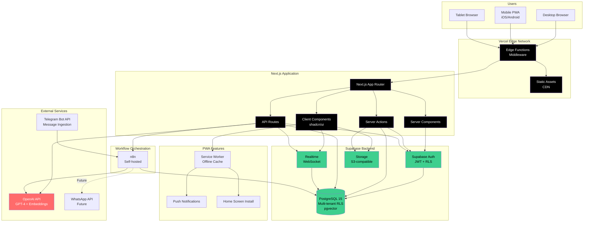
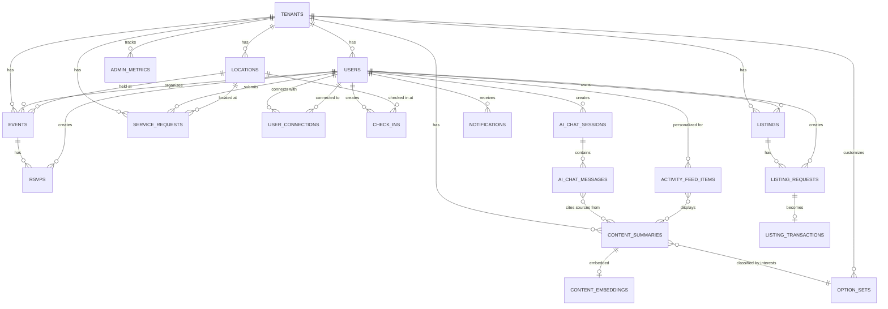

# Ecovilla Community Platform - Fullstack Architecture Document

**Version:** 2.1  
**Last Updated:** October 6, 2025  
**Status:** In Progress

---

## Introduction

This document outlines the complete fullstack architecture for the Ecovilla Community Platform, including backend systems, frontend implementation, and their integration. It serves as the single source of truth for AI-driven development, ensuring consistency across the entire technology stack.

This unified approach combines what would traditionally be separate backend and frontend architecture documents, streamlining the development process for modern fullstack applications where these concerns are increasingly intertwined.

### Change Log

| Date | Version | Description | Author |
|------|---------|-------------|--------|
| 2025-10-05 | 1.0 | Initial architecture draft | Winston |
| 2025-10-05 | 2.0 | Revised to Next.js + shadcn/ui, comprehensive stack definition | Winston |
| 2025-10-06 | 2.1 | Added complete Data Models section with option sets and new features | Winston |

### Starter Template Decision

**Decision:** No starter template. Building from scratch with Next.js 14.

**Rationale:** 
- The project has highly specific requirements (multi-tenancy, AI integration, real-time features)
- Design specification is extremely detailed with custom component architecture
- Using shadcn/ui's copy-paste philosophy allows precise control
- Supabase integration requires custom setup anyway

**Constraints:**
- Must manually configure all tooling, build pipeline, and deployment
- Full control over every architectural decision
- Longer initial setup but better long-term flexibility

---

## High Level Architecture

### Technical Summary

The Ecovilla Community Platform is a **modern web application** built with Next.js 15 and React, employing a mobile-first responsive design that delivers an exceptional experience across all devices. The architecture leverages **Next.js App Router** for optimal performance through server-side rendering, static generation, and streaming, while **shadcn/ui components** provide a sophisticated, accessible UI layer following the detailed design specification.

The backend utilizes **Supabase** for managed PostgreSQL database with Row Level Security for multi-tenancy, authentication, real-time subscriptions, and file storage, complemented by **Next.js Server Actions and API Routes** for custom business logic. An AI-powered assistant integrates with **OpenAI's GPT-4** for chat-based knowledge access with RAG (Retrieval Augmented Generation) using Supabase's pgvector extension. 

The application deploys as a **Progressive Web App (PWA)** via Vercel's edge network, providing mobile-optimized access with offline support, push notifications, and home screen installation—with a clear path to native apps post-MVP. This architecture achieves the PRD's goals of scalability (300 families/~800 users), performance (<3s load times, 99.5%+ uptime), and multi-tenant SaaS readiness while perfectly aligning with the detailed design specification.

### Platform and Infrastructure Choice

**Platform:** Next.js + Supabase + Vercel

**Key Services:**
- **Next.js 15+**: React framework with App Router, Server Components, Server Actions, streaming SSR, static generation
- **Vercel**: Hosting platform, edge network CDN, serverless functions, automatic deployments
- **Supabase**: PostgreSQL 15.x database, Row Level Security (RLS), Supabase Auth, Supabase Storage, Supabase Realtime
- **n8n (self-hosted)**: Workflow automation engine for Telegram integration, message processing, and future external integrations
- **OpenAI API**: GPT-4 for AI assistant chat, GPT-3.5-turbo for message classification, text-embedding-3-large for RAG embeddings
- **Telegram Bot API**: Scheduled message ingestion from interest-based community groups
- **Vercel KV (Redis)**: In-memory caching for session data and rate limiting

**Deployment Host and Regions:**
- **Vercel (Web App)**: Global Edge Network (300+ locations worldwide)
- **Supabase**: AWS `us-east-1` (N. Virginia) initially, can add regions as needed
- **n8n**: Self-hosted (user's existing infrastructure) - webhook endpoint must be publicly accessible
- **PWA**: Installable on all platforms via modern browsers

**Rationale:**
- Next.js + Vercel provide industry-leading performance (Core Web Vitals optimization)
- Server Components reduce JavaScript bundle size dramatically
- Vercel's edge network ensures <3s load times globally (NFR1)
- PWA capabilities provide mobile-app-like experience without app stores
- Supabase RLS provides secure, scalable multi-tenancy (TA2)
- **n8n integration enables scheduled Telegram message ingestion and AI-powered processing** - core value proposition bridging existing community communication with new platform
- **n8n integration enables scheduled Telegram message ingestion and AI-powered processing** - core value proposition bridging existing community communication with new platform
- Cost-effective for MVP with transparent scaling (~$25/month for Telegram processing)

### Repository Structure

**Structure:** Monorepo

**Monorepo Tool:** Turborepo

**Package Organization:**
```
ecovilla-platform/
├── apps/
│   ├── web/                    # Next.js 15 application
│   └── docs/                   # Documentation site (future)
├── packages/
│   ├── ui/                     # shadcn/ui components + custom components
│   ├── database/               # Database schemas, migrations, types
│   ├── shared/                 # Shared utilities, validation (Zod), constants
│   └── config/                 # Shared tooling configs (ESLint, TypeScript, Tailwind)
├── infrastructure/             # OpenTofu configurations (minimal)
└── scripts/                    # Build and deployment scripts
```

**Rationale:**
- Simpler structure for web-focused architecture
- `ui` package centralizes all shadcn components + design system
- `database` package manages Supabase schema and type generation
- Future-ready for additional apps (admin dashboard, docs site)
- Infrastructure tracked in version control with OpenTofu

### High Level Architecture Diagram



### Architectural Patterns

- **Server-First Architecture with Streaming:** Next.js App Router prioritizes Server Components for initial render, progressively enhancing with Client Components. Server Actions handle mutations. _Rationale:_ Minimizes JavaScript sent to client, improves Core Web Vitals, reduces bundle size for mobile (<150KB target).

- **Progressive Web App (PWA):** Service workers cache assets and API responses, enable offline functionality, support push notifications and home screen installation. _Rationale:_ Provides native-app-like experience on mobile without app store deployment, meets mobile-first requirement (NFR1).

- **Multi-Tenant Architecture with RLS:** PostgreSQL Row Level Security policies automatically filter all queries by `tenant_id` based on JWT claims. _Rationale:_ Secure, performant multi-tenancy foundation for SaaS (TA2), eliminates application-layer filtering complexity.

- **Optimistic UI with Server Actions:** Client updates state immediately, Server Actions sync to database in background with automatic revalidation. _Rationale:_ Instant perceived performance (<3s), graceful offline handling, better UX.

- **Real-time Subscriptions:** Supabase Realtime WebSocket connections for live check-ins, notifications, feed updates. Client subscribes to specific tables/filters. _Rationale:_ Core requirement for map features and community awareness (NFR4: <30s notification latency).

- **Component-Based Design System:** shadcn/ui primitives extended with custom components following Atomic Design (atoms → molecules → organisms) as defined in design spec. _Rationale:_ Matches detailed design specification, ensures consistency, leverages proven accessible components (Radix UI).

- **Repository Pattern for Data Access:** All database interactions abstracted through typed repository functions using Supabase client, never raw SQL in components. _Rationale:_ Type safety, testability, consistent error handling, enables future database migration.

- **AI Assistant as RAG-Powered Orchestrator:** Chat interface queries embedded knowledge base (pgvector), combines with GPT-4 for contextual responses and action suggestions. Uses streaming for real-time response display. _Rationale:_ FR4 requirement, provides intelligent knowledge access without traditional KB UI.

- **Structured Workflow Pattern (No Direct Messaging):** All interactions through typed workflows (exchange requests, event RSVPs, service requests) with state machines tracked in database. _Rationale:_ Explicit PRD requirement, reduces communication overhead, maintains focus on coordination vs chat.

- **Event-Driven Integration with n8n:** Telegram message ingestion via Bot API webhooks → n8n workflows orchestrate: (1) real-time storage in PostgreSQL, (2) daily batch classification by interest area (GPT-3.5-turbo), (3) daily summarization per interest (GPT-4), (4) embedding generation for RAG search (text-embedding-3-large). _Rationale:_ Core MVP feature enabling interest-based home feed summaries from existing Telegram groups (FR10), enriches AI assistant with real community conversation context, bridges existing communication tools with new platform.

---

## Tech Stack

**DEFINITIVE Technology Selection**

This table is the **single source of truth** for all technology choices. Every version is pinned specifically. All development must use these exact versions.

| Category | Technology | Version | Purpose | Rationale |
|----------|-----------|---------|---------|-----------|
| **Frontend Language** | TypeScript | 5.3.x | Type-safe development | Prevents runtime errors, excellent IDE support, required for shadcn/ui |
| **Frontend Framework** | Next.js | 15.x | React framework with App Router | Server Components, streaming SSR, optimized performance, Vercel integration |
| **React** | React | 18.3.x | UI library | Required by Next.js, Server Components support |
| **UI Component Library** | shadcn/ui | Latest | Accessible component primitives | Matches design spec, Radix UI foundation, copy-paste philosophy |
| **UI Primitives** | Radix UI | 1.x | Headless accessible components | Foundation for shadcn/ui, WCAG AA compliant |
| **Extended Components** | ReactBits, Skiper UI, Cult UI, Magic UI | Latest | Advanced UI patterns | Per design spec for animations, forms, interactions |
| **Icons** | Lucide React | 0.263.x | Icon system | Per design spec, 1000+ icons, tree-shakeable |
| **Styling** | Tailwind CSS | 3.4.x | Utility-first CSS | Core to shadcn/ui, design spec foundation |
| **State Management** | Zustand | 4.5.x | Client-side state | Lightweight, simple API, no boilerplate |
| **Server State** | TanStack Query | 5.x | Async state management | Caching, refetching, optimistic updates for Supabase data |
| **Forms** | React Hook Form | 7.51.x | Form management | Performance, DX, integrates with Zod |
| **Validation** | Zod | 3.22.x | Schema validation | Type-safe validation, shared frontend/backend |
| **Date Handling** | date-fns | 3.x | Date utilities | Lightweight, tree-shakeable |
| **Animation** | Framer Motion | 11.x | UI animations | Declarative animations, spring physics, per design spec |
| **Charts/Viz** | Recharts | 2.12.x | Data visualization | React-first, for admin analytics if needed |
| **Backend Language** | TypeScript | 5.3.x | Type-safe APIs | Consistent with frontend |
| **API Framework** | Next.js API Routes + Server Actions | 15.x | Backend logic | Integrated with Next.js, serverless-ready |
| **Database** | PostgreSQL | 15.x | Primary database | Via Supabase, ACID compliance, mature ecosystem |
| **Database Client** | Supabase JS Client | 2.x | Database access | Auto-generated types, RLS support, realtime |
| **ORM/Query Builder** | Supabase (PostgREST) | Latest | API layer | Auto-generated REST API from PostgreSQL schema |
| **Database Migrations** | Supabase CLI | 1.x | Schema management | Version-controlled migrations |
| **Vector Database** | pgvector | 0.5.x | AI embeddings | PostgreSQL extension via Supabase, for RAG |
| **Cache** | Vercel KV (Redis) | Latest | In-memory cache | Session data, rate limiting, temporary data |
| **File Storage** | Supabase Storage | Latest | User-uploaded files | S3-compatible, RLS-protected, CDN integration |
| **Authentication** | Supabase Auth | Latest | User authentication | Email/password, magic links, OAuth, JWT tokens |
| **Authorization** | PostgreSQL RLS | 15.x | Row-level security | Multi-tenant data isolation, policy-based access |
| **Real-time** | Supabase Realtime | Latest | Live updates | WebSocket, PostgreSQL change subscriptions |
| **AI/LLM** | OpenAI API | Latest | AI assistant | GPT-4 for chat, text-embedding-3-large for RAG |
| **Vector Search** | pgvector | 0.5.x | Semantic search | Cosine similarity for RAG knowledge retrieval |
| **Workflow Automation** | n8n | Latest (self-hosted) | Integration workflows | **MVP Core**: Telegram ingestion, message classification, summarization, embeddings, future Google Sheets/WhatsApp |
| **External Messaging** | Telegram Bot API | Latest | Message ingestion | **MVP Core**: Real-time message capture from interest-based groups |
| **Frontend Testing** | Vitest | 1.x | Unit/component tests | Fast, Vite-native, Jest-compatible API |
| **React Testing** | Testing Library | 14.x | Component testing | User-centric testing, accessibility focus |
| **E2E Testing** | Playwright | 1.42.x | End-to-end tests | Multi-browser, reliable, great DX |
| **Code Quality** | ESLint | 8.x | Linting | Code quality, Next.js config |
| **Code Formatting** | Prettier | 3.x | Code formatting | Consistent style |
| **Git Hooks** | Husky | 9.x | Pre-commit checks | Enforce linting, tests before commit |
| **Commit Linting** | Commitlint | 18.x | Commit message format | Conventional commits |
| **Package Manager** | pnpm | 8.x | Dependency management | Fast, efficient, monorepo support |
| **Monorepo Tool** | Turborepo | 1.12.x | Build orchestration | Caching, parallel execution |
| **Deployment** | Vercel | Latest | Hosting platform | Zero-config Next.js, edge functions, analytics |
| **CI/CD** | GitHub Actions | Latest | Continuous integration | Automated testing, deployments |
| **IaC** | OpenTofu | 1.6.x | Infrastructure as code | Open-source Terraform alternative, minimal usage |
| **Monitoring** | Vercel Analytics | Latest | Performance monitoring | Real User Monitoring, Web Vitals |
| **Error Tracking** | Vercel built-in | Latest | Error monitoring | Basic error tracking for MVP |
| **Logging** | Vercel Logs + Supabase Logs | Latest | Application logging | Centralized logging |
| **API Documentation** | TypeDoc | 0.25.x | Code documentation | Auto-generated from TypeScript |
| **PWA** | next-pwa | 5.6.x | Progressive Web App | Service worker, offline, installable |
| **Push Notifications** | Web Push API | Native | Mobile notifications | Browser-native push (PWA) |
| **Image Optimization** | Next.js Image | 15.x | Image optimization | Automatic WebP, lazy loading, responsive |
| **SEO** | Next.js Metadata API | 15.x | SEO optimization | Dynamic meta tags, OG images |

---

## Data Models

### Overview

The Ecovilla platform data model is organized into **7 core domains**:

1. **Tenant & User Domain** - Multi-tenancy, user management, profiles, connections
2. **Location & Community Domain** - Physical locations, check-ins, spatial features
3. **Events Domain** - Community events, RSVPs, calendar
4. **Exchange Domain** - Listings, requests, transactions, resource sharing
5. **Service Requests Domain** - Community service requests and management
6. **Telegram Integration Domain** - Message ingestion, classification, knowledge extraction
7. **AI & System Domain** - AI chat sessions, knowledge base, system entities

All entities include **multi-tenant isolation** via `tenant_id` and are protected by PostgreSQL Row Level Security (RLS) policies.

---

### Domain 1: Tenant & User Management

#### 1.1 Tenant

**Purpose:** Represents a community instance (Ecovilla San Mateo, future communities). Foundation for SaaS multi-tenancy.

**Key Attributes:**

```typescript
interface Tenant {
  id: string;                    // uuid, primary key
  name: string;                  // Community name
  slug: string;                  // URL-safe identifier (unique)
  domain?: string;               // Custom domain (optional)
  status: 'active' | 'suspended' | 'trial';
  settings: {
    timezone: string;            // e.g., "America/Costa_Rica"
    locale: string;              // e.g., "en-US", "es-CR"
    features: {
      ai_assistant: boolean;
      telegram_integration: boolean;
      exchange: boolean;
      events: boolean;
      service_requests: boolean;
    };
    branding?: {
      logo_url: string;
      primary_color: string;
      accent_color: string;
    };
  };
  created_at: string;
  updated_at: string;
}
```

**Database Schema:**

```sql
CREATE TABLE tenants (
  id uuid PRIMARY KEY DEFAULT gen_random_uuid(),
  name text NOT NULL,
  slug text UNIQUE NOT NULL,
  domain text UNIQUE,
  status text NOT NULL DEFAULT 'active',
  settings jsonb NOT NULL DEFAULT '{}',
  created_at timestamptz DEFAULT now(),
  updated_at timestamptz DEFAULT now()
);
```

#### 1.2 User

**Purpose:** Represents a community resident or admin. Foundation for authentication and authorization.

**Key Attributes:**

```typescript
interface User {
  id: string;                    // uuid, matches Supabase auth.users.id
  tenant_id: string;             // Foreign key to tenants
  email: string;                 // Primary email (unique within tenant)
  full_name: string;
  display_name?: string;         // Nickname if different from full_name
  avatar_url?: string;
  phone?: string;
  preferred_language: 'en' | 'es';
  journey_stage: 'newcomer' | 'settled_resident' | 'coordinator';
  role: 'resident' | 'coordinator' | 'admin' | 'super_admin';
  lot_assignment?: string;       // Lot number or identifier
  bio?: string;                  // Max 280 characters
  interests: string[];           // Array of interest IDs
  skills: string[];              // Array of skill tags
  privacy_settings: {
    map_visibility: boolean;     // Show on community map
    profile_visibility: 'public' | 'community_only' | 'private';
    show_email: boolean;
    show_phone: boolean;
  };
  notification_preferences: {
    push_enabled: boolean;
    email_digest: 'daily' | 'weekly' | 'never';
    event_reminders: boolean;
    exchange_requests: boolean;
    check_in_nearby: boolean;
  };
  status: 'active' | 'pending' | 'inactive';
  last_active_at?: string;
  created_at: string;
  updated_at: string;
}
```

**Database Schema:**

```sql
CREATE TABLE users (
  id uuid PRIMARY KEY REFERENCES auth.users(id),
  tenant_id uuid NOT NULL REFERENCES tenants(id),
  email text NOT NULL,
  full_name text NOT NULL,
  display_name text,
  avatar_url text,
  phone text,
  preferred_language text DEFAULT 'en',
  journey_stage text DEFAULT 'newcomer',
  role text DEFAULT 'resident',
  lot_assignment text,
  bio text,
  interests text[] DEFAULT '{}',
  skills text[] DEFAULT '{}',
  privacy_settings jsonb NOT NULL DEFAULT '{}',
  notification_preferences jsonb NOT NULL DEFAULT '{}',
  status text DEFAULT 'active',
  last_active_at timestamptz,
  created_at timestamptz DEFAULT now(),
  updated_at timestamptz DEFAULT now(),
  UNIQUE(tenant_id, email)
);
```

**RLS Policies:**

```sql
-- Users can view other users in their tenant
CREATE POLICY "Tenant members view users"
ON users FOR SELECT
USING (tenant_id = (SELECT tenant_id FROM users WHERE id = auth.uid()));

-- Users can only update their own profile
CREATE POLICY "Users update own profile"
ON users FOR UPDATE
USING (id = auth.uid());
```

#### 1.3 UserConnection (NEW)

**Purpose:** Represents connections between residents, enabling private invites to events and check-ins.

**Key Attributes:**

```typescript
interface UserConnection {
  id: string;
  tenant_id: string;
  user_id: string;               // Requester
  connected_user_id: string;     // Recipient
  status: 'pending' | 'accepted' | 'declined' | 'blocked';
  created_at: string;
  updated_at: string;
}
```

**Database Schema:**

```sql
CREATE TABLE user_connections (
  id uuid PRIMARY KEY DEFAULT gen_random_uuid(),
  tenant_id uuid NOT NULL REFERENCES tenants(id),
  user_id uuid NOT NULL REFERENCES users(id),
  connected_user_id uuid NOT NULL REFERENCES users(id),
  status text NOT NULL DEFAULT 'pending',
  created_at timestamptz DEFAULT now(),
  updated_at timestamptz DEFAULT now(),
  UNIQUE(user_id, connected_user_id),
  CHECK (user_id != connected_user_id)
);
```

**Relationships:**
- Belongs to a Tenant
- Belongs to two Users (bidirectional)
- Used for filtering visibility (check-ins, private events)

---

### Domain 2: Location & Community

#### 2.1 Location

**Purpose:** Represents physical locations within the community for map pins and check-ins.

**Key Attributes:**

```typescript
interface Location {
  id: string;
  tenant_id: string;
  name: string;                  // e.g., "Community Center", "Tool Library"
  type: string;                  // Option set ID (defined in option_sets table)
  description: string;
  latitude: number;
  longitude: number;
  address?: string;              // OPTIONAL - not used in Costa Rica
  photo_url?: string;
  amenities: string[];           // e.g., ["wifi", "restrooms", "parking"]
  hours?: {
    [day: string]: { open: string; close: string } | 'closed';
  };
  capacity?: number;
  status: 'accessible' | 'temporarily_unavailable' | 'under_construction';
  created_by: string;
  created_at: string;
  updated_at: string;
}
```

**Database Schema:**

```sql
CREATE TABLE locations (
  id uuid PRIMARY KEY DEFAULT gen_random_uuid(),
  tenant_id uuid NOT NULL REFERENCES tenants(id),
  name text NOT NULL,
  type text NOT NULL,            -- References option_sets
  description text NOT NULL,
  latitude numeric NOT NULL,
  longitude numeric NOT NULL,
  address text,                  -- Optional
  photo_url text,
  amenities text[] DEFAULT '{}',
  hours jsonb,
  capacity integer,
  status text NOT NULL DEFAULT 'accessible',
  created_by uuid NOT NULL REFERENCES users(id),
  created_at timestamptz DEFAULT now(),
  updated_at timestamptz DEFAULT now()
);
```

**Relationships:**
- Belongs to a Tenant
- Has many CheckIns
- Has many Events

**Option Set (location_type):**
- To be defined in option_sets table
- Examples: facility, gathering_spot, service_area, outdoor_space, custom

#### 2.2 CheckIn

**Purpose:** User checking in at a location to share presence with community.

**Key Attributes:**

```typescript
interface CheckIn {
  id: string;
  tenant_id: string;
  user_id: string;
  location_id: string;
  activity_description: string;  // Max 280 chars
  visibility: 'everyone' | 'connections' | 'specific_neighborhood' | 'selected_users';
  selected_user_ids?: string[];  // If visibility = 'selected_users'
  duration_minutes: number;
  expires_at: string;            // Auto-calculated from duration
  is_expired: boolean;           // Computed field for queries
  latitude: number;              // Actual GPS (may differ from location)
  longitude: number;
  responses: CheckInResponse[];  // Auto-responses from other users
  created_at: string;
}

interface CheckInResponse {
  user_id: string;
  response: 'on_my_way' | 'be_in_touch' | 'have_fun';
  created_at: string;
}
```

**Database Schema:**

```sql
CREATE TABLE check_ins (
  id uuid PRIMARY KEY DEFAULT gen_random_uuid(),
  tenant_id uuid NOT NULL REFERENCES tenants(id),
  user_id uuid NOT NULL REFERENCES users(id),
  location_id uuid NOT NULL REFERENCES locations(id),
  activity_description text NOT NULL,
  visibility text NOT NULL DEFAULT 'everyone',
  selected_user_ids uuid[],
  duration_minutes integer NOT NULL,
  expires_at timestamptz NOT NULL,
  is_expired boolean GENERATED ALWAYS AS (expires_at < now()) STORED,
  latitude numeric NOT NULL,
  longitude numeric NOT NULL,
  responses jsonb DEFAULT '[]',
  created_at timestamptz DEFAULT now()
);

CREATE INDEX idx_check_ins_active ON check_ins (tenant_id, is_expired)
WHERE is_expired = false;
```

**Relationships:**
- Belongs to a User
- Belongs to a Location
- Belongs to a Tenant

**RLS Policy:**

```sql
-- Users see check-ins based on visibility rules
CREATE POLICY "Users see check-ins based on visibility"
ON check_ins FOR SELECT
USING (
  tenant_id = (SELECT tenant_id FROM users WHERE id = auth.uid())
  AND is_expired = false
  AND (
    visibility = 'everyone'
    OR (visibility = 'connections' AND EXISTS (
      SELECT 1 FROM user_connections 
      WHERE (user_id = auth.uid() AND connected_user_id = check_ins.user_id)
         OR (connected_user_id = auth.uid() AND user_id = check_ins.user_id)
      AND status = 'accepted'
    ))
    OR (visibility = 'selected_users' AND auth.uid() = ANY(selected_user_ids))
    OR user_id = auth.uid()
  )
);
```

**Note:** Expired check-ins are kept for metrics/insights (not deleted).

---

### Domain 3: Events

#### 3.1 Event

**Purpose:** Community events (official and resident-created).

**Key Attributes:**

```typescript
interface Event {
  id: string;
  tenant_id: string;
  title: string;
  description: string;           // Markdown supported
  category: string;              // Option set ID
  event_type: 'official_community_wide' | 'official_neighborhood' | 'resident_event';
  start_time: string;
  end_time: string;
  is_all_day: boolean;
  location_id?: string;
  custom_location?: string;      // If not using location_id
  photo_url?: string;
  created_by: string;            // Organizer
  rsvp_enabled: boolean;
  max_attendees?: number;
  rsvp_deadline?: string;
  allow_guests: boolean;
  status: 'draft' | 'published' | 'cancelled';
  moderation_status: 'published' | 'flagged' | 'under_review';
  created_at: string;
  updated_at: string;
}
```

**Database Schema:**

```sql
CREATE TABLE events (
  id uuid PRIMARY KEY DEFAULT gen_random_uuid(),
  tenant_id uuid NOT NULL REFERENCES tenants(id),
  title text NOT NULL,
  description text NOT NULL,
  category text NOT NULL,        -- References option_sets
  event_type text NOT NULL,
  start_time timestamptz NOT NULL,
  end_time timestamptz NOT NULL,
  is_all_day boolean DEFAULT false,
  location_id uuid REFERENCES locations(id),
  custom_location text,
  photo_url text,
  created_by uuid NOT NULL REFERENCES users(id),
  rsvp_enabled boolean DEFAULT true,
  max_attendees integer,
  rsvp_deadline timestamptz,
  allow_guests boolean DEFAULT false,
  status text DEFAULT 'published',
  moderation_status text DEFAULT 'published',
  created_at timestamptz DEFAULT now(),
  updated_at timestamptz DEFAULT now()
);
```

**Relationships:**
- Belongs to a Tenant
- Belongs to a User (creator/organizer)
- Optionally belongs to a Location
- Has many RSVPs

**Auto-Publication Rule:**
- All events (including resident-created) are auto-published (status = 'published')
- Admins review post-publication if needed

**Option Set (event_category):**
- To be defined in option_sets table
- Examples: social, governance, workshop, sports, culture, wellness, work_party, other

#### 3.2 RSVP

**Purpose:** Event attendance tracking.

**Key Attributes:**

```typescript
interface RSVP {
  id: string;
  event_id: string;
  user_id: string;
  tenant_id: string;
  status: 'going' | 'maybe' | 'not_going';
  guest_count: number;
  notes?: string;
  created_at: string;
  updated_at: string;
}
```

**Database Schema:**

```sql
CREATE TABLE rsvps (
  id uuid PRIMARY KEY DEFAULT gen_random_uuid(),
  event_id uuid NOT NULL REFERENCES events(id),
  user_id uuid NOT NULL REFERENCES users(id),
  tenant_id uuid NOT NULL REFERENCES tenants(id),
  status text NOT NULL DEFAULT 'going',
  guest_count integer DEFAULT 0,
  notes text,
  created_at timestamptz DEFAULT now(),
  updated_at timestamptz DEFAULT now(),
  UNIQUE(event_id, user_id)
);
```

**Relationships:**
- Belongs to an Event
- Belongs to a User
- Unique constraint: one RSVP per user per event

---

### Domain 4: Exchange

#### 4.1 Listing

**Purpose:** Items, services, produce, products, rides available in community exchange.

**Key Attributes:**

```typescript
interface Listing {
  id: string;
  tenant_id: string;
  title: string;
  description: string;
  type: 'tool' | 'produce' | 'service' | 'product' | 'ride' | 'other';
  category: string;              // Option set ID (depends on type)
  owner_id: string;
  photos: string[];
  condition?: 'new' | 'like_new' | 'good' | 'fair' | 'for_parts'; // Only for physical items
  
  // CONDITIONAL FIELDS (only for borrowable items like tools)
  availability_start?: string;   // Only for tools/borrowable items
  availability_end?: string;     // Only for tools/borrowable items
  max_borrow_days?: number;      // Only for tools/borrowable items
  deposit_required?: boolean;    // Only for tools/borrowable items
  deposit_amount?: number;       // Only for tools/borrowable items
  
  quantity: number;
  pickup_location: string;
  delivery_available: boolean;
  
  // PRICING
  is_free: boolean;              // Toggle
  price?: number;                // If not free
  
  status: 'available' | 'reserved' | 'borrowed' | 'unavailable';
  moderation_status: 'published' | 'flagged' | 'under_review' | 'unlisted';
  created_at: string;
  updated_at: string;
}
```

**Database Schema:**

```sql
CREATE TABLE listings (
  id uuid PRIMARY KEY DEFAULT gen_random_uuid(),
  tenant_id uuid NOT NULL REFERENCES tenants(id),
  title text NOT NULL,
  description text NOT NULL,
  type text NOT NULL,
  category text NOT NULL,        -- References option_sets
  owner_id uuid NOT NULL REFERENCES users(id),
  photos text[] DEFAULT '{}',
  condition text,
  
  -- Conditional fields
  availability_start date,
  availability_end date,
  max_borrow_days integer,
  deposit_required boolean,
  deposit_amount numeric,
  
  quantity integer NOT NULL DEFAULT 1,
  pickup_location text NOT NULL,
  delivery_available boolean DEFAULT false,
  
  -- Pricing
  is_free boolean DEFAULT true,
  price numeric,
  
  status text DEFAULT 'available',
  moderation_status text DEFAULT 'published',
  created_at timestamptz DEFAULT now(),
  updated_at timestamptz DEFAULT now()
);
```

**Relationships:**
- Belongs to a Tenant
- Belongs to a User (owner)
- Has many ListingRequests

**Option Sets by Type:**
- **tool**: power_tools, hand_tools, garden_tools, etc.
- **produce**: fruit, vegetables, baked_goods, eggs, dairy, etc.
- **service**: tutoring, massage, cleaning, gardening, etc.
- **product**: clothing, furniture, electronics, books, etc.
- **ride**: rideshare, carpool, airport_ride, etc.
- **other**: miscellaneous

**Field Logic:**
- `condition`, `availability_start`, `availability_end`, `max_borrow_days`, `deposit_required`, `deposit_amount` only shown for `type = 'tool'` or other borrowable items
- `price` only shown if `is_free = false`

#### 4.2 ListingRequest

**Purpose:** Request to borrow/use a listing (structured workflow).

**Key Attributes:**

```typescript
interface ListingRequest {
  id: string;
  listing_id: string;
  requester_id: string;
  tenant_id: string;
  preferred_start_date: string;
  preferred_end_date: string;
  message?: string;              // Max 250 chars
  status: 'pending' | 'approved' | 'declined' | 'cancelled';
  owner_response?: string;
  responded_at?: string;
  created_at: string;
  updated_at: string;
}
```

**Database Schema:**

```sql
CREATE TABLE listing_requests (
  id uuid PRIMARY KEY DEFAULT gen_random_uuid(),
  listing_id uuid NOT NULL REFERENCES listings(id),
  requester_id uuid NOT NULL REFERENCES users(id),
  tenant_id uuid NOT NULL REFERENCES tenants(id),
  preferred_start_date date NOT NULL,
  preferred_end_date date NOT NULL,
  message text,
  status text DEFAULT 'pending',
  owner_response text,
  responded_at timestamptz,
  created_at timestamptz DEFAULT now(),
  updated_at timestamptz DEFAULT now()
);
```

**Relationships:**
- Belongs to a Listing
- Belongs to a User (requester)
- Can become a ListingTransaction (when approved)

#### 4.3 ListingTransaction

**Purpose:** Tracks borrow/lend cycle after request approval.

**Key Attributes:**

```typescript
interface ListingTransaction {
  id: string;
  listing_request_id: string;
  listing_id: string;
  owner_id: string;
  borrower_id: string;
  tenant_id: string;
  start_date: string;
  due_date: string;
  returned_date?: string;
  deposit_held: number;
  deposit_released: boolean;
  borrower_confirmed_pickup: boolean;
  borrower_confirmed_return: boolean;
  owner_confirmed_return: boolean;
  condition_on_return?: 'good' | 'damaged' | 'lost';
  notes?: string;
  status: 'active' | 'completed' | 'overdue' | 'disputed';
  created_at: string;
  updated_at: string;
}
```

**Database Schema:**

```sql
CREATE TABLE listing_transactions (
  id uuid PRIMARY KEY DEFAULT gen_random_uuid(),
  listing_request_id uuid NOT NULL REFERENCES listing_requests(id),
  listing_id uuid NOT NULL REFERENCES listings(id),
  owner_id uuid NOT NULL REFERENCES users(id),
  borrower_id uuid NOT NULL REFERENCES users(id),
  tenant_id uuid NOT NULL REFERENCES tenants(id),
  start_date date NOT NULL,
  due_date date NOT NULL,
  returned_date date,
  deposit_held numeric DEFAULT 0,
  deposit_released boolean DEFAULT false,
  borrower_confirmed_pickup boolean DEFAULT false,
  borrower_confirmed_return boolean DEFAULT false,
  owner_confirmed_return boolean DEFAULT false,
  condition_on_return text,
  notes text,
  status text DEFAULT 'active',
  created_at timestamptz DEFAULT now(),
  updated_at timestamptz DEFAULT now()
);

-- Auto-update status to overdue
CREATE OR REPLACE FUNCTION update_overdue_transactions()
RETURNS void AS $
BEGIN
  UPDATE listing_transactions
  SET status = 'overdue'
  WHERE status = 'active'
    AND due_date < CURRENT_DATE
    AND returned_date IS NULL;
END;
$ LANGUAGE plpgsql;
```

**Relationships:**
- Belongs to a ListingRequest
- Belongs to a Listing
- Belongs to User (owner and borrower)

---

### Domain 5: Service Requests

#### 5.1 ServiceRequest

**Purpose:** Residents submit requests for community services (maintenance, infrastructure, etc.).

**Key Attributes:**

```typescript
interface ServiceRequest {
  id: string;
  tenant_id: string;
  submitted_by: string;
  category: string;              // Option set ID (triggers n8n workflows)
  title: string;
  description: string;
  location_id?: string;          // Location from map
  location_latitude?: number;    // Or pin on map
  location_longitude?: number;
  priority: 'low' | 'medium' | 'high' | 'urgent';
  photos: string[];
  status: 'submitted' | 'in_review' | 'in_progress' | 'resolved' | 'closed';
  assigned_to?: string;          // Auto-mapped based on category
  admin_notes?: string;          // Internal only
  resolution_notes?: string;     // Visible to requester
  resolved_at?: string;
  created_at: string;
  updated_at: string;
}
```

**Database Schema:**

```sql
CREATE TABLE service_requests (
  id uuid PRIMARY KEY DEFAULT gen_random_uuid(),
  tenant_id uuid NOT NULL REFERENCES tenants(id),
  submitted_by uuid NOT NULL REFERENCES users(id),
  category text NOT NULL,        -- References option_sets
  title text NOT NULL,
  description text NOT NULL,
  location_id uuid REFERENCES locations(id),
  location_latitude numeric,
  location_longitude numeric,
  priority text DEFAULT 'medium',
  photos text[] DEFAULT '{}',
  status text DEFAULT 'submitted',
  assigned_to uuid REFERENCES users(id),
  admin_notes text,
  resolution_notes text,
  resolved_at timestamptz,
  created_at timestamptz DEFAULT now(),
  updated_at timestamptz DEFAULT now()
);
```

**Relationships:**
- Belongs to a Tenant
- Belongs to a User (submitter)
- Optionally belongs to a Location
- Optionally assigned to a User (admin/coordinator)

**Option Set (service_request_category):**
- To be defined based on community processes
- Each category can trigger specific n8n workflows
- Examples: maintenance, infrastructure, landscaping, security, administrative

**Auto-Assignment Logic:**
- Category → assigned_to mapping (configurable in option_sets)
- Can trigger n8n workflows for external tool integration (Google Sheets, etc.)

---

### Domain 6: Content & Summaries (n8n Integration Output)

#### 6.1 ContentSummary

**Purpose:** Stores n8n-generated summaries from Telegram groups for home feed display and AI Assistant context.

**Key Attributes:**

```typescript
interface ContentSummary {
  id: string;
  tenant_id: string;
  interest_area: string;         // Option set ID (user interests)
  timeframe: 'daily' | 'weekly' | 'monthly';
  summary_date: string;          // Date/period covered
  summary_text: string;          // n8n/GPT-4 generated summary
  key_topics: string[];          // Extracted topics
  contributors: Contributor[];   // Users who participated
  links: ExternalLink[];         // Referenced URLs (PDFs, docs, Telegram links)
  source_group_name: string;     // Original Telegram group
  message_count: number;         // Number of messages summarized
  created_at: string;
  updated_at: string;
}

interface Contributor {
  username: string;              // Telegram @username
  display_name: string;
  message_count: number;
}

interface ExternalLink {
  url: string;
  title?: string;
  type: 'pdf' | 'document' | 'telegram_message' | 'website' | 'other';
  description?: string;
}
```

**Database Schema:**

```sql
CREATE TABLE content_summaries (
  id uuid PRIMARY KEY DEFAULT gen_random_uuid(),
  tenant_id uuid NOT NULL REFERENCES tenants(id),
  interest_area text NOT NULL,
  timeframe text NOT NULL,
  summary_date date NOT NULL,
  summary_text text NOT NULL,
  key_topics text[] DEFAULT '{}',
  contributors jsonb NOT NULL DEFAULT '[]',
  links jsonb NOT NULL DEFAULT '[]',
  source_group_name text NOT NULL,
  message_count integer NOT NULL DEFAULT 0,
  created_at timestamptz DEFAULT now(),
  updated_at timestamptz DEFAULT now(),
  UNIQUE(tenant_id, interest_area, timeframe, summary_date)
);

CREATE INDEX idx_content_summaries_interest 
ON content_summaries (tenant_id, interest_area, summary_date DESC);
```

**Relationships:**
- Belongs to a Tenant
- Referenced by ActivityFeedItems
- Referenced by ContentEmbeddings for AI search

**RLS Policy:**

```sql
-- All tenant members can view summaries
CREATE POLICY "Tenant members view summaries"
ON content_summaries FOR SELECT
USING (tenant_id = (SELECT tenant_id FROM users WHERE id = auth.uid()));
```

**Option Set (interest_area):**
- Matches user interest preferences
- Examples: sustainability, wellness, food_growing, community_life, skills_sharing, governance

**n8n Integration Notes:**
- n8n creates/updates these records daily/weekly/monthly
- Summary text includes: key conversations, decisions made, questions asked
- Contributors array tracks participation for gamification/recognition
- Links array enables click-through to original sources

#### 6.2 ContentEmbedding

**Purpose:** Vector embeddings for AI Assistant semantic search (RAG).

**Key Attributes:**

```typescript
interface ContentEmbedding {
  id: string;
  tenant_id: string;
  content_summary_id: string;    // Links to content_summaries
  embedding: number[];           // 1536-dimensional vector (text-embedding-3-large)
  created_at: string;
}
```

**Database Schema:**

```sql
CREATE EXTENSION IF NOT EXISTS vector;

CREATE TABLE content_embeddings (
  id uuid PRIMARY KEY DEFAULT gen_random_uuid(),
  tenant_id uuid NOT NULL REFERENCES tenants(id),
  content_summary_id uuid NOT NULL REFERENCES content_summaries(id) ON DELETE CASCADE,
  embedding vector(1536) NOT NULL,
  created_at timestamptz DEFAULT now(),
  UNIQUE(content_summary_id)
);

-- Create index for fast cosine similarity search
CREATE INDEX idx_content_embeddings_vector 
ON content_embeddings USING ivfflat (embedding vector_cosine_ops)
WITH (lists = 100);
```

**Relationships:**
- Belongs to a Tenant
- Belongs to a ContentSummary (one-to-one)
- Used by AI Assistant for semantic search

**RLS Policy:**

```sql
-- All tenant members can search embeddings
CREATE POLICY "Tenant members search embeddings"
ON content_embeddings FOR SELECT
USING (tenant_id = (SELECT tenant_id FROM users WHERE id = auth.uid()));
```

**AI Assistant Integration:**
- When user asks a question, generate query embedding
- Perform cosine similarity search in content_embeddings
- Return top 5 most relevant content_summaries
- GPT-4 uses summaries as context for response
- Citations include: summary date, interest area, source group, and links to original sources

---

### Domain 7: AI & System

#### 7.1 AIChatSession

**Purpose:** Tracks AI assistant chat sessions for conversation history and context.

**Key Attributes:**

```typescript
interface AIChatSession {
  id: string;
  tenant_id: string;
  user_id: string;
  title?: string;                // Auto-generated from first message
  created_at: string;
  updated_at: string;
}
```

**Database Schema:**

```sql
CREATE TABLE ai_chat_sessions (
  id uuid PRIMARY KEY DEFAULT gen_random_uuid(),
  tenant_id uuid NOT NULL REFERENCES tenants(id),
  user_id uuid NOT NULL REFERENCES users(id),
  title text,
  created_at timestamptz DEFAULT now(),
  updated_at timestamptz DEFAULT now()
);

CREATE INDEX idx_chat_sessions_user 
ON ai_chat_sessions (user_id, created_at DESC);
```

**Relationships:**
- Belongs to a Tenant
- Belongs to a User
- Has many AIChatMessages

**RLS Policy:**

```sql
-- Users can only see their own chat sessions
CREATE POLICY "Users view own chat sessions"
ON ai_chat_sessions FOR SELECT
USING (user_id = auth.uid());

-- Users can only create their own chat sessions
CREATE POLICY "Users create own chat sessions"
ON ai_chat_sessions FOR INSERT
WITH CHECK (user_id = auth.uid());
```

#### 7.2 AIChatMessage

**Purpose:** Stores messages in AI chat sessions with RAG citations.

**Key Attributes:**

```typescript
interface AIChatMessage {
  id: string;
  session_id: string;
  tenant_id: string;
  role: 'user' | 'assistant';
  content: string;
  sources?: RAGSource[];         // For assistant messages with citations
  created_at: string;
}

interface RAGSource {
  type: 'content_summary';       // Links to content_summaries
  summary_id: string;
  interest_area: string;
  summary_date: string;
  excerpt: string;               // Relevant portion of summary
  links?: string[];              // URLs from summary.links
}
```

**Database Schema:**

```sql
CREATE TABLE ai_chat_messages (
  id uuid PRIMARY KEY DEFAULT gen_random_uuid(),
  session_id uuid NOT NULL REFERENCES ai_chat_sessions(id) ON DELETE CASCADE,
  tenant_id uuid NOT NULL REFERENCES tenants(id),
  role text NOT NULL,
  content text NOT NULL,
  sources jsonb,
  created_at timestamptz DEFAULT now()
);

CREATE INDEX idx_chat_messages_session 
ON ai_chat_messages (session_id, created_at ASC);
```

**Relationships:**
- Belongs to an AIChatSession
- Belongs to a Tenant
- References ContentSummary via sources (for citations)

**RLS Policy:**

```sql
-- Users can only see messages from their own sessions
CREATE POLICY "Users view own chat messages"
ON ai_chat_messages FOR SELECT
USING (
  session_id IN (
    SELECT id FROM ai_chat_sessions WHERE user_id = auth.uid()
  )
);

-- Users can only create messages in their own sessions
CREATE POLICY "Users create own chat messages"
ON ai_chat_messages FOR INSERT
WITH CHECK (
  session_id IN (
    SELECT id FROM ai_chat_sessions WHERE user_id = auth.uid()
  )
);
```

**AI RAG Integration:**
- User query → generate embedding
- Search content_embeddings for similar vectors
- Retrieve top 5 content_summaries
- GPT-4 uses summaries as context
- Response includes sources with citations to original Telegram content

#### 7.3 OptionSet

**Purpose:** Centralized option set definitions for dropdowns, categories, and configurable lists.

**Key Attributes:**

```typescript
interface OptionSet {
  id: string;
  tenant_id?: string;            // null = global option set
  set_name: string;              // e.g., "location_type", "event_category"
  options: OptionSetItem[];
  created_at: string;
  updated_at: string;
}

interface OptionSetItem {
  id: string;
  label: string;
  value: string;
  metadata?: Record<string, any>;
}
```

**Database Schema:**

```sql
CREATE TABLE option_sets (
  id uuid PRIMARY KEY DEFAULT gen_random_uuid(),
  tenant_id uuid REFERENCES tenants(id),
  set_name text NOT NULL,
  options jsonb NOT NULL,
  created_at timestamptz DEFAULT now(),
  updated_at timestamptz DEFAULT now(),
  UNIQUE(tenant_id, set_name)
);

CREATE INDEX idx_option_sets_tenant 
ON option_sets (tenant_id, set_name);
```

**Relationships:**
- Optionally belongs to a Tenant (global if tenant_id is null)
- Referenced by: Location.type, Event.category, Listing.type, Listing.category, ServiceRequest.category, User.interests, ContentSummary.interest_area

**RLS Policy:**

```sql
-- All tenant members can view option sets
CREATE POLICY "Tenant members view option sets"
ON option_sets FOR SELECT
USING (
  tenant_id IS NULL -- Global option sets
  OR tenant_id = (SELECT tenant_id FROM users WHERE id = auth.uid())
);

-- Only admins can modify option sets
CREATE POLICY "Admins manage option sets"
ON option_sets FOR ALL
USING (
  EXISTS (
    SELECT 1 FROM users 
    WHERE id = auth.uid() 
    AND role IN ('admin', 'super_admin')
  )
);
```

**Example Option Sets:**

```json
// location_type
{
  "set_name": "location_type",
  "options": [
    { "id": "facility", "label": "Facility", "value": "facility" },
    { "id": "gathering_spot", "label": "Gathering Spot", "value": "gathering_spot" },
    { "id": "service_area", "label": "Service Area", "value": "service_area" },
    { "id": "outdoor_space", "label": "Outdoor Space", "value": "outdoor_space" },
    { "id": "custom", "label": "Custom", "value": "custom" }
  ]
}

// event_category
{
  "set_name": "event_category",
  "options": [
    { "id": "social", "label": "Social", "value": "social" },
    { "id": "governance", "label": "Governance", "value": "governance" },
    { "id": "workshop", "label": "Workshop", "value": "workshop" },
    { "id": "sports", "label": "Sports", "value": "sports" },
    { "id": "culture", "label": "Culture", "value": "culture" },
    { "id": "wellness", "label": "Wellness", "value": "wellness" },
    { "id": "work_party", "label": "Work Party", "value": "work_party" },
    { "id": "other", "label": "Other", "value": "other" }
  ]
}

// listing_type
{
  "set_name": "listing_type",
  "options": [
    { "id": "tool", "label": "Tool", "value": "tool" },
    { "id": "produce", "label": "Produce", "value": "produce" },
    { "id": "service", "label": "Service", "value": "service" },
    { "id": "product", "label": "Product", "value": "product" },
    { "id": "ride", "label": "Ride", "value": "ride" },
    { "id": "other", "label": "Other", "value": "other" }
  ]
}

// listing_category_produce (depends on type=produce)
{
  "set_name": "listing_category_produce",
  "options": [
    { "id": "fruit", "label": "Fruit", "value": "fruit" },
    { "id": "vegetables", "label": "Vegetables", "value": "vegetables" },
    { "id": "baked_goods", "label": "Baked Goods", "value": "baked_goods" },
    { "id": "eggs", "label": "Eggs", "value": "eggs" },
    { "id": "dairy", "label": "Dairy", "value": "dairy" },
    { "id": "other", "label": "Other", "value": "other" }
  ]
}

// interest_area (used by users and content_summaries)
{
  "set_name": "interest_area",
  "options": [
    { "id": "sustainability", "label": "Sustainability", "value": "sustainability" },
    { "id": "wellness", "label": "Wellness", "value": "wellness" },
    { "id": "food_growing", "label": "Food & Growing", "value": "food_growing" },
    { "id": "community_life", "label": "Community Life", "value": "community_life" },
    { "id": "skills_sharing", "label": "Skills Sharing", "value": "skills_sharing" },
    { "id": "governance", "label": "Governance", "value": "governance" },
    { "id": "events", "label": "Events", "value": "events" }
  ]
}
```

#### 7.4 Notification

**Purpose:** Tracks all notifications sent to users (push, in-app, email).

**Key Attributes:**

```typescript
interface Notification {
  id: string;
  tenant_id: string;
  user_id: string;
  type: 'event_reminder' | 'exchange_request' | 'check_in_nearby' | 
        'rsvp_confirmation' | 'item_overdue' | 'service_request_update' |
        'system_announcement' | 'connection_request' | 'connection_accepted';
  title: string;
  body: string;
  related_entity_type?: 'event' | 'listing' | 'check_in' | 'service_request' | 'user_connection';
  related_entity_id?: string;
  action_url?: string;           // Deep link
  delivery_method: 'push' | 'in_app' | 'email' | 'all';
  status: 'pending' | 'sent' | 'delivered' | 'read' | 'failed';
  sent_at?: string;
  read_at?: string;
  metadata?: Record<string, any>;
  created_at: string;
}
```

**Database Schema:**

```sql
CREATE TABLE notifications (
  id uuid PRIMARY KEY DEFAULT gen_random_uuid(),
  tenant_id uuid NOT NULL REFERENCES tenants(id),
  user_id uuid NOT NULL REFERENCES users(id),
  type text NOT NULL,
  title text NOT NULL,
  body text NOT NULL,
  related_entity_type text,
  related_entity_id uuid,
  action_url text,
  delivery_method text NOT NULL DEFAULT 'all',
  status text NOT NULL DEFAULT 'pending',
  sent_at timestamptz,
  read_at timestamptz,
  metadata jsonb,
  created_at timestamptz DEFAULT now()
);

CREATE INDEX idx_notifications_user_unread 
ON notifications (user_id, status) 
WHERE status IN ('sent', 'delivered');

CREATE INDEX idx_notifications_pending 
ON notifications (status, created_at) 
WHERE status = 'pending';
```

**Relationships:**
- Belongs to a Tenant
- Belongs to a User
- Optionally relates to Event, Listing, CheckIn, ServiceRequest, UserConnection

**RLS Policy:**

```sql
-- Users can only see their own notifications
CREATE POLICY "Users view own notifications"
ON notifications FOR SELECT
USING (user_id = auth.uid());

-- Users can mark their own notifications as read
CREATE POLICY "Users update own notifications"
ON notifications FOR UPDATE
USING (user_id = auth.uid());
```

#### 7.5 ActivityFeedItem

**Purpose:** Personalized home feed aggregation (Actions, Updates, Recent Activity).

**Key Attributes:**

```typescript
interface ActivityFeedItem {
  id: string;
  tenant_id: string;
  user_id: string;              // Target user for personalization
  category: 'action' | 'update' | 'activity';
  priority: number;             // For sorting (higher = more important)
  
  // Action items (things requiring user attention)
  action_type?: 'event_rsvp' | 'item_overdue' | 'request_pending' | 'connection_request';
  
  // Update items (announcements, summaries)
  update_type?: 'announcement' | 'interest_summary' | 'system_update';
  
  // Activity items (community happenings)
  activity_type?: 'check_in' | 'new_listing' | 'new_event' | 'rsvp';
  
  source_entity_type: 'event' | 'listing' | 'check_in' | 'interest_summary' | 'announcement';
  source_entity_id: string;
  
  title: string;
  description: string;
  action_url?: string;
  
  display_from: string;         // When to start showing
  display_until?: string;       // When to stop showing (optional)
  
  is_read: boolean;
  is_dismissed: boolean;
  
  relevance_score: number;      // AI-calculated personalization score
  metadata?: Record<string, any>;
  
  created_at: string;
  updated_at: string;
}
```

**Database Schema:**

```sql
CREATE TABLE activity_feed_items (
  id uuid PRIMARY KEY DEFAULT gen_random_uuid(),
  tenant_id uuid NOT NULL REFERENCES tenants(id),
  user_id uuid NOT NULL REFERENCES users(id),
  category text NOT NULL,
  priority integer NOT NULL DEFAULT 0,
  
  action_type text,
  update_type text,
  activity_type text,
  
  source_entity_type text NOT NULL,
  source_entity_id uuid NOT NULL,
  
  title text NOT NULL,
  description text NOT NULL,
  action_url text,
  
  display_from timestamptz NOT NULL DEFAULT now(),
  display_until timestamptz,
  
  is_read boolean DEFAULT false,
  is_dismissed boolean DEFAULT false,
  
  relevance_score numeric DEFAULT 0,
  metadata jsonb,
  
  created_at timestamptz DEFAULT now(),
  updated_at timestamptz DEFAULT now()
);

-- Fast queries for home feed
CREATE INDEX idx_feed_user_active 
ON activity_feed_items (user_id, priority DESC, created_at DESC) 
WHERE is_dismissed = false 
  AND display_from <= now() 
  AND (display_until IS NULL OR display_until > now());

-- Cleanup old dismissed items
CREATE INDEX idx_feed_cleanup 
ON activity_feed_items (created_at) 
WHERE is_dismissed = true;
```

**Relationships:**
- Belongs to a Tenant
- Belongs to a User (personalized)
- References any source entity (Event, Listing, CheckIn, InterestSummary, etc.)

**RLS Policy:**

```sql
-- Users can only see their own feed items
CREATE POLICY "Users view own feed items"
ON activity_feed_items FOR SELECT
USING (
  user_id = auth.uid()
  AND display_from <= now()
  AND (display_until IS NULL OR display_until > now())
  AND is_dismissed = false
);

-- Users can update their own feed items (mark read/dismissed)
CREATE POLICY "Users update own feed items"
ON activity_feed_items FOR UPDATE
USING (user_id = auth.uid());
```

**Feed Generation Logic:**

```typescript
// Actions Section - High Priority
// - Event RSVPs due soon
// - Overdue borrowed items
// - Pending exchange requests (if owner)
// - Connection requests

// Updates Section - Medium Priority  
// - Interest summaries (from Telegram)
// - System announcements
// - Official community updates

// Recent Activity Section - Low Priority
// - Nearby check-ins
// - New listings in user's interests
// - Upcoming events in user's interests
// - Recent RSVPs from connections
```

**Auto-Cleanup:**
- Dismissed items older than 30 days: Deleted
- Read items with display_until passed: Deleted
- Activity items older than 7 days: Deleted (except if is_read=false)

#### 7.6 AdminMetric

**Purpose:** Tracks key platform metrics for admin dashboard.

**Key Attributes:**

```typescript
interface AdminMetric {
  id: string;
  tenant_id: string;
  metric_type: string;           // e.g., "active_users", "check_ins", "events"
  metric_date: string;           // Date of metric
  value: number;
  metadata?: Record<string, any>;
  created_at: string;
}
```

**Database Schema:**

```sql
CREATE TABLE admin_metrics (
  id uuid PRIMARY KEY DEFAULT gen_random_uuid(),
  tenant_id uuid NOT NULL REFERENCES tenants(id),
  metric_type text NOT NULL,
  metric_date date NOT NULL,
  value numeric NOT NULL,
  metadata jsonb,
  created_at timestamptz DEFAULT now(),
  UNIQUE(tenant_id, metric_type, metric_date)
);
```

**Metrics to Track:**
- Daily/Weekly Active Users (DAU/WAU)
- Check-in count
- Event creation/attendance
- Exchange listing activity
- Service request volume
- AI assistant usage
- Telegram message volume
- Interest engagement levels

---

## Data Model Diagram



---

## API Specification (Server Actions & API Routes)

This section defines the core Server Actions (SA) and API Routes (API) required to implement the functional requirements, organized by data domain. All Server Actions are implemented within the Next.js application layer and utilize the Supabase client with RLS for authorization.

### Domain 1: Tenant & User Management

| Action | Type | Purpose | Input (Zod Schema) | Output | Auth/RLS Check |
| :--- | :--- | :--- | :--- | :--- | :--- |
| `updateProfile` | SA | Updates user profile details (name, bio, interests, etc.). | `full_name`, `bio`, `interests`, `skills`, `privacy_settings`, `preferred_language` | `User` object | User must be authenticated (`auth.uid()`). RLS policy on `users` table. |
| `getUserProfile` | SA | Retrieves a specific user's profile (respecting privacy settings). | `user_id` | `User` object (filtered) | RLS policy on `users` table. |
| `searchUsers` | SA | Searches for users within the tenant. | `query` (text), `limit` (int) | Array of `User` objects (filtered) | RLS policy on `users` table. |
| `sendConnectionRequest` | SA | Creates a new connection request. | `target_user_id` | `UserConnection` object | User must be authenticated. |
| `respondToConnectionRequest` | SA | Accepts or declines a connection request. | `request_id`, `status` ('accepted' or 'declined') | `UserConnection` object | User must be the recipient. |
| `getTenantSettings` | SA | Retrieves tenant-specific settings and features. | None | `Tenant` object | RLS policy on `tenants` table. |

### Domain 2: Location & Community

| Action | Type | Purpose | Input (Zod Schema) | Output | Auth/RLS Check |
| :--- | :--- | :--- | :--- | :--- | :--- |
| `createCheckIn` | SA | Posts a new check-in for the user. | `location_id`, `activity_description`, `duration_minutes`, `visibility`, `latitude`, `longitude` | `CheckIn` object | User must be authenticated and active in the tenant. |
| `endCheckIn` | SA | Manually ends an active check-in. | `check_in_id` | `CheckIn` object | User must be the owner of the check-in. |
| `getCheckIns` | SA | Retrieves active check-ins visible to the user (for map/feed). | Optional filters: `location_id`, `user_id` | Array of `CheckIn` objects | RLS policy on `check_ins` table handles visibility. |
| `respondToCheckIn` | SA | Allows a user to send an emoji response. | `check_in_id`, `response` ('on_my_way', etc.) | `CheckIn` object | User must be authenticated. |
| `getLocations` | SA | Retrieves all community locations for the map. | None | Array of `Location` objects | RLS policy on `locations` table. |
| `createLocation` | SA | Admin action to add a new community location. | `name`, `type`, `description`, `latitude`, `longitude`, etc. | `Location` object | User must have `role: 'admin'` or `role: 'coordinator'`. |

### Domain 3: Events

| Action | Type | Purpose | Input (Zod Schema) | Output | Auth/RLS Check |
| :--- | :--- | :--- | :--- | :--- | :--- |
| `createEvent` | SA | Creates a new resident-led event (auto-published). | `title`, `description`, `category`, `start_time`, `end_time`, `location_id`, etc. | `Event` object | User must be authenticated. |
| `getEvents` | SA | Retrieves events for the calendar view. | Optional filters: `start_date`, `end_date`, `category` | Array of `Event` objects | RLS policy on `events` table (only published events). |
| `rsvpToEvent` | SA | Creates or updates an RSVP for an event. | `event_id`, `status` ('going', 'maybe', 'not_going'), `guest_count` | `RSVP` object | User must be authenticated. |
| `getEventRSVPs` | SA | Retrieves the list of RSVPs for a specific event. | `event_id` | Array of `RSVP` objects | User must be the event organizer or an admin/coordinator. |
| `moderateEvent` | SA | Admin action to review/flag an event post-publication. | `event_id`, `moderation_status`, `admin_notes` | `Event` object | User must have `role: 'admin'` or `role: 'coordinator'`. |

### Domain 4: Exchange

| Action | Type | Purpose | Input (Zod Schema) | Output | Auth/RLS Check |
| :--- | :--- | :--- | :--- | :--- | :--- |
| `createListing` | SA | Creates a new item/service listing. | `title`, `description`, `type`, `category`, `quantity`, `pickup_location`, etc. | `Listing` object | User must be authenticated. |
| `getListings` | SA | Retrieves listings for the exchange browse view. | Optional filters: `type`, `category`, `status`, `query` | Array of `Listing` objects | RLS policy on `listings` table (only published/available). |
| `requestListing` | SA | Submits a structured request to borrow/use a listing. | `listing_id`, `preferred_start_date`, `preferred_end_date`, `message` | `ListingRequest` object | User must be authenticated. |
| `respondToListingRequest` | SA | Owner accepts or declines a request. | `request_id`, `status` ('approved' or 'declined') | `ListingRequest` object | User must be the listing owner. |
| `confirmTransaction` | SA | Borrower/Owner confirms pickup/return status. | `transaction_id`, `action` ('pickup', 'return', 'confirm_return') | `ListingTransaction` object | User must be the relevant party (borrower/owner). |
| `moderateListing` | SA | Admin action to flag or remove a listing. | `listing_id`, `moderation_status`, `reason` | `Listing` object | User must have `role: 'admin'` or `role: 'coordinator'`. |

### Domain 5: Service Requests

| Action | Type | Purpose | Input (Zod Schema) | Output | Auth/RLS Check |
| :--- | :--- | :--- | :--- | :--- | :--- |
| `submitServiceRequest` | SA | Submits a new service request. | `category`, `title`, `description`, `location_latitude`, `location_longitude`, `priority`, `photos` | `ServiceRequest` object | User must be authenticated. |
| `getServiceRequests` | SA | Retrieves service requests (filtered by user or admin view). | Optional filters: `status`, `category`, `submitted_by` | Array of `ServiceRequest` objects | RLS policy (user sees own, admin sees all). |
| `updateServiceRequestStatus` | SA | Admin action to update status or assign request. | `request_id`, `status`, `assigned_to`, `admin_notes` | `ServiceRequest` object | User must have `role: 'admin'` or `role: 'coordinator'`. |

### Domain 6: Content & Summaries (n8n Output)

| Action | Type | Purpose | Input (Zod Schema) | Output | Auth/RLS Check |
| :--- | :--- | :--- | :--- | :--- | :--- |
| `getContentSummaries` | SA | Retrieves summaries for the personalized home feed. | `interest_area` (optional), `timeframe` | Array of `ContentSummary` objects | RLS policy on `content_summaries` table. |

### Domain 7: AI & System

| Action | Type | Purpose | Input (Zod Schema) | Output | Auth/RLS Check |
| :--- | :--- | :--- | :--- | :--- | :--- |
| `startAIChatSession` | SA | Creates a new chat session. | None | `AIChatSession` object | User must be authenticated. |
| `sendAIChatMessage` | SA | Sends a message to the AI assistant (triggers RAG/LLM). | `session_id`, `content` | `AIChatMessage` object (assistant response) | User must be authenticated and own the session. |
| `getAIChatHistory` | SA | Retrieves messages for a specific session. | `session_id` | Array of `AIChatMessage` objects | User must be authenticated and own the session. |
| `getOptionSet` | SA | Retrieves options for a specific dropdown/category. | `set_name` | `OptionSet` object | RLS policy on `option_sets` table. |
| `getNotifications` | SA | Retrieves the user's personalized notifications. | Optional filters: `status` ('read', 'unread') | Array of `Notification` objects | RLS policy on `notifications` table. |
| `markNotificationRead` | SA | Marks a notification as read. | `notification_id` | `Notification` object | User must be the recipient. |
| `getFeedItems` | SA | Retrieves the personalized activity feed. | Optional filters: `category` | Array of `ActivityFeedItem` objects | RLS policy on `activity_feed_items` table. |

---

## Security and Performance (Hardening Strategy)

This section defines the implementation details for security and performance hardening to protect the application and its users.

### 1. Input Validation (Zod)

**Strategy:** Strict schema validation will be enforced at the boundary of every Server Action and API Route using Zod. This prevents malformed data, injection attacks, and ensures data integrity before interacting with the database.

**Implementation Details:**
- **Schema Definition:** All input objects (e.g., `createCheckInSchema`, `updateProfileSchema`) will be defined in the `packages/shared/` monorepo package for reuse across frontend and backend.
- **Sanitization:** Zod's refinement and transformation capabilities will be used to sanitize inputs (e.g., trimming strings, ensuring numeric ranges, validating UUID formats).
- **Error Handling:** Validation failures will immediately return a 400 Bad Request response with specific, non-verbose error messages to the client.

### 2. CSRF Protection (Server Actions)

**Strategy:** Next.js Server Actions provide built-in protection against CSRF attacks by verifying the origin and ensuring the request is not cross-site.

**Implementation Details:**
- **Default Protection:** Rely on Next.js's native CSRF protection for all Server Actions.
- **API Route Hardening:** For the two external API Routes (`ingestTelegramMessage`, `updateContentSummary`), standard CSRF protection is not applicable as they are webhooks. Protection will rely on API Key/Secret validation (see below).
- **Client-Side Forms:** All forms utilizing Server Actions will use the native `action` prop, ensuring the framework's protection mechanisms are engaged.

### 3. API Key Management (External Services)

**Strategy:** All sensitive keys (OpenAI, Telegram Bot Token, n8n webhook secrets) will be stored securely as environment variables and accessed only by the necessary server-side components.

**Implementation Details:**
- **Storage:** Keys will be stored as encrypted secrets in Vercel's environment configuration and accessed via `process.env`.
- **Access Control:** Keys will **never** be exposed to the client-side. They will only be used within Server Actions or API Routes.
- **n8n Webhook Secrets:** The `ingestTelegramMessage` and `updateContentSummary` API Routes will require a unique, long-lived secret token passed in the request header or URL query parameter, which must be validated against a stored environment variable. This acts as the primary authentication for the n8n service.

### 4. Rate Limiting (Vercel KV/Redis)

**Strategy:** Implement a global and per-user rate limiting mechanism to prevent denial-of-service (DoS) attacks and abuse, particularly on expensive operations like AI queries and mutations.

**Implementation Details:**
- **Tooling:** Use Vercel KV (Redis) for fast, distributed counter storage.
- **Global Limit:** Apply a global limit (e.g., 100 requests/second) to all unauthenticated API Routes (e.g., login attempts).
- **Per-User Limit:** Apply a stricter per-user limit (e.g., 10 mutations/minute, 5 AI queries/minute) to all authenticated Server Actions.
- **Webhook Exemption:** The n8n webhook API Routes will be exempt from general rate limiting but will be monitored for excessive traffic from the n8n source IP.

---

## Testing Strategy

This section defines the architectural approach to testing the Ecovilla platform, ensuring correctness, security, and reliability across all layers of the stack. The strategy is designed to validate the complex multi-tenant, real-time, and AI-integrated architecture.

### 1. Unit Testing (Vitest)

**Scope:** Individual functions, utility classes, Zod schemas, and UI components (isolated).
**Focus:** Logic correctness, type safety, and accessibility of atomic components.
**Tools:** Vitest for backend/frontend unit tests, React Testing Library for component tests.
**Strategy:**
- All shared utilities in `packages/shared` must have 100% unit test coverage.
- Zod schemas are tested to ensure validation and sanitization work as expected.
- UI components are tested in isolation using mocks for external dependencies.
- Accessibility tests are integrated for all interactive components.

### 2. Integration Testing (Vitest + Supabase Mocking)

**Scope:** Server Actions, Repository functions, and RLS policies.
**Focus:** Testing the contract between the application layer and the database.
**Strategy:**
- Use Supabase's local development tools or a dedicated test database to simulate RLS checks.
- Test multi-tenant data isolation by running the same tests with different `tenant_id` contexts.
- Validate that Server Actions correctly enforce authorization and return appropriate errors.
- Mock external API calls (OpenAI, Telegram) to focus on business logic.

### 3. End-to-End (E2E) Testing (Playwright)

**Scope:** Critical user journeys (Onboarding, Check-in, Exchange Request, AI Query).
**Focus:** Validating the entire stack from browser to database.
**Strategy:**
- Test all user roles: `resident`, `coordinator`, `admin` to ensure correct permissions and views.
- Validate real-time features (check-ins appearing on map, notifications).
- Test PWA functionality (offline behavior, push notifications).
- Cross-browser testing on Chrome, Safari, and Firefox.
- Mobile viewport testing to ensure responsive design works.

### 4. Workflow Testing (n8n)

**Scope:** The n8n workflows for Telegram ingestion, classification, and summarization.
**Focus:** Testing the data transformation and orchestration logic.
**Strategy:**
- Set up a dedicated n8n test environment that can simulate Telegram webhooks.
- Validate that messages are correctly parsed, classified by interest, and stored in PostgreSQL.
- Test the AI summarization workflow with sample message sets to ensure quality summaries.
- Verify that embeddings are correctly generated and stored for RAG search.
- Monitor for data integrity issues and error handling within the workflows.

---

## Deployment Architecture

This section defines the deployment strategy for the Next.js application, the Supabase database, and the self-hosted n8n workflow engine.

### 1. CI/CD Pipeline (GitHub Actions)

The entire deployment process will be automated via GitHub Actions, triggered on pushes to the `main` branch.

| Stage | Component | Tooling | Rationale |
| :--- | :--- | :--- | :--- |
| **1. Build & Test** | Next.js App | Turborepo, Vitest, ESLint | Fast, cached build and comprehensive testing before deployment. |
| **2. Database Migration** | Supabase Schema | Supabase CLI, GitHub Actions | **Critical Step:** Ensures the database schema is updated before the application is deployed. |
| **3. Web App Deployment** | Next.js App | Vercel CLI, GitHub Actions | Zero-downtime deployment to Vercel Edge Network. |
| **4. n8n Workflow Sync** | n8n Workflows | n8n CLI, GitHub Actions | Automates the upload of new/updated n8n workflows to the self-hosted instance. |

**Database Migration Pipeline (Critical Path):**
1.  **Pre-Deployment Check:** GitHub Action runs `pnpm db:migrate:check` (Supabase CLI) to ensure no pending migrations exist.
2.  **Migration Execution:** If migrations are pending, the action runs `pnpm db:migrate:up` against the staging/production Supabase instance.
3.  **Type Generation:** After migration, `pnpm db:types` runs to generate updated TypeScript types for the application.
4.  **Deployment Gate:** The Vercel deployment only proceeds if the migration and type generation steps succeed.

### 2. n8n Hosting Strategy (Self-Hosted, Scheduled)

Since the MVP will use a **daily scheduled process** for Telegram ingestion (not real-time webhooks), the n8n deployment is significantly simplified.

**Recommended Setup:**
- **Environment:** A single, reliable Virtual Private Server (VPS) or a managed container service (e.g., AWS ECS, DigitalOcean App Platform).
- **Containerization:** Deploy n8n using the official Docker image for easy updates and management.
- **Database:** Use a dedicated PostgreSQL instance (separate from Supabase) or a managed Redis instance for n8n's internal data persistence. **Do NOT use SQLite for production.**
- **Scheduling:** Configure n8n's internal scheduler or a system cron job to trigger the Telegram ingestion workflow once per day.
- **Security:** Since no public webhook is required, the n8n instance can be behind a firewall, accessible only for management via SSH or a secure admin panel.

**n8n Workflow Sync:**
- Workflows will be version-controlled in the monorepo (`infrastructure/n8n/workflows/`).
- The CI/CD pipeline will use the n8n CLI to connect to the self-hosted instance and push the latest workflow definitions, ensuring the deployed workflows match the committed code.

### 3. Environment Management

| Component | Secrets Storage | Access Level |
| :--- | :--- | :--- |
| **Next.js App** | Vercel Secrets | Server Actions/API Routes only |
| **Supabase** | Supabase Dashboard | Accessed by Next.js (Service Role Key for admin tasks, Anon Key for client) |
| **n8n Instance** | n8n Environment Variables | Accessed by n8n workflows |
| **External Keys** (OpenAI, Telegram) | Vercel Secrets & n8n Environment Variables | Duplicated where necessary, never exposed client-side. |

---

## Error Handling Strategy

This strategy ensures consistent, user-friendly error reporting and robust handling of external API failures.

### 1. Global Error Handling Pattern

**Strategy:** Implement a centralized error handling utility that standardizes error objects across the application.

**Implementation Details:**
- **Custom Error Class:** Define a custom `AppError` class in `packages/shared` that includes `status_code` (HTTP status), `code` (internal error code, e.g., `ERR_RLS_VIOLATION`), and a `message` (safe for client display).
- **Server Action Errors:** All Server Actions must catch exceptions and return a standardized `AppError` object. Sensitive details (stack traces, raw database errors) must be logged server-side and never exposed to the client.
- **Client-Side Display:** The frontend uses TanStack Query's error handling to display user-friendly messages via the Toast component, referencing the design specification's micro-copy guidelines.

### 2. External API Retry Mechanisms

**Strategy:** Implement exponential backoff and retry logic for transient failures when interacting with external services (OpenAI, Telegram).

**Implementation Details:**
- **OpenAI:** Use a dedicated wrapper function that implements a maximum of 3 retries with exponential backoff (e.g., 1s, 2s, 4s delay) for 429 (Rate Limit) and 5xx (Server Error) responses.
- **n8n Workflows:** n8n's built-in retry mechanism will be configured for all external API nodes (Supabase, Telegram, OpenAI) within the daily scheduled workflow. Failed executions will be logged and trigger an alert.

### 3. Database Error Handling

**Strategy:** Supabase errors (PostgREST, RLS violations) must be translated into safe `AppError` objects.

**Implementation Details:**
- **RLS Violations:** Any RLS violation (e.g., unauthorized update) must be caught and returned as a generic "Permission Denied" error to prevent information leakage.
- **Repository Layer:** The repository pattern will handle the translation of raw database errors into standardized `AppError` objects before they reach the Server Action layer.

---

## Monitoring and Observability

This strategy ensures we have the necessary visibility to maintain the platform's 99.5%+ uptime and manage costs associated with AI and workflow orchestration.

### 1. Application Performance Monitoring (APM)

**Strategy:** Track key performance indicators (KPIs) and Core Web Vitals to proactively identify bottlenecks.

**Implementation Details:**
- **Tooling:** Use Vercel Analytics (built-in RUM) for frontend performance and a lightweight APM solution (e.g., Sentry or Datadog) for Server Action latency and error tracking.
- **Metrics:** Monitor Server Action execution time, database query latency, and external API response times.
- **Alerting:** Set up alerts for latency spikes (e.g., P95 latency > 500ms) and error rate increases (>1%).

### 2. Logging Strategy

**Strategy:** Implement structured, centralized logging across all components.

**Implementation Details:**
- **Next.js:** Use a structured logger (e.g., Pino or Winston) to log Server Action execution, errors, and security events (e.g., failed login attempts).
- **Supabase:** Utilize Supabase's built-in PostgreSQL logs for database query analysis and RLS policy debugging.
- **n8n:** Configure n8n to log all workflow executions and errors to a centralized logging service (e.g., Datadog, Logtail, or a simple file system for MVP).

### 3. Cost Tracking and Optimization

**Strategy:** Proactively monitor and alert on usage of expensive external services.

**Implementation Details:**
- **OpenAI:** Implement a dedicated cost tracking service or use a third-party tool to monitor token usage daily. Set up alerts if daily usage exceeds a predefined budget (e.g., $5/day).
- **n8n:** Monitor n8n execution counts and resource usage (CPU/Memory) on the self-hosted instance to ensure the VPS size is appropriate and to prevent unexpected hosting costs.

---

## Implementation Architecture

This final section defines the high-level implementation details necessary to ensure a cohesive system, enabling the development teams to proceed with detailed implementation.

### 1. External API Integration Contracts

#### OpenAI API Integration

**Purpose:** Power the AI Assistant chat and n8n message summarization/classification workflows.

**Integration Points:**
- **AI Assistant (GPT-4):**
  - **Endpoint:** `POST /chat/completions`
  - **Model:** `gpt-4-turbo` (for reasoning) or `gpt-4o` (for speed)
  - **Context:** Supabase `content_embeddings` (RAG) + `ai_chat_messages` history
  - **Response:** Streaming JSON with `sources` array for citations
- **Message Classification (GPT-3.5-turbo):**
  - **Endpoint:** `POST /chat/completions`
  - **Model:** `gpt-3.5-turbo`
  - **Context:** Raw Telegram message text
  - **Response:** JSON with `interest_area` classification
- **Embedding Generation (text-embedding-3-large):**
  - **Endpoint:** `POST /embeddings`
  - **Model:** `text-embedding-3-large`
  - **Context:** `content_summary.summary_text`
  - **Response:** 1536-dimensional vector

**Data Flow:**
1.  **AI Chat:** User message → Generate embedding → Search `content_embeddings` → RAG context + chat history → GPT-4 → Stream response with citations.
2.  **n8n Summarization:** Daily batch of Telegram messages → GPT-4 summary → `text-embedding-3-large` → Store in `content_summaries` and `content_embeddings`.

#### Telegram Bot API Integration

**Purpose:** Ingest messages from community interest groups for n8n processing.

**Integration Points:**
- **Webhook Endpoint:** `POST /api/ingest/telegram` (n8n webhook)
- **Bot Configuration:** Set via `@BotFather` with the public URL of the n8n webhook.
- **Message Format:** JSON payload containing `message_id`, `from` (user info), `chat` (group info), `text`, `date`.

**Data Flow:**
1.  Telegram Bot API receives message in group.
2.  Telegram sends POST request to n8n webhook URL.
3.  n8n workflow processes message (store, classify, summarize).
4.  Results stored in Supabase (`content_summaries`, `content_embeddings`).

### 2. Frontend Architecture

#### Component Architecture & State Management

**Purpose:** Define how the detailed design specification (shadcn/ui, Magic UI, etc.) translates into a maintainable Next.js 14 codebase.

**Key Decisions:**
- **Server Component/Client Component Split:**
  - **Server Components:** All data fetching, complex logic, and initial renders (e.g., `app/home/page.tsx`, `app/map/page.tsx`).
  - **Client Components:** Interactive elements requiring state/hooks (e.g., `components/map/MapClient.tsx`, `components/chat/AIChatClient.tsx`).
- **State Management:**
  - **Global State:** Zustand for lightweight, UI-focused state (e.g., theme, sidebar open/closed, mobile view flags).
  - **Server State:** TanStack Query for all data from Supabase (caching, refetching, optimistic updates).
  - **Form State:** React Hook Form for all forms, integrated with Zod for validation.
- **Component Structure (packages/ui):**
  - **Primitives:** Direct copy-paste from shadcn/ui (Button, Input, Card, etc.).
  - **Molecules:** Combinations of primitives (e.g., `UserAvatar`, `EventCard`, `CheckInForm`).
  - **Organisms:** Complex sections from the design spec (e.g., `HomeFeed`, `CommunityMap`, `ExchangeBrowser`).
  - **Templates:** Page-level layouts (e.g., `MainLayout`, `AuthLayout`).

#### Routing & Data Fetching

- **App Router:** All routes defined in `apps/web/app/` with nested layouts.
- **Loading States:** Skeleton screens for all data-fetching pages.
- **Error Boundaries:** Per-page error boundaries with user-friendly messages.
- **Streaming SSR:** Use `loading.tsx` and Suspense boundaries for progressive enhancement.

### 3. Unified Project Structure

**Purpose:** Finalize the monorepo structure to ensure clear separation of concerns and easy navigation.

```
ecovilla-platform/
├── apps/
│   ├── web/                           # Next.js 14 application
│   │   ├── app/                       # App Router pages, layouts, routes
│   │   ├── components/                # App-specific components (layouts, pages)
│   │   └── lib/                       # App-specific utilities, hooks
│   └── docs/                          # Documentation site (future)
├── packages/
│   ├── ui/                            # shadcn/ui + custom design system components
│   │   ├── components/                # atoms, molecules, organisms
│   │   └── lib/                       # UI-specific utilities
│   ├── database/                      # Supabase schema, migrations, generated types
│   │   ├── schema/                    # SQL DDL files
│   │   ├── migrations/                # Supabase CLI migrations
│   │   └── types/                     # Generated TypeScript types
│   ├── shared/                        # Shared utilities, Zod schemas, constants
│   │   ├── lib/                       # Validation, error handling, utils
│   │   └── types/                     # Shared TypeScript types
│   └── config/                        # Shared tooling configs (ESLint, TypeScript, Tailwind)
├── infrastructure/
│   └── n8n/
│       ├── workflows/                 # Version-controlled n8n workflows (.json)
│       └── credentials/               # n8n credential templates (not actual secrets)
└── scripts/                           # Build and deployment scripts
```

**Key File Locations:**
- **Zod Schemas:** `packages/shared/lib/schemas/` (e.g., `user.schema.ts`, `checkin.schema.ts`)
- **Repository Functions:** `packages/database/lib/repositories/` (e.g., `user.repository.ts`)
- **Server Actions:** `apps/web/app/actions/` (e.g., `user.actions.ts`, `checkin.actions.ts`)
- **API Routes:** `apps/web/app/api/` (e.g., `/api/ingest/telegram/route.ts`)
- **n8n Workflows:** `infrastructure/n8n/workflows/telegram-ingestion.json`

---

## Next Steps

The Fullstack Architecture Document is now complete. All high-level architectural decisions have been documented to guide the development teams.

**For Development Teams:**
- **Dev Team:** Begin detailed component implementation using the `packages/ui` structure and the defined Server Action/API contracts.
- **UX/PM Team:** Create detailed user stories and sequence diagrams for core workflows (Check-in, Exchange, Events).
- **Infra/DevOps Team:** Set up the CI/CD pipeline, Vercel/VPS hosting, and define detailed coding/development standards.

---

**Status:** Architecture Document Complete. Ready for detailed implementation planning by respective teams.
