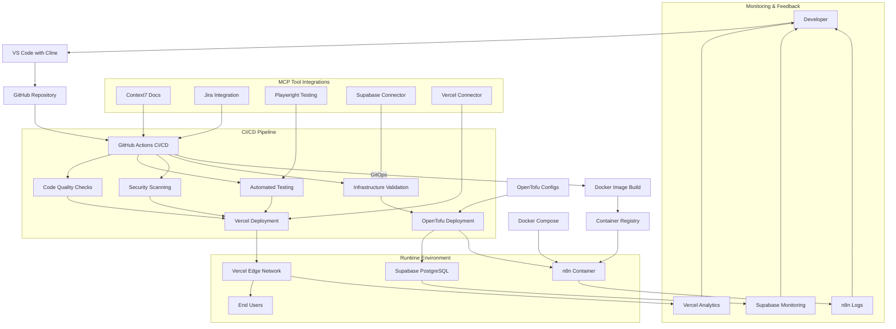

# Platform Infrastructure Implementation

**Project:** Ecovilla Community Platform
**Version:** 1.0
**Status:** In Progress

---

## Executive Summary

The Platform Infrastructure Implementation document details the deployment and configuration of the Ecovilla Community Platform, based on the approved Fullstack Architecture Document (v2.1). The platform leverages a hybrid cloud approach, utilizing Vercel's Edge Network for the Next.js application and Supabase (PostgreSQL/RLS/Realtime) hosted on AWS `us-east-1` for the core data layer. Key implementation objectives include establishing a robust, multi-tenant foundation, implementing a container orchestration platform (adapted to Vercel/Supabase serverless functions), and setting up GitOps workflows using OpenTofu and GitHub Actions for continuous delivery. The implementation prioritizes security (RLS, input validation), performance (Vercel Edge), and resilience (Disaster Recovery planning).

## Joint Planning Session with Architect

### Architecture Alignment Review
Confirmed alignment with Next.js/Vercel/Supabase/n8n stack. Key decision confirmed: Multi-tenant RLS on PostgreSQL.

### Implementation Strategy Collaboration
Platform layers will be sequenced as: 1. Cloud Provider Setup (AWS/Vercel/n8n host), 2. Network Foundation (Vercel Edge/Supabase VPC/n8n host networking), 3. Core Services (DNS, Logging, Monitoring).

### Risk & Constraint Discussion
**Risk:** Reliance on Supabase's managed AWS infrastructure for core data layer. **Constraint:** n8n is self-hosted, requiring secure public webhook exposure and separate infrastructure management. **Deviation:** The template assumes a traditional Kubernetes/Container Platform layer, but the architecture uses Vercel Serverless/Supabase. The subsequent sections will be adapted to focus on serverless function configuration and containerization of the n8n workflow engine.

### Implementation Validation Planning
Success criteria include RLS policy validation, Vercel Edge performance targets, and successful daily execution of the n8n Telegram ingestion workflow.

### Documentation & Knowledge Transfer Planning
Focus on runbooks for n8n and IaC documentation for OpenTofu. **Enhanced Developer Onboarding:** Create a comprehensive developer onboarding guide covering Vercel project setup, Supabase RLS basics, and n8n workflow overview. Provide example Supabase RLS policies and common patterns.

## Foundation Infrastructure Layer

This layer establishes the core cloud environments and foundational services for the Ecovilla platform.

### 1. Cloud Provider Setup

*   **Vercel Account Configuration:**
    *   Create/verify Vercel team account for Ecovilla.
    *   Configure billing and team members with appropriate roles.
    *   Set up custom domain (if applicable) and DNS management within Vercel.
*   **Supabase Project Setup:**
    *   Create Supabase project in `us-east-1` region.
    *   Configure project settings, including database password and region.
    *   Set up Supabase Auth (email/password, magic links, OAuth providers).
    *   Enable Supabase Storage and configure bucket policies.
    *   Enable Supabase Realtime for WebSocket connections.
*   **n8n Hosting Environment:**
    *   Provision VPS or container service for self-hosted n8n instance.
    *   Configure domain, SSL certificate, and firewall rules for n8n.
    *   Set up n8n environment variables (database connection, API keys).

### 2. Network Foundation

*   **Vercel Edge Network:**
    *   Leverage Vercel's global edge network for low-latency content delivery.
    *   Configure Vercel middleware for routing, security headers, and redirects.
*   **Supabase VPC:**
    *   Utilize Supabase's managed VPC in AWS `us-east-1`.
    *   Configure database connection pooling and network security groups.
*   **n8n Networking:**
    *   Configure public endpoint for n8n webhooks (Telegram Bot API integration).
    *   Implement IP whitelisting or API key authentication for webhook security.
    *   Set up internal networking for n8n to access Supabase and external APIs.

### 3. Security Foundation

*   **Identity and Access Management (IAM):**
    *   Vercel: Configure team members and roles (Owner, Developer, Viewer).
    *   Supabase: Define database roles and RLS policies for multi-tenancy.
    *   n8n: Set up user accounts and permissions for workflow management.
*   **Authentication & Authorization:**
    *   Supabase Auth: Configure JWT settings, email templates, and OAuth providers.
    *   API Keys: Generate and securely store API keys for n8n workflows (Telegram, OpenAI).
*   **Data Security:**
    *   Enable encryption at rest for Supabase PostgreSQL and Storage.
    *   Enforce HTTPS for all services (Vercel, Supabase, n8n).
    *   Regularly rotate API keys and database passwords.

### 4. Core Services

*   **DNS Configuration:**
    *   Manage DNS records within Vercel for the main application domain.
    *   Configure subdomains for n8n (e.g., `n8n.ecovilla.app`).
*   **Certificate Management:**
    *   Leverage Vercel's automatic SSL certificate management.
    *   Configure custom SSL certificates for n8n if required.
*   **Logging Infrastructure:**
    *   Utilize Vercel's built-in logs for application monitoring.
    *   Configure Supabase logging for database queries and errors.
    *   Set up centralized logging for n8n (file system or external service).
*   **Monitoring Foundation:**
    *   Enable Vercel Analytics for performance and usage metrics.
    *   Configure Supabase monitoring for database performance.
    *   Set up basic health checks for the n8n instance.

### 5. Developer Experience (DX) Considerations

To ensure a positive and productive developer experience with the chosen stack, the following considerations and practices are integrated into the foundation:

*   **Local Development Environment:**
    *   **Vercel CLI:** Utilize `vercel dev` for local development to closely mimic the production Vercel Edge environment, including environment variables and routing.
    *   **Supabase CLI:** Use the Supabase CLI to run a local Supabase stack (database, auth, storage) for development and testing, ensuring parity with the cloud instance.
    *   **n8n Local Development:** Run n8n locally during workflow development and testing before deploying to the self-hosted instance.

*   **Onboarding & Documentation:**
    *   **Comprehensive Developer Guide:** A dedicated guide covering project setup, Vercel/Supabase/n8n basics, and common development tasks.
    *   **Example Patterns:** Provide documented examples for common Supabase RLS policies, n8n workflow structures, and Vercel configuration patterns.
    *   **Quick Start Script:** Automate initial environment setup (installing CLIs, linking projects, environment variables) where possible.

*   **Tooling & Workflow:**
    *   **Integrated Development Tools:** Leverage IDE extensions for Vercel, Supabase, and n8n to enhance productivity (syntax highlighting, auto-completion, deployment helpers).
    *   **Supabase Type Generation:** Integrate `supabase gen types` into the development workflow to automatically generate TypeScript types from the database schema, ensuring type safety.
    *   **Version Control Practices:** Establish clear guidelines for managing n8n workflows in version control (exporting JSON) and handling environment-specific configurations.

*   **Monitoring & Debugging:**
    *   **Enhanced Error Tracking:** Integrate a dedicated error tracking service (e.g., Sentry) for frontend JavaScript errors and API route exceptions to provide more detailed debugging information than Vercel's built-in logs alone.
    *   **Structured Logging:** Encourage the use of structured logging practices in application code (Vercel functions) for easier searching and analysis.
    *   **Runbooks for Common Issues:** Create runbooks that guide developers through debugging common issues that span the Vercel/Supabase/n8n stack.

*   **Feedback Loops:**
    *   **Preview Deployments:** Leverage Vercel's automatic preview deployments for every pull request to facilitate early feedback and testing.
    *   **Developer Surveys:** Periodically gather feedback from developers on pain points and areas for improvement in the development environment and tooling.

## Detailed Rationale for Foundation Infrastructure Layer

*   **Trade-offs and Choices Made:**
    *   **Hybrid Cloud Choice:** We chose a hybrid approach (Vercel + Supabase/AWS + Self-hosted n8n) over a fully managed or fully self-hosted solution. This balances developer velocity (Vercel/Supabase) with workflow flexibility (n8n). Fully managed reduces operational overhead but limits customization; fully self-hosted increases control but requires more DevOps effort. The chosen approach leverages managed services for the core application while allowing customization for workflow automation.
    *   **Supabase over Vanilla PostgreSQL:** Supabase provides a comprehensive backend-as-a-service with built-in Auth, RLS, Realtime, and Storage, significantly accelerating development compared to setting up these services individually with vanilla PostgreSQL. The trade-off is vendor lock-in and less granular control over individual components.
    *   **Self-hosted n8n:** n8n is self-hosted to allow for custom workflow development and integration with internal systems. This requires more setup and maintenance compared to fully managed workflow services but provides maximum flexibility for the Telegram ingestion and AI processing workflows.
    *   **Vercel Edge Network:** Chosen for its global distribution and performance benefits, directly addressing the NFR1 (Mobile-First Design with <3s load times) and NFR2 (Scalability) requirements. The trade-off is less control over the underlying infrastructure compared to self-hosting on a specific cloud provider's VMs.

*   **Key Assumptions Made During Drafting:**
    *   The existing Vercel and Supabase accounts can be used or new ones can be provisioned with the necessary permissions.
    *   The user has or can provision a suitable hosting environment for n8n (VPS, container service, etc.).
    *   DNS management will primarily be handled within Vercel, with potential subdomain delegation for n8n.
    *   API keys for external services (Telegram Bot Token, OpenAI) are available or will be generated.
    *   The n8n instance will have outbound internet access to communicate with Telegram, Supabase, and OpenAI.

*   **Interesting or Questionable Decisions That Need User Attention:**
    *   **n8n Self-hosting:** The requirement for a public webhook endpoint for Telegram integration is a key security consideration. The user needs to confirm the hosting environment and security measures (firewall, authentication) for the n8n instance.
    *   **Supabase Region:** The architecture specifies `us-east-1`. If the primary user base is elsewhere, this might introduce latency. However, Vercel's edge network mitigates frontend latency.
    *   **Monitoring Depth:** The current draft includes basic monitoring. The user might want to consider integrating a dedicated monitoring solution (e.g., Datadog, Sentry) for more comprehensive observability across all services.

*   **Areas That Might Need Validation:**
    *   Confirm the specific Vercel and Supabase plan tiers required for the expected usage (300 families, thousands of content items, 100+ daily check-ins, 1,000+ daily messages).
    *   Validate the n8n hosting requirements (CPU, memory, disk space) based on the expected daily Telegram message volume.
    *   Ensure the security posture of the n8n instance meets the community's standards, especially regarding the public webhook endpoint.

## Container Platform Implementation (Adapted for Serverless/Managed Services)

While the template refers to a traditional "Container Platform," the Ecovilla architecture leverages a serverless and managed service approach. This section details the implementation of the application runtime and deployment platform based on Vercel (serverless functions), Supabase (managed backend), and containerized self-hosted services (n8n).

### 1. Vercel Application Platform

Vercel serves as the primary application platform, handling the deployment and execution of the Next.js frontend and backend serverless functions.

*   **Project Configuration:**
    *   Link the local development environment to the Vercel project using `vercel link`.
    *   Configure project settings in the Vercel dashboard (build command, output directory, environment variables).
    *   Set up environment-specific configurations (development, preview, production).
*   **Serverless Function Deployment:**
    *   Next.js API Routes and Server Actions are automatically deployed as Vercel serverless functions.
    *   Configure function memory, timeout, and regions via `vercel.json` if needed.
    *   Utilize Vercel's built-in Edge Functions for low-latency, globally distributed computations.
*   **Static Asset Optimization:**
    *   Leverage Vercel's automatic static optimization for images, fonts, and other assets.
    *   Configure asset compression and caching headers.

### 2. Supabase Managed Backend Services

Supabase provides managed backend services, eliminating the need for self-hosted containers for database, authentication, and storage.

*   **Database Management:**
    *   Use the Supabase dashboard and CLI for database schema migrations (`supabase db push`).
    *   Manage database backups and point-in-time recovery through Supabase's built-in features.
    *   Monitor database performance and query logs via the Supabase dashboard.
*   **Authentication Service:**
    *   Configure Supabase Auth settings (providers, email templates, rate limits).
    *   Manage user accounts and roles through the Supabase dashboard or API.
*   **Storage Service:**
    *   Configure storage buckets and access policies.
    *   Manage file uploads and CDN integration through Supabase Storage.

### 3. Containerized Self-Hosted Services (n8n)

The n8n workflow automation engine is self-hosted and should be containerized for ease of deployment and management.

*   **Containerization:**
    *   Use the official n8n Docker image (`n8nio/n8n`) for deployment.
    *   Create a `Dockerfile` if custom configurations or nodes are required.
*   **Orchestration (Docker Compose):**
    *   Define the n8n service and its dependencies (e.g., database if not using n8n's internal DB) in a `docker-compose.yml` file.
    *   Configure environment variables for API keys, database connections, and other settings.
*   **Deployment:**
    *   Deploy the containerized n8n instance to the provisioned VPS or container service.
    *   Set up process management (e.g., using `docker-compose up -d` with restart policies).
    *   Configure health checks and monitoring for the n8n container.

### 4. Node Configuration (Adapted)

In a serverless context, "node configuration" refers to the underlying compute resources for self-hosted services and local development environments.

*   **n8n Hosting Environment:**
    *   **Resource Allocation:** Allocate sufficient CPU, memory, and disk space on the VPS/container service based on expected workflow load.
    *   **Security Hardening:** Apply OS-level security patches, configure firewall rules, and use non-root users for running containers.
    *   **Resource Quotas:** Implement resource limits for the n8n container to prevent resource exhaustion.
*   **Local Development Environment:**
    *   Ensure developer machines have sufficient resources to run local instances of Supabase (`supabase start`) and n8n (`docker run n8nio/n8n`).

### 5. Platform Services (Adapted)

Traditional cluster services are provided by the managed platforms or need to be configured for self-hosted services.

*   **DNS and Routing:**
    *   Vercel handles DNS and routing for the main application.
    *   Configure subdomain routing for the n8n instance (e.g., `n8n.ecovilla.app`).
*   **Certificate Management:**
    *   Vercel provides automatic SSL certificate management for the main domain.
    *   Configure SSL certificates for the n8n instance (Let's Encrypt, custom certs).
*   **Storage:**
    *   Supabase Storage provides managed object storage.
    *   For n8n, configure persistent volumes or bind mounts for workflow data and logs.

### 6. Security & Access Control (Adapted)

Security is implemented at the platform level (Vercel, Supabase) and for the self-hosted service (n8n).

*   **Vercel Security:**
    *   Configure Vercel team members and roles.
    *   Use Vercel's built-in security headers and middleware.
*   **Supabase Security:**
    *   Implement and maintain Row Level Security (RLS) policies.
    *   Configure Supabase Auth settings (JWT secrets, OAuth provider credentials).
    *   Manage API keys and database connection strings securely.
*   **n8n Security:**
    *   Configure n8n user accounts and permissions.
    *   Secure the n8n webhook endpoint (API keys, IP whitelisting).
    *   Manage secrets within n8n workflows securely (using n8n's credential system).

## Detailed Rationale for Container Platform Implementation (Adapted)

*   **Trade-offs and Choices Made:**
    *   **Serverless over Traditional Kubernetes:** The architecture's choice of Vercel and Supabase represents a significant shift from a traditional self-managed Kubernetes cluster. This decision trades off fine-grained infrastructure control for rapid development velocity, reduced operational overhead, and built-in scalability. The trade-off is vendor lock-in and less control over the underlying compute environment. For the MVP and long-term SaaS vision, the benefits of developer productivity and managed scaling outweigh the need for infrastructure control.
    *   **Managed Backend Services (Supabase):** Using Supabase instead of self-hosting PostgreSQL and related services (Auth, Storage) accelerates backend development significantly. The trade-off is reliance on Supabase's feature set and potential limitations in customization compared to a fully self-hosted solution. However, the built-in RLS, Auth, and Realtime features are core to the application's requirements.
    *   **Selective Containerization (n8n):** Only n8n is containerized and self-hosted, as it requires custom workflow development and integration capabilities not available in fully managed alternatives. This hybrid approach allows leveraging managed services where they fit perfectly while retaining control where customization is essential.
    *   **Docker Compose over Full Kubernetes for n8n:** For the single self-hosted service (n8n), Docker Compose is chosen over a full Kubernetes setup. This simplifies deployment and management for a single service while still providing containerization benefits (isolation, reproducibility). A full Kubernetes cluster would be overkill and add unnecessary complexity for hosting just one service.

*   **Key Assumptions Made During Drafting:**
    *   Vercel's serverless functions and Edge Network will meet the application's performance and scalability requirements (NFR1, NFR2).
    *   Supabase's managed services (Database, Auth, Storage, Realtime) will provide the necessary features and reliability.
    *   The n8n Docker image is stable and suitable for the required workflows.
    *   The VPS or container service for n8n can be provisioned with the necessary resources.
    *   Developers will use the Supabase CLI for local development to ensure parity with the cloud instance.

*   **Interesting or Questionable Decisions That Need User Attention:**
    *   **n8n Containerization:** Confirm that containerizing n8n (using Docker Compose) is the preferred deployment method for the self-hosted workflow engine. An alternative could be direct installation on the VPS, but containerization is generally recommended for consistency and ease of management.
    *   **Vercel/Supabase Plan Tiers:** The specific plan tiers for Vercel and Supabase need to be validated against the expected usage (300 families, thousands of content items, 100+ daily check-ins, 1,000+ daily messages) to ensure performance and cost-effectiveness.
    *   **Local Development Parity:** Ensuring that the local development experience with `vercel dev` and `supabase start` closely matches the production environment is crucial for developer productivity.

*   **Areas That Might Need Validation:**
    *   Validate the resource requirements (CPU, memory, disk) for the n8n container based on the expected complexity and frequency of workflows.
    *   Confirm the backup and disaster recovery strategy for the n8n instance and its data.
    *   Ensure that the security configuration of the n8n instance (firewall, authentication, secrets management) meets the community's standards.
    *   Test the performance of Vercel Edge Functions and Supabase under load to ensure they meet the NFR targets.

## CI/CD Platform Implementation

The CI/CD platform for the Ecovilla Community Platform is built on GitHub Actions, implementing a GitOps workflow for infrastructure and application deployments. This section details the setup and configuration of the CI/CD pipelines.

### 1. GitHub Actions Configuration

GitHub Actions serves as the primary CI/CD engine, orchestrating builds, tests, and deployments for both the application and infrastructure.

*   **Repository Structure:**
    *   Organize the repository to support both application code (Next.js) and infrastructure code (OpenTofu) in a monorepo or separate repositories based on team preference.
    *   Define clear directory structures for `app/` (Next.js application) and `infra/` (OpenTofu configurations).
*   **Workflow Definitions:**
    *   Create GitHub Actions workflows in `.github/workflows/` for different stages:
        *   `ci.yml`: Continuous Integration (linting, testing, building)
        *   `cd-app.yml`: Continuous Deployment for the Next.js application to Vercel
        *   `cd-infra.yml`: Continuous Deployment for infrastructure changes using OpenTofu
*   **Environment Management:**
    *   Configure GitHub Environments (development, staging, production) with appropriate protection rules (required reviewers, wait timers).
    *   Use GitHub Secrets to manage environment-specific variables (API keys, database URLs, Vercel tokens).

### 2. Application CI/CD Pipeline

The application pipeline automates the build, test, and deployment process for the Next.js frontend and backend.

*   **Continuous Integration:**
    *   Trigger on `push` and `pull_request` events to the `main` branch and feature branches.
    *   Run linting checks (`npm run lint`) to ensure code quality.
    *   Execute unit and integration tests (`npm run test`) with code coverage reporting.
    *   Build the Next.js application (`npm run build`) to verify successful compilation.
    *   Run security scans (dependency checks, SAST) as part of the CI process.
*   **Continuous Deployment:**
    *   For `main` branch pushes, automatically deploy to Vercel using the Vercel GitHub App integration.
    *   For pull requests, create Vercel preview deployments for review and testing.
    *   Implement deployment approval gates for production deployments via GitHub Environments.

### 3. Infrastructure CI/CD Pipeline (GitOps with OpenTofu)

The infrastructure pipeline implements GitOps principles for managing the cloud infrastructure using OpenTofu.

*   **OpenTofu Workflow:**
    *   Store OpenTofu configurations in the `infra/` directory with modular structure (modules for Vercel, Supabase, n8n).
    *   Use OpenTofu workspaces or separate state files for different environments (development, staging, production).
    *   Implement a plan-and-apply workflow:
        *   `terraform plan`: Automatically run on pull requests to show infrastructure changes.
        *   `terraform apply`: Manually triggered or automatically applied after approval for main branch merges.
*   **Security & Compliance:**
    *   Integrate security scanning tools (e.g., tfsec, checkov) into the infrastructure CI pipeline.
    *   Enforce infrastructure policies using tools like Open Policy Agent (OPA) or Sentinel.
*   **State Management:**
    *   Store OpenTofu state files in a secure, remote backend (e.g., AWS S3 with DynamoDB locking, or a dedicated state management solution).
    *   Implement state file encryption and access controls.

### 4. GitOps Principles Implementation

The platform adheres to GitOps principles for both application and infrastructure management.

*   **Declarative Infrastructure:**
    *   All infrastructure is defined as code using OpenTofu, ensuring reproducibility and version control.
*   **Automated Sync:**
    *   GitHub Actions automatically syncs the desired state (code in the repository) with the actual state (cloud resources).
*   **Pull Request Workflow:**
    *   All changes to application code or infrastructure are made via pull requests, enabling review and approval processes.
    *   Automated checks (linting, testing, planning) provide immediate feedback on pull requests.
*   **Observability:**
    *   CI/CD pipeline runs are visible and traceable through GitHub Actions logs and Vercel deployment logs.

### CI/CD Toolchain Visualization

The following diagram illustrates how the various tools and services interact within the CI/CD pipeline:



### 5. Pipeline Security

Security is integrated throughout the CI/CD pipeline.

*   **Secrets Management:**
    *   Use GitHub Secrets for managing sensitive information (API keys, tokens, passwords).
    *   Avoid hardcoding secrets in the codebase or configuration files.
*   **Access Controls:**
    *   Configure branch protection rules to prevent direct pushes to the `main` branch.
    *   Require pull request reviews and status checks before merging.
*   **Dependency Security:**
    *   Regularly scan dependencies for vulnerabilities using tools like Dependabot or Snyk.
    *   Automate dependency updates where safe to do so.

## Detailed Rationale for CI/CD Platform Implementation

*   **Trade-offs and Choices Made:**
    *   **GitHub Actions over Alternative CI/CD Platforms:** GitHub Actions was chosen as the CI/CD platform due to its tight integration with GitHub (the chosen source control system), cost-effectiveness (free tier for public repos, competitive pricing for private repos), and ease of configuration through YAML files stored in the repository. The trade-off is vendor lock-in to GitHub's ecosystem and potential limitations in advanced features compared to dedicated CI/CD platforms like Jenkins or GitLab CI. However, for the Ecovilla platform's needs, GitHub Actions provides a robust and scalable solution.
    *   **GitOps with OpenTofu:** The GitOps approach with OpenTofu for infrastructure management ensures that infrastructure changes are version-controlled, auditable, and repeatable. This approach trades off immediate infrastructure changes for increased reliability and security through code review and automated testing. The use of OpenTofu (a fork of Terraform) provides vendor-neutral infrastructure as code capabilities while avoiding some of the licensing concerns associated with HashiCorp's switch to the BSL license.
    *   **Monorepo vs. Separate Repos:** The decision to potentially use a monorepo for application and infrastructure code simplifies dependency management and ensures atomic changes across the stack. However, it can also increase repository size and complexity. The flexibility to choose between monorepo and separate repositories allows the team to adapt based on project growth and team structure.

*   **Key Assumptions Made During Drafting:**
    *   GitHub will be used as the primary source control system.
    *   The Vercel GitHub App integration will be used for seamless application deployments.
    *   OpenTofu configurations will be modular and well-structured for maintainability.
    *   GitHub Actions runners will have sufficient resources to handle the build and deployment processes.
    *   The team will follow established best practices for pull request reviews and code quality.

*   **Interesting or Questionable Decisions That Need User Attention:**
    *   **Monorepo vs. Separate Repositories:** The choice between a monorepo structure (application and infrastructure in one repository) versus separate repositories needs to be validated based on team preferences and project complexity. A monorepo can simplify atomic changes but may increase repository size and complexity.
    *   **OpenTofu State Management:** The specific backend for OpenTofu state management (e.g., AWS S3, dedicated solution) needs to be chosen and configured securely. State file security is critical for infrastructure integrity.
    *   **Environment Promotion Strategy:** The strategy for promoting changes from development to staging to production (manual approval, automated gates) should be clearly defined and agreed upon.

*   **Areas That Might Need Validation:**
    *   Validate the GitHub Actions workflow definitions to ensure they cover all necessary build, test, and deployment scenarios.
    *   Confirm the OpenTofu module structure and ensure it aligns with the infrastructure architecture.
    *   Test the GitOps workflow with a small infrastructure change to ensure the plan-and-apply process works as expected.
    *   Verify that the security scanning tools are properly configured and integrated into the CI/CD pipeline.

## Monitoring Platform Implementation

The monitoring platform for the Ecovilla Community Platform provides comprehensive observability across the application, infrastructure, and user experience. This section details the setup and configuration of monitoring tools and practices.

### 1. Application Performance Monitoring (APM)

Monitoring the performance and health of the Next.js application is crucial for maintaining a high-quality user experience.

*   **Vercel Analytics:**
    *   Enable Vercel Analytics to track Core Web Vitals, performance metrics, and user experience data.
    *   Configure custom events to track specific user interactions and business metrics.
    *   Set up dashboards to visualize performance trends and identify regressions.
    *   Utilize Vercel's built-in Real User Monitoring (RUM) to understand actual user performance.
*   **Error Tracking:**
    *   Integrate a dedicated error tracking service (e.g., Sentry) to capture frontend JavaScript errors, backend API route exceptions, and serverless function failures.
    *   Configure error grouping and tagging to facilitate efficient debugging.
    *   Set up alerting for critical errors and error rate thresholds.

### 2. Infrastructure Monitoring

Monitoring the health and performance of the underlying infrastructure ensures reliability and helps identify issues before they impact users.

*   **Vercel Infrastructure:**
    *   Monitor Vercel Edge Network performance, function execution times, and cold start metrics.
    *   Track build times and deployment success rates.
    *   Set up alerts for Vercel service disruptions or performance degradation.
*   **Supabase Monitoring:**
    *   Utilize Supabase's built-in monitoring dashboard to track database performance, query latency, and connection usage.
    *   Monitor Auth service metrics (login success/failure rates, token refresh rates).
    *   Track Storage service usage and performance (upload/download speeds, error rates).
*   **n8n Monitoring:**
    *   Implement health checks for the n8n instance to ensure it's running and responsive.
    *   Monitor workflow execution success/failure rates and execution times.
    *   Set up logging for workflow errors and performance bottlenecks.

### 3. Log Management

Centralized log management provides visibility into application behavior and facilitates debugging.

*   **Vercel Logs:**
    *   Utilize Vercel's built-in log streaming and retention for serverless function logs.
    *   Configure log levels (info, warn, error) appropriately to balance detail with noise.
    *   Set up log-based alerting for specific error patterns or anomalies.
*   **Supabase Logs:**
    *   Access and analyze Supabase database query logs, authentication logs, and storage logs through the Supabase dashboard.
    *   Configure log retention policies based on compliance requirements.
*   **n8n Logs:**
    *   Configure n8n to output structured logs to a file system or external logging service.
    *   Set up log rotation and retention for the n8n instance.
    *   Integrate with a centralized logging solution (e.g., ELK stack, Datadog) for unified log analysis.

### 4. User Experience Monitoring

Monitoring the actual user experience helps ensure the platform meets its performance and usability goals.

*   **Core Web Vitals:**
    *   Track LCP (Largest Contentful Paint), FID (First Input Delay), and CLS (Cumulative Layout Shift) through Vercel Analytics.
    *   Set up alerts for Core Web Vitals that fall below target thresholds (e.g., LCP < 2.5s).
    *   Monitor performance across different devices, browsers, and geographic regions.
*   **Business Metrics:**
    *   Track key business metrics such as daily active users (DAU), weekly active users (WAU), and user engagement patterns.
    *   Monitor feature adoption rates and user journey completion rates.
    *   Set up dashboards to visualize trends and identify opportunities for improvement.

### 5. Alerting and Incident Response

Proactive alerting and a well-defined incident response process ensure issues are detected and resolved quickly.

*   **Alerting Strategy:**
    *   Define alert thresholds based on Service Level Objectives (SLOs) and Service Level Indicators (SLIs).
    *   Implement tiered alerting (e.g., warning, critical) with appropriate escalation paths.
    *   Use alert deduplication and grouping to reduce noise and improve response efficiency.
*   **Incident Response:**
    *   Establish clear runbooks for common incident types (e.g., database performance degradation, n8n workflow failures).
    *   Define on-call rotations and escalation procedures for critical alerts.
    *   Conduct regular incident retrospectives to improve response processes and prevent recurrence.

## Detailed Rationale for Monitoring Platform Implementation

*   **Trade-offs and Choices Made:**
    *   **Leveraging Built-in Monitoring (Vercel, Supabase) over Full Self-Hosted Solutions:** The architecture relies heavily on managed services (Vercel, Supabase) that provide built-in monitoring capabilities. This approach trades off fine-grained control over monitoring infrastructure for rapid setup and reduced operational overhead. The built-in tools are sufficient for the MVP and can be augmented with dedicated solutions (e.g., Sentry for error tracking) as the platform grows. Fully self-hosted monitoring solutions (e.g., Prometheus, Grafana, ELK stack) would provide more control but require significant setup and maintenance effort.
    *   **Hybrid Log Management:** The monitoring strategy uses a hybrid approach where each service's built-in logging is leveraged (Vercel, Supabase) while planning for centralized logging for the self-hosted n8n service. This balances ease of setup with the need for unified log analysis for the self-hosted component. A fully centralized logging solution could be implemented later if log volume and complexity increase.
    *   **Focus on User Experience Metrics:** The monitoring platform prioritizes user experience metrics (Core Web Vitals, business metrics) over purely technical metrics. This aligns with the platform's goal of providing a high-quality user experience and directly ties monitoring to business outcomes.

*   **Key Assumptions Made During Drafting:**
    *   Vercel Analytics and Supabase's built-in monitoring will provide sufficient visibility into application and infrastructure performance for the initial phase.
    *   A dedicated error tracking service (e.g., Sentry) will be integrated to provide more detailed error analysis than built-in tools alone.
    *   The n8n instance will be configured to output structured logs that can be easily parsed and analyzed.
    *   The team will define and track meaningful Service Level Objectives (SLOs) to guide alerting and incident response.

*   **Interesting or Questionable Decisions That Need User Attention:**
    *   **Dedicated Error Tracking Service:** The decision to integrate a dedicated error tracking service (e.g., Sentry) in addition to Vercel's built-in error reporting should be validated. This adds another tool but provides more detailed error analysis and alerting capabilities.
    *   **Centralized Logging Strategy:** The approach to centralized logging for the n8n instance needs to be confirmed. Will a full ELK stack or similar solution be implemented, or will simpler file-based logging with external tools suffice?
    *   **Alerting Thresholds:** The specific SLOs and alerting thresholds need to be defined and agreed upon based on the platform's performance requirements and user expectations.

*   **Areas That Might Need Validation:**
    *   Validate that Vercel Analytics provides all the necessary performance and user experience metrics required by the team.
    *   Confirm that Supabase's built-in monitoring meets the database and backend service monitoring needs.
    *   Test the integration and configuration of the dedicated error tracking service (e.g., Sentry) to ensure it captures all relevant errors.
    *   Define and implement the log management strategy for the n8n instance, including retention and analysis processes.

## Security & Compliance Implementation

The security and compliance implementation for the Ecovilla Community Platform follows a defense-in-depth approach, addressing security at every layer of the architecture. This section details the security controls, compliance measures, and best practices to protect the platform and its users.

### 1. Identity and Access Management (IAM)

Controlling access to the platform and its resources is fundamental to security.

*   **Vercel Access Control:**
    *   Configure Vercel team roles (Owner, Admin, Developer, Viewer) with least-privilege principles.
    *   Implement SSO integration for centralized user management and authentication.
    *   Regularly review and audit team member access and permissions.
*   **Supabase Authentication:**
    *   Configure Supabase Auth with secure JWT settings (appropriate expiration times, secure signing).
    *   Implement multi-factor authentication (MFA) for administrative accounts.
    *   Set up email verification and password reset flows with proper security measures.
    *   Configure OAuth providers (Google, GitHub) with secure redirect URIs and scopes.
*   **n8n Access Control:**
    *   Configure n8n user accounts with role-based access control (Admin, Editor, Viewer).
    *   Secure the n8n webhook endpoint with API keys or IP whitelisting.
    *   Implement strong password policies for n8n administrative accounts.

### 2. Data Security

Protecting data at rest and in transit is critical for user privacy and compliance.

*   **Encryption:**
    *   Ensure all data is encrypted in transit using HTTPS/TLS for all services (Vercel, Supabase, n8n).
    *   Enable encryption at rest for Supabase PostgreSQL database and Storage service.
    *   Use secure key management practices for encryption keys (AWS KMS or similar).
*   **Data Classification and Handling:**
    *   Classify data types (PII, PHI, community data) and apply appropriate security controls.
    *   Implement data retention policies and secure data deletion procedures.
    *   Use secure data transfer methods for backups and migrations.
*   **Row Level Security (RLS):**
    *   Implement and maintain comprehensive RLS policies in Supabase PostgreSQL to enforce multi-tenancy and data isolation.
    *   Regularly audit RLS policies to ensure they correctly enforce access controls.
    *   Test RLS policies with various user roles and data scenarios.

### 3. Network Security

Securing network communications and access points reduces the attack surface.

*   **Vercel Edge Network:**
    *   Leverage Vercel's built-in DDoS protection and security headers.
    *   Configure custom security headers (CSP, HSTS, X-Frame-Options) in Vercel middleware.
*   **Supabase Network Security:**
    *   Configure Supabase database connection pooling and network security groups.
    *   Restrict database access to specific IP ranges or VPC peering where possible.
*   **n8n Network Security:**
    *   Configure firewall rules to restrict access to the n8n instance.
    *   Use API key authentication or IP whitelisting for n8n webhook endpoints.
    *   Implement secure network segmentation between n8n and other services.

### 4. Application Security

Securing the application code and runtime environment prevents common vulnerabilities.

*   **Input Validation and Sanitization:**
    *   Implement strict input validation and sanitization in all application entry points (API routes, Server Actions).
    *   Use Zod schemas for comprehensive data validation and type safety.
    *   Sanitize user-generated content to prevent XSS attacks.
*   **Dependency Security:**
    *   Regularly scan dependencies for known vulnerabilities using tools like Dependabot or Snyk.
    *   Keep dependencies up-to-date with automated update processes.
    *   Use lock files to ensure reproducible builds and prevent supply chain attacks.
*   **Secure Coding Practices:**
    *   Follow secure coding guidelines and conduct regular code reviews.
    *   Implement proper error handling that doesn't expose sensitive information.
    *   Use parameterized queries to prevent SQL injection attacks.

### 5. Compliance and Governance

Ensuring compliance with relevant regulations and internal policies maintains trust and avoids legal issues.

*   **Privacy Compliance:**
    *   Implement privacy controls in accordance with applicable regulations (GDPR, CCPA, etc.).
    *   Provide users with data access, rectification, and deletion capabilities.
    *   Maintain records of data processing activities and privacy impact assessments.
*   **Audit and Logging:**
    *   Enable comprehensive audit logging for all critical operations and access events.
    *   Implement log retention policies that meet compliance requirements.
    *   Regularly review audit logs for suspicious activity or policy violations.
*   **Security Policies and Training:**
    *   Establish and maintain security policies covering all aspects of the platform.
    *   Provide regular security awareness training for developers and administrators.
    *   Conduct periodic security assessments and penetration testing.

### 6. Incident Response and Recovery

Having a plan for security incidents ensures rapid response and recovery.

*   **Incident Response Plan:**
    *   Develop and maintain a comprehensive incident response plan with clear roles and procedures.
    *   Establish communication protocols for security incidents.
    *   Conduct regular incident response drills and tabletop exercises.
*   **Backup and Recovery:**
    *   Implement regular automated backups for all critical data (database, storage, n8n workflows).
    *   Test backup restoration procedures regularly to ensure data can be recovered.
    *   Store backups securely with appropriate encryption and access controls.

## Detailed Rationale for Security & Compliance Implementation

*   **Trade-offs and Choices Made:**
    *   **Leveraging Managed Service Security over Full Self-Hosted Control:** The architecture relies on managed services (Vercel, Supabase) that provide built-in security features and are maintained by their providers. This approach trades off fine-grained control over security configurations for rapid setup and reduced operational overhead. The managed services' security teams handle many security aspects (patching, DDoS protection, etc.), allowing the platform to benefit from professional security management while focusing development efforts on application features.
    *   **Defense-in-Depth over Single Point of Failure:** The security implementation follows a defense-in-depth strategy, applying security controls at multiple layers (network, application, data, identity). This approach trades off some complexity in implementation for significantly improved security posture. Rather than relying on a single security mechanism, multiple overlapping controls provide redundancy and resilience against various attack vectors.
    *   **Row Level Security over Application-Level Authorization:** The choice to use PostgreSQL Row Level Security (RLS) in Supabase for multi-tenancy and data isolation trades off some flexibility in authorization logic for stronger, database-enforced security boundaries. RLS policies are evaluated at the database level, making it impossible for application-layer bugs or compromises to bypass data isolation.

*   **Key Assumptions Made During Drafting:**
    *   The managed services (Vercel, Supabase) maintain industry-standard security practices and will be kept up-to-date with security patches.
    *   The n8n instance will be properly secured and maintained by the operations team.
    *   Developers will follow secure coding practices and conduct regular security reviews.
    *   Regular security assessments and penetration testing will be performed to identify and address vulnerabilities.

*   **Interesting or Questionable Decisions That Need User Attention:**
    *   **n8n Security Configuration:** The specific security configuration for the self-hosted n8n instance (firewall rules, authentication methods, secrets management) needs to be validated and approved by the security team.
    *   **Data Classification Policy:** The data classification policy and corresponding security controls for different data types (PII, community data, etc.) need to be formally defined and approved.
    *   **Incident Response Procedures:** The incident response procedures and escalation paths need to be tested and validated with the operations and security teams.

*   **Areas That Might Need Validation:**
    *   Validate the RLS policies in Supabase to ensure they correctly enforce multi-tenancy and data isolation.
    *   Test the n8n webhook security configuration to ensure it properly authenticates and authorizes incoming requests.
    *   Verify that all encryption keys are properly managed and rotated according to security best practices.
    *   Confirm that the audit logging configuration captures all necessary security-relevant events.

## Disaster Recovery Implementation

The disaster recovery implementation for the Ecovilla Community Platform ensures business continuity and data protection against various failure scenarios. This section details the backup strategies, recovery procedures, and resilience measures for all platform components.

### 1. Backup Strategy

A comprehensive backup strategy protects against data loss and system failures across all services.

*   **Vercel Application Backups:**
    *   Leverage Vercel's built-in deployment history and rollback capabilities for application code.
    *   Maintain version-controlled source code in GitHub with regular commits and proper branching strategy.
    *   Store application configuration and environment variables securely in Vercel's environment management system.
*   **Supabase Data Backups:**
    *   Utilize Supabase's automated point-in-time recovery (PITR) for database backups.
    *   Configure daily automated backups with retention periods that meet compliance requirements.
    *   Implement manual backup triggers for critical operations or before major changes.
    *   Regularly test database backup restoration procedures to ensure data can be recovered.
*   **Supabase Storage Backups:**
    *   Enable versioning for Supabase Storage buckets to maintain multiple versions of objects.
    *   Implement cross-region replication for critical storage assets where available.
    *   Maintain off-platform copies of essential storage content for disaster scenarios.
*   **n8n Workflow Backups:**
    *   Export n8n workflow definitions as JSON files and store them in version control (Git).
    *   Backup n8n database and configuration files regularly.
    *   Maintain documentation of all custom n8n nodes and their configurations.

### 2. Recovery Procedures

Well-defined recovery procedures ensure rapid restoration of services during disaster scenarios.

*   **Application Recovery:**
    *   Use Vercel's rollback feature to quickly revert to a previous working deployment.
    *   Restore application state from the latest stable code in GitHub repository.
    *   Reconfigure environment variables and secrets from secure storage.
*   **Database Recovery:**
    *   Restore Supabase PostgreSQL database from automated backups or point-in-time recovery.
    *   Validate data integrity after restoration before bringing services back online.
    *   Reapply any database schema changes that occurred after the backup point.
*   **Storage Recovery:**
    *   Restore storage objects from versioned backups or cross-region replicas.
    *   Reconfigure storage bucket policies and access controls.
*   **n8n Recovery:**
    *   Restore n8n workflows from version-controlled JSON files.
    *   Reconfigure n8n settings and credentials from secure backup.
    *   Restart n8n services and verify workflow execution.

### 3. Business Continuity Planning

Business continuity planning ensures critical platform functions remain available during and after disasters.

*   **High Availability:**
    *   Leverage Vercel's global edge network for automatic failover and load distribution.
    *   Utilize Supabase's multi-region capabilities where available for database redundancy.
    *   Implement health checks and auto-scaling for n8n services.
*   **Geographic Distribution:**
    *   Deploy application across Vercel's global edge network for geographic resilience.
    *   Consider multi-region database deployment for critical data availability.
*   **Service Dependencies:**
    *   Identify and document critical service dependencies and their failure impact.
    *   Implement fallback mechanisms for external service dependencies (Telegram API, OpenAI).

### 4. Testing and Validation

Regular testing and validation ensure disaster recovery plans are effective and up-to-date.

*   **Recovery Testing:**
    *   Conduct quarterly disaster recovery drills to test backup restoration procedures.
    *   Simulate various failure scenarios (database corruption, service outages, data loss).
    *   Measure recovery time objectives (RTO) and recovery point objectives (RPO).
*   **Plan Updates:**
    *   Regularly review and update disaster recovery procedures based on platform changes.
    *   Update documentation when new services or components are added.
    *   Train team members on disaster recovery procedures and their roles.

### 5. Monitoring and Alerting

Proactive monitoring helps detect potential disaster scenarios before they occur.

*   **Health Monitoring:**
    *   Monitor backup job success/failure rates and alert on backup failures.
    *   Track database replication lag and storage availability.
    *   Monitor n8n service health and workflow execution status.
*   **Capacity Planning:**
    *   Monitor storage capacity and database growth to prevent resource exhaustion.
    *   Plan for backup storage requirements and retention policy compliance.

## Detailed Rationale for Disaster Recovery Implementation

*   **Trade-offs and Choices Made:**
    *   **Leveraging Managed Service Backup Features over Full Self-Hosted Solutions:** The disaster recovery strategy relies heavily on managed services' (Vercel, Supabase) built-in backup and recovery features. This approach trades off fine-grained control over backup processes for rapid setup and reduced operational overhead. The managed services provide enterprise-grade backup capabilities without requiring dedicated backup infrastructure. Fully self-hosted backup solutions would provide more control but require significant setup, maintenance, and expertise.
    *   **Automated over Manual Backup Processes:** The backup strategy emphasizes automated backup processes to reduce human error and ensure consistency. This trades off some flexibility in backup timing for reliability and completeness. Manual backup processes are more prone to being forgotten or executed incorrectly, potentially leading to gaps in protection.
    *   **Version Control Integration for Configuration Backups:** Using Git for version control of n8n workflows and application configurations provides a robust, auditable backup mechanism. This approach trades off some complexity in managing multiple backup systems for strong version control and easy restoration capabilities.

*   **Key Assumptions Made During Drafting:**
    *   The managed services (Vercel, Supabase) maintain reliable backup infrastructure and processes.
    *   Team members will follow established procedures for regular backup validation and testing.
    *   Sufficient storage capacity will be available for backup retention requirements.
    *   Network connectivity will be available for backup operations and remote storage.

*   **Interesting or Questionable Decisions That Need User Attention:**
    *   **Backup Retention Policies:** The specific backup retention policies and compliance requirements need to be validated with legal and compliance teams.
    *   **Cross-Region Replication:** The availability and cost implications of cross-region replication for Supabase Storage need to be confirmed.
    *   **Disaster Recovery Testing Frequency:** The frequency and scope of disaster recovery testing need to be agreed upon based on business requirements and risk tolerance.

*   **Areas That Might Need Validation:**
    *   Validate that Supabase's point-in-time recovery meets the required RPO (Recovery Point Objective) targets.
    *   Test the n8n workflow restoration process from version-controlled JSON files to ensure completeness.
    *   Confirm that Vercel's deployment history and rollback capabilities meet the required RTO (Recovery Time Objective) targets.
    *   Verify that backup storage costs align with budget constraints and retention requirements.

## Operational Excellence Implementation

The operational excellence implementation for the Ecovilla Community Platform establishes best practices, processes, and tools to ensure smooth day-to-day operations, maintain high service quality, and enable continuous improvement. This section details the operational procedures, documentation standards, and team practices that support platform reliability and team effectiveness.

### 1. Operational Procedures and Best Practices

Establishing standardized procedures ensures consistent and reliable platform operations.

*   **Daily Operations:**
    *   Implement daily health checks for all critical services (Vercel deployments, Supabase database, n8n workflows).
    *   Monitor key performance indicators (KPIs) and service level indicators (SLIs) through dashboards.
    *   Review and respond to alerts and notifications promptly.
    *   Conduct brief daily standups to sync on operational status and upcoming tasks.
*   **Weekly Operations:**
    *   Perform weekly review of system performance metrics and trends.
    *   Conduct security scans and vulnerability assessments.
    *   Review and update documentation based on recent changes.
    *   Plan and coordinate maintenance windows for updates and improvements.
*   **Monthly Operations:**
    *   Conduct comprehensive performance reviews and capacity planning.
    *   Review and optimize resource usage and costs.
    *   Update runbooks and operational documentation.
    *   Perform security audits and compliance checks.

### 2. Documentation and Knowledge Management

Comprehensive documentation ensures knowledge sharing and operational continuity.

*   **System Documentation:**
    *   Maintain up-to-date architecture diagrams and system documentation.
    *   Document all infrastructure configurations and deployment procedures.
    *   Create and maintain runbooks for common operational tasks and incident response.
*   **Process Documentation:**
    *   Document operational procedures and best practices.
    *   Maintain clear onboarding documentation for new team members.
    *   Create troubleshooting guides for common issues.
*   **Knowledge Sharing:**
    *   Implement a knowledge base or wiki for centralized documentation.
    *   Conduct regular knowledge sharing sessions and technical discussions.
    *   Encourage documentation updates as part of the development process.

### 3. Team Practices and Collaboration

Effective team practices enhance collaboration and operational efficiency.

*   **Communication:**
    *   Establish clear communication channels and escalation paths.
    *   Use collaboration tools (Slack, Microsoft Teams) for real-time communication.
    *   Schedule regular team meetings and retrospectives.
*   **Incident Management:**
    *   Implement structured incident response procedures.
    *   Conduct post-incident reviews and create action items for improvement.
    *   Maintain an incident log and lessons learned database.
*   **Continuous Improvement:**
    *   Conduct regular retrospectives to identify areas for improvement.
    *   Implement a feedback loop for operational processes and tools.
    *   Stay updated with industry best practices and emerging technologies.

### 4. Automation and Tooling

Leveraging automation and proper tooling reduces manual effort and improves reliability.

*   **Infrastructure Automation:**
    *   Use Infrastructure as Code (OpenTofu) for all infrastructure provisioning.
    *   Implement automated testing for infrastructure changes.
    *   Use configuration management tools for consistent service configurations.
*   **Operational Automation:**
    *   Automate routine operational tasks (backups, health checks, reporting).
    *   Implement chatops for common operational commands and procedures.
    *   Use automated deployment and rollback procedures.
*   **Monitoring and Alerting:**
    *   Implement comprehensive monitoring with automated alerting.
    *   Use centralized logging and log analysis tools.
    *   Set up performance monitoring and optimization tools.

### 5. Change Management

Structured change management ensures controlled and safe platform evolution.

*   **Change Control Process:**
    *   Implement a formal change control process for all infrastructure and application changes.
    *   Use pull requests and code reviews for all changes.
    *   Implement automated testing and validation for changes.
*   **Release Management:**
    *   Follow a consistent release process with proper versioning.
    *   Implement blue-green deployments or similar strategies for zero-downtime releases.
    *   Maintain a clear release calendar and communication plan.
*   **Rollback Procedures:**
    *   Ensure all changes have a clear rollback plan.
    *   Test rollback procedures regularly.
    *   Implement feature flags for safe feature rollouts.

## Detailed Rationale for Operational Excellence Implementation

*   **Trade-offs and Choices Made:**
    *   **Standardized Procedures over Ad-hoc Operations:** Implementing standardized operational procedures trades off some flexibility for consistency and reliability. While ad-hoc approaches might be faster for unique situations, standardized procedures reduce errors, ensure knowledge transfer, and improve overall service quality. The operational overhead of maintaining procedures is outweighed by the benefits of predictable and reliable operations.
    *   **Comprehensive Documentation over Minimal Documentation:** Choosing comprehensive documentation over minimal documentation requires more upfront effort but provides significant long-term benefits. Well-documented systems are easier to maintain, debug, and scale. The trade-off is the time investment in creating and maintaining documentation, but this is offset by reduced onboarding time and fewer operational issues.
    *   **Regular Retrospectives over Reactive Improvement:** Implementing regular retrospectives for continuous improvement trades off some immediate development time for long-term operational efficiency. Reactive improvement only addresses problems after they occur, while regular retrospectives help identify and address issues proactively. The investment in regular reflection leads to sustained operational excellence.

*   **Key Assumptions Made During Drafting:**
    *   The team will commit to maintaining and following established operational procedures.
    *   Documentation will be treated as a first-class citizen and updated regularly.
    *   Team members will participate actively in knowledge sharing and continuous improvement activities.
    *   Adequate tooling and automation will be available to support operational practices.
    *   Clear communication channels and escalation paths will be established and maintained.

*   **Interesting or Questionable Decisions That Need User Attention:**
    *   **Documentation Tool Selection:** The specific tools for documentation and knowledge management (wiki, Notion, Confluence, etc.) need to be selected based on team preferences and requirements. The choice of tool significantly impacts adoption and effectiveness.
    *   **Incident Response Roles:** Clear definition of roles and responsibilities during incidents needs to be established and communicated to all team members. This includes primary responders, communication leads, and decision makers.
    *   **Automation Tool Selection:** The specific tools for operational automation (chatops, monitoring, CI/CD) need to be validated against team expertise and integration requirements.

*   **Areas That Might Need Validation:**
    *   Validate that the proposed operational procedures align with team size and structure.
    *   Confirm that the documentation strategy is practical and sustainable for the team.
    *   Test the incident response procedures with tabletop exercises to ensure effectiveness.
    *   Verify that the automation and tooling plans are feasible with available resources and expertise.

## Cost Optimization Implementation

The cost optimization implementation for the Ecovilla Community Platform focuses on maximizing value while minimizing infrastructure and operational expenses. This section details strategies for monitoring, analyzing, and optimizing costs across all platform components.

### 1. Cost Monitoring and Analysis

Proactive cost monitoring ensures visibility into spending patterns and identifies optimization opportunities.

*   **Cost Tracking:**
    *   Implement detailed cost tracking for all cloud services (Vercel, Supabase, n8n hosting).
    *   Use cloud provider cost management tools (AWS Cost Explorer for Supabase, Vercel Analytics for usage).
    *   Set up cost alerts and notifications for budget thresholds.
*   **Usage Analytics:**
    *   Monitor resource utilization (CPU, memory, storage, bandwidth) across all services.
    *   Analyze usage patterns to identify underutilized or over-provisioned resources.
    *   Track API call volumes and database query patterns for optimization opportunities.

### 2. Resource Optimization

Optimizing resource allocation ensures efficient use of infrastructure and reduces waste.

*   **Vercel Optimization:**
    *   Optimize serverless function execution time and memory allocation.
    *   Implement efficient caching strategies (Vercel Cache, CDN) to reduce compute costs.
    *   Use Vercel's built-in image optimization to reduce bandwidth and storage costs.
*   **Supabase Optimization:**
    *   Optimize database queries and implement efficient indexing strategies.
    *   Monitor and optimize storage usage, implementing data lifecycle policies.
    *   Right-size database instances based on actual usage patterns.
*   **n8n Optimization:**
    *   Optimize workflow execution efficiency and reduce unnecessary processing.
    *   Implement resource limits for n8n containers to prevent over-consumption.
    *   Schedule non-critical workflows during off-peak hours if possible.

### 3. Cost Management Strategies

Implementing strategic cost management practices ensures long-term financial sustainability.

*   **Reserved Instances and Commitments:**
    *   Evaluate reserved instance pricing for predictable workloads (n8n hosting).
    *   Consider committed use discounts for consistent resource usage.
*   **Auto-scaling and Rightsizing:**
    *   Implement auto-scaling for n8n workloads based on demand.
    *   Regularly review and rightsize infrastructure resources based on actual usage.
*   **Data Lifecycle Management:**
    *   Implement data retention policies to automatically archive or delete old data.
    *   Use cost-effective storage tiers for different data access patterns.
    *   Optimize database storage by archiving historical data.

### 4. Financial Governance

Establishing financial governance ensures accountability and alignment with business objectives.

*   **Budget Management:**
    *   Establish clear budgets for each service and team.
    *   Implement chargeback or showback mechanisms for resource usage.
    *   Regularly review and adjust budgets based on business needs and usage patterns.
*   **Cost Allocation:**
    *   Implement tagging strategies to track costs by project, team, or feature.
    *   Use cost allocation reports to understand spending distribution.
    *   Share cost insights with teams to promote cost-conscious development practices.
*   **Vendor Management:**
    *   Regularly review vendor contracts and pricing models.
    *   Negotiate better rates based on usage patterns and long-term commitments.
    *   Evaluate alternative vendors or services for cost-effectiveness.

### 5. Continuous Cost Optimization

Ongoing cost optimization ensures sustained financial efficiency as the platform evolves.

*   **Regular Reviews:**
    *   Conduct monthly cost reviews to identify optimization opportunities.
    *   Perform quarterly comprehensive cost optimization assessments.
    *   Benchmark costs against industry standards and best practices.
*   **Performance-Cost Trade-offs:**
    *   Balance performance requirements with cost optimization goals.
    *   Use caching and content delivery networks to reduce compute costs.
    *   Optimize for cost efficiency while maintaining acceptable performance levels.
*   **Innovation and Modernization:**
    *   Stay updated with new cost-saving technologies and practices.
    *   Evaluate newer service offerings that provide better cost-performance ratios.
    *   Implement cost optimization as part of the continuous improvement process.

## Detailed Rationale for Cost Optimization Implementation

*   **Trade-offs and Choices Made:**
    *   **Proactive Cost Management over Reactive Cost Control:** Implementing proactive cost monitoring and optimization strategies trades off some initial setup effort for long-term financial sustainability. Reactive cost control only addresses issues after they become problems, while proactive management prevents cost overruns and identifies optimization opportunities early. The investment in cost monitoring tools and processes pays dividends through sustained cost savings.
    *   **Granular Cost Tracking over High-Level Cost Monitoring:** Choosing detailed cost tracking over high-level monitoring requires more setup and maintenance but provides better insights for optimization. Granular tracking enables precise identification of cost drivers and optimization opportunities, while high-level monitoring might miss important cost-saving opportunities. The additional complexity is justified by the potential for significant cost reductions.
    *   **Automated Optimization over Manual Optimization:** Implementing automated cost optimization processes trades off some initial configuration complexity for ongoing efficiency gains. Manual optimization is time-consuming and prone to oversight, while automated processes ensure consistent optimization efforts. The upfront investment in automation tools and configuration is offset by sustained cost savings and reduced operational overhead.

*   **Key Assumptions Made During Drafting:**
    *   The team will actively monitor and act on cost optimization recommendations.
    *   Cost optimization will be balanced with performance and reliability requirements.
    *   Regular reviews and adjustments will be made to cost optimization strategies.
    *   Team members will adopt cost-conscious development practices.
    *   Adequate tooling and visibility into costs will be available.

*   **Interesting or Questionable Decisions That Need User Attention:**
    *   **Cost Optimization Prioritization:** The specific prioritization of cost optimization efforts (which services or resources to optimize first) needs to be aligned with business priorities and risk tolerance. Some optimizations might require significant effort for minimal savings, while others might provide substantial benefits with minimal investment.
    *   **Performance vs. Cost Trade-offs:** Clear guidelines need to be established for balancing performance requirements with cost optimization goals. Over-optimization for cost savings might impact user experience or system reliability, so these trade-offs need careful consideration.
    *   **Budget Allocation Strategy:** The approach to budget allocation and cost attribution across teams or projects needs to be validated based on organizational structure and financial reporting requirements.

*   **Areas That Might Need Validation:**
    *   Validate that the proposed cost tracking and monitoring tools integrate well with the existing infrastructure.
    *   Confirm that the cost optimization strategies align with performance and reliability requirements.
    *   Test the effectiveness of auto-scaling and rightsizing configurations to ensure they meet demand while minimizing costs.
    *   Verify that the financial governance processes are practical and sustainable for the organization.

## Final Validation Implementation

The final validation implementation for the Ecovilla Community Platform ensures that all infrastructure components, services, and integrations meet the specified requirements and quality standards before production deployment. This section details the comprehensive validation procedures, testing strategies, and acceptance criteria.

### 1. Validation Framework and Approach

Establishing a structured validation framework ensures systematic verification of all platform components.

*   **Validation Strategy:**
    *   Implement a phased validation approach covering unit, integration, system, and user acceptance testing.
    *   Define clear validation criteria and success metrics for each component and service.
    *   Establish validation environments that mirror production configurations.
*   **Testing Methodologies:**
    *   Use automated testing frameworks for infrastructure and application components.
    *   Implement manual testing for user experience and business logic validation.
    *   Conduct security testing and penetration testing as part of the validation process.

### 2. Component-Specific Validation

Validating each platform component ensures individual reliability and performance.

*   **Vercel Application Validation:**
    *   Verify application deployment and configuration in all environments (dev, staging, prod).
    *   Test serverless function performance and error handling.
    *   Validate Edge Network performance and global distribution.
    *   Confirm security headers and middleware configurations.
*   **Supabase Backend Validation:**
    *   Test database connectivity, performance, and query optimization.
    *   Validate Row Level Security policies and multi-tenancy implementation.
    *   Verify Auth service functionality (login, registration, OAuth integration).
    *   Test Storage service access controls and file operations.
*   **n8n Workflow Validation:**
    *   Test workflow execution reliability and error handling.
    *   Validate webhook integrations (Telegram, Supabase, OpenAI).
    *   Verify data processing accuracy and consistency.
    *   Test workflow scheduling and resource utilization.

### 3. Integration and End-to-End Testing

Comprehensive integration testing ensures seamless interaction between all components.

*   **API Integration Testing:**
    *   Test API endpoints for functionality, performance, and error handling.
    *   Validate data flow between frontend, backend, and external services.
    *   Test authentication and authorization across all integration points.
*   **Data Flow Validation:**
    *   Verify data consistency and integrity across all platform components.
    *   Test real-time data synchronization and notification systems.
    *   Validate backup and recovery procedures for all data stores.
*   **User Journey Testing:**
    *   Test complete user workflows from registration to core functionality.
    *   Validate cross-browser and cross-device compatibility.
    *   Test accessibility compliance and user experience standards.

### 4. Performance and Load Testing

Performance validation ensures the platform meets scalability and responsiveness requirements.

*   **Load Testing:**
    *   Conduct load testing to validate performance under expected usage patterns.
    *   Test platform behavior under peak load conditions.
    *   Validate auto-scaling and resource allocation mechanisms.
*   **Performance Benchmarking:**
    *   Establish performance baselines for key metrics (response time, throughput).
    *   Monitor and validate Service Level Objectives (SLOs) and SLIs.
    *   Test database query performance and optimization.
*   **Stress Testing:**
    *   Conduct stress testing to identify breaking points and failure modes.
    *   Test platform resilience under extreme conditions.
    *   Validate graceful degradation and error handling.

### 5. Security and Compliance Validation

Security validation ensures the platform meets all security requirements and compliance standards.

*   **Security Testing:**
    *   Conduct penetration testing and vulnerability assessments.
    *   Test authentication and authorization mechanisms.
    *   Validate data encryption and security controls.
*   **Compliance Validation:**
    *   Verify compliance with relevant regulations (GDPR, CCPA, etc.).
    *   Test audit logging and monitoring capabilities.
    *   Validate data retention and deletion procedures.
*   **Incident Response Testing:**
    *   Test incident response procedures and escalation paths.
    *   Validate backup and recovery processes.
    *   Conduct disaster recovery drills and validation.

## Detailed Rationale for Final Validation Implementation

*   **Trade-offs and Choices Made:**
    *   **Comprehensive Testing over Minimal Testing:** Implementing a comprehensive validation approach trades off initial time and resource investment for long-term platform reliability and quality. Minimal testing might miss critical issues that could impact users or cause system failures in production. The upfront investment in thorough testing prevents costly post-deployment issues and ensures user satisfaction.
    *   **Automated Testing over Manual Testing:** Prioritizing automated testing over manual testing trades off initial setup complexity for ongoing efficiency and consistency. Automated tests can be run frequently and consistently, while manual testing is time-consuming and prone to human error. The investment in automated testing frameworks pays dividends through faster validation cycles and reduced testing overhead.
    *   **Phased Validation over Big Bang Validation:** Implementing phased validation (unit, integration, system, acceptance) trades off some parallel development time for better risk management and issue isolation. Big bang validation only reveals issues at the end of development, while phased validation identifies and resolves problems incrementally. The structured approach reduces integration risks and improves overall quality.

*   **Key Assumptions Made During Drafting:**
    *   Adequate testing environments will be available that mirror production configurations.
    *   Automated testing frameworks and tools will be implemented and maintained.
    *   Testing will be integrated into the development and deployment processes.
    *   Performance and load testing tools will be available and properly configured.
    *   Security testing and compliance validation will be conducted by qualified personnel.

*   **Interesting or Questionable Decisions That Need User Attention:**
    *   **Validation Environment Fidelity:** The degree to which validation environments should mirror production environments needs to be validated based on cost and risk considerations. High-fidelity environments provide better test accuracy but require more resources, while lower-fidelity environments are more cost-effective but might miss environment-specific issues.
    *   **Automated Testing Coverage:** The specific level of automated testing coverage (unit, integration, end-to-end) needs to be balanced with manual testing requirements. Over-automation might miss user experience issues, while under-automation increases testing time and risk.
    *   **Performance Testing Scenarios:** The specific performance testing scenarios and load patterns need to be defined based on expected usage and business requirements. Testing with unrealistic scenarios might not reveal real-world performance issues.

*   **Areas That Might Need Validation:**
    *   Validate that the testing environments accurately represent production configurations and conditions.
    *   Confirm that automated testing frameworks provide sufficient coverage and reliability.
    *   Test the performance testing tools and scenarios to ensure they reflect real-world usage patterns.
    *   Verify that security testing and compliance validation procedures meet industry standards and regulatory requirements.

## Implementation Timeline

The implementation of the Ecovilla Community Platform infrastructure will follow a phased approach to ensure proper validation and minimize risk. This timeline outlines the key milestones and deliverables for each phase of the implementation.

### Phase 1: Foundation Infrastructure (Weeks 1-2)

**Week 1: Environment Setup and Configuration**
*   Set up Vercel team account and configure billing
*   Create Supabase project in `us-east-1` region
*   Provision and configure n8n hosting environment
*   Configure DNS and SSL certificates
*   Set up initial IAM roles and permissions
*   Deliverable: Functional development environments for all services

**Week 2: Security and Networking**
*   Implement initial RLS policies in Supabase
*   Configure authentication providers (email, OAuth)
*   Set up network security for all services
*   Implement basic monitoring and logging
*   Conduct security baseline assessment
*   Deliverable: Secure, interconnected foundation infrastructure

### Phase 2: Platform Services and CI/CD (Weeks 3-4)

**Week 3: Platform Implementation**
*   Deploy containerized n8n instance
*   Configure Vercel application platform settings
*   Set up Supabase Storage and Realtime services
*   Implement developer experience enhancements
*   Deliverable: Fully configured platform services

**Week 4: CI/CD Pipeline Setup**
*   Implement GitHub Actions workflows for application deployment
*   Set up OpenTofu CI/CD pipeline for infrastructure
*   Configure GitOps workflows and environment management
*   Implement automated testing in CI pipeline
*   Deliverable: Automated deployment and infrastructure management

### Phase 3: Monitoring and Security Hardening (Weeks 5-6)

**Week 5: Monitoring Implementation**
*   Implement comprehensive monitoring platform
*   Set up APM and error tracking (Sentry integration)
*   Configure log management and analysis
*   Implement alerting and notification systems
*   Deliverable: Full observability across all platform components

**Week 6: Security and Compliance**
*   Implement advanced security controls
*   Conduct penetration testing and vulnerability assessment
*   Set up compliance monitoring and reporting
*   Implement disaster recovery procedures
*   Conduct security audit and validation
*   Deliverable: Production-ready security and compliance posture

### Phase 4: Validation and Go-Live (Weeks 7-8)

**Week 7: Final Validation**
*   Conduct comprehensive testing (unit, integration, load)
*   Perform user acceptance testing
*   Validate disaster recovery procedures
*   Conduct final security assessment
*   Deliverable: Fully validated platform ready for production

**Week 8: Production Deployment and Monitoring**
*   Deploy to production environment
*   Monitor system performance and stability
*   Conduct post-deployment review
*   Hand off to operations team
*   Deliverable: Live production platform with monitoring and support procedures

## Appendix

### A. Glossary of Terms

*   **APM (Application Performance Monitoring):** Tools and practices for monitoring and managing application performance and availability.
*   **CI/CD (Continuous Integration/Continuous Deployment):** Practices for automating the software delivery process.
*   **GitOps:** An operational framework that uses Git as a single source of truth for declarative infrastructure and applications.
*   **IAM (Identity and Access Management):** Framework for managing digital identities and user access to resources.
*   **n8n:** A free and open node-based workflow automation tool.
*   **OpenTofu:** An open-source infrastructure as code tool for provisioning and managing cloud infrastructure.
*   **RLS (Row Level Security):** A security feature that enables fine-grained access control for database rows.
*   **SLI (Service Level Indicator):** A carefully defined quantitative measure of some aspect of the level of service.
*   **SLO (Service Level Objective):** A target value or range of values for a service level that is measured by an SLI.
*   **Vercel Edge Network:** A global network of edge servers that deliver content with low latency.

### B. Reference Architecture Diagram

```
[User] --> [Vercel Edge Network] --> [Next.js Application (Serverless Functions)]
                                          |
                                          | (API Calls, Realtime Subscriptions)
                                          v
                                   [Supabase (PostgreSQL/RLS/AWS us-east-1)]
                                          |
                                          | (Webhooks, API Calls)
                                          v
                                   [n8n (Self-hosted Container)]
                                          |
                                          | (Telegram API, OpenAI API)
                                          v
                                [External Services & Integrations]
```

### C. Technology Stack Summary

*   **Frontend/Backend Platform:** Vercel (Next.js, Serverless Functions, Edge Network)
*   **Database:** Supabase PostgreSQL with Row Level Security
*   **Authentication:** Supabase Auth (Email, OAuth providers)
*   **Storage:** Supabase Storage
*   **Realtime:** Supabase Realtime (WebSockets)
*   **Workflow Automation:** n8n (Self-hosted, Containerized)
*   **Infrastructure as Code:** OpenTofu
*   **CI/CD:** GitHub Actions
*   **Monitoring:** Vercel Analytics, Supabase Monitoring, Sentry (planned)
*   **Containerization:** Docker, Docker Compose

### D. Key Performance Indicators (KPIs)

*   **Application Performance:**
    *   Page load time < 3 seconds (NFR1)
    *   API response time < 500ms
    *   Uptime > 99.9% (NFR3)
*   **Database Performance:**
    *   Query response time < 100ms for 95% of queries
    *   Database connection pool utilization < 80%
*   **Workflow Performance:**
    *   Telegram message processing time < 5 seconds
    *   n8n workflow success rate > 99.5%
*   **Cost Metrics:**
    *   Monthly infrastructure cost within budget
    *   Resource utilization efficiency > 70%

### E. Risk Register

| Risk | Likelihood | Impact | Mitigation Strategy |
|------|------------|--------|-------------------|
| n8n webhook security | Medium | High | API key authentication, IP whitelisting, regular security audits |
| Supabase performance degradation | Low | High | Monitor performance metrics, implement auto-scaling, maintain backup plans |
| Vercel deployment failures | Low | Medium | Implement rollback procedures, test deployments in staging first |
| Data loss | Low | Critical | Implement backup and disaster recovery procedures, test regularly |
| Security breach | Medium | High | Implement defense-in-depth security, conduct regular penetration testing |

### F. Change History

| Version | Date | Author | Description |
|---------|------|--------|-------------|
| 1.0 | 2025-10-06 | Platform Engineering Team | Initial version based on Fullstack Architecture Document v2.1 |

</final_file_content>

---

_This document is complete and ready for review and implementation._
