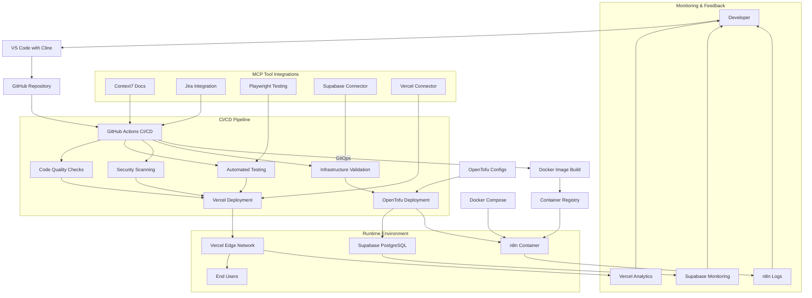

# CI/CD Platform Implementation

The CI/CD platform for the Ecovilla Community Platform is built on GitHub Actions, implementing a GitOps workflow for infrastructure and application deployments. This section details the setup and configuration of the CI/CD pipelines.

## 1. GitHub Actions Configuration

GitHub Actions serves as the primary CI/CD engine, orchestrating builds, tests, and deployments for both the application and infrastructure.

*   **Repository Structure:**
    *   Organize the repository to support both application code (Next.js) and infrastructure code (OpenTofu) in a monorepo or separate repositories based on team preference.
    *   Define clear directory structures for `app/` (Next.js application) and `infra/` (OpenTofu configurations).
*   **Workflow Definitions:**
    *   Create GitHub Actions workflows in `.github/workflows/` for different stages:
        *   `ci.yml`: Continuous Integration (linting, testing, building)
        *   `cd-app.yml`: Continuous Deployment for the Next.js application to Vercel
        *   `cd-infra.yml`: Continuous Deployment for infrastructure changes using OpenTofu
*   **Environment Management:**
    *   Configure GitHub Environments (development, staging, production) with appropriate protection rules (required reviewers, wait timers).
    *   Use GitHub Secrets to manage environment-specific variables (API keys, database URLs, Vercel tokens).

## 2. Application CI/CD Pipeline

The application pipeline automates the build, test, and deployment process for the Next.js frontend and backend.

*   **Continuous Integration:**
    *   Trigger on `push` and `pull_request` events to the `main` branch and feature branches.
    *   Run linting checks (`npm run lint`) to ensure code quality.
    *   Execute unit and integration tests (`npm run test`) with code coverage reporting.
    *   Build the Next.js application (`npm run build`) to verify successful compilation.
    *   Run security scans (dependency checks, SAST) as part of the CI process.
*   **Continuous Deployment:**
    *   For `main` branch pushes, automatically deploy to Vercel using the Vercel GitHub App integration.
    *   For pull requests, create Vercel preview deployments for review and testing.
    *   Implement deployment approval gates for production deployments via GitHub Environments.

## 3. Infrastructure CI/CD Pipeline (GitOps with OpenTofu)

The infrastructure pipeline implements GitOps principles for managing the cloud infrastructure using OpenTofu.

*   **OpenTofu Workflow:**
    *   Store OpenTofu configurations in the `infra/` directory with modular structure (modules for Vercel, Supabase, n8n).
    *   Use OpenTofu workspaces or separate state files for different environments (development, staging, production).
    *   Implement a plan-and-apply workflow:
        *   `terraform plan`: Automatically run on pull requests to show infrastructure changes.
        *   `terraform apply`: Manually triggered or automatically applied after approval for main branch merges.
*   **Security & Compliance:**
    *   Integrate security scanning tools (e.g., tfsec, checkov) into the infrastructure CI pipeline.
    *   Enforce infrastructure policies using tools like Open Policy Agent (OPA) or Sentinel.
*   **State Management:**
    *   Store OpenTofu state files in a secure, remote backend (e.g., AWS S3 with DynamoDB locking, or a dedicated state management solution).
    *   Implement state file encryption and access controls.

## 4. GitOps Principles Implementation

The platform adheres to GitOps principles for both application and infrastructure management.

*   **Declarative Infrastructure:**
    *   All infrastructure is defined as code using OpenTofu, ensuring reproducibility and version control.
*   **Automated Sync:**
    *   GitHub Actions automatically syncs the desired state (code in the repository) with the actual state (cloud resources).
*   **Pull Request Workflow:**
    *   All changes to application code or infrastructure are made via pull requests, enabling review and approval processes.
    *   Automated checks (linting, testing, planning) provide immediate feedback on pull requests.
*   **Observability:**
    *   CI/CD pipeline runs are visible and traceable through GitHub Actions logs and Vercel deployment logs.

## CI/CD Toolchain Visualization

The following diagram illustrates how the various tools and services interact within the CI/CD pipeline:

## 5. Pipeline Security

Security is integrated throughout the CI/CD pipeline.

*   **Secrets Management:**
    *   Use GitHub Secrets for managing sensitive information (API keys, tokens, passwords).
    *   Avoid hardcoding secrets in the codebase or configuration files.
*   **Access Controls:**
    *   Configure branch protection rules to prevent direct pushes to the `main` branch.
    *   Require pull request reviews and status checks before merging.
*   **Dependency Security:**
    *   Regularly scan dependencies for vulnerabilities using tools like Dependabot or Snyk.
    *   Automate dependency updates where safe to do so.
